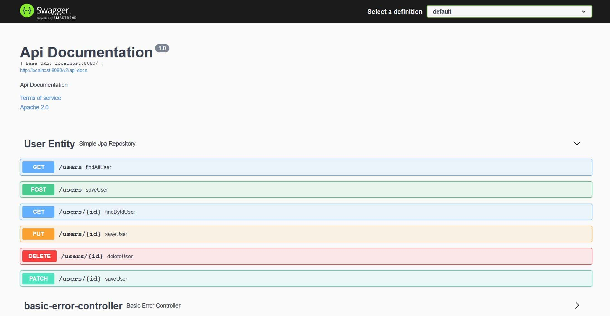
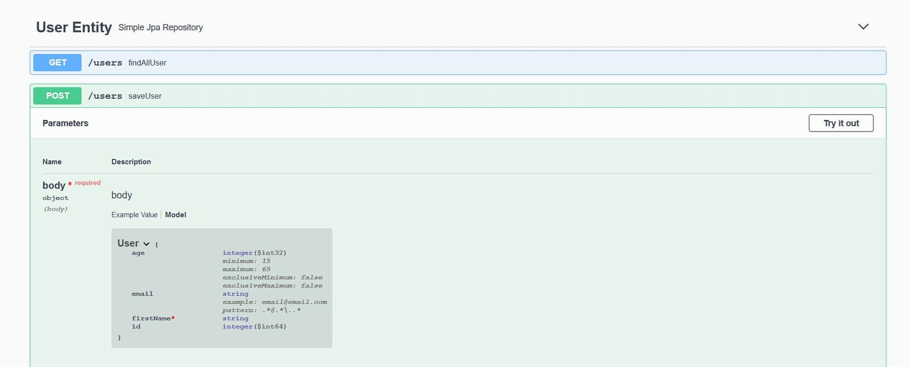
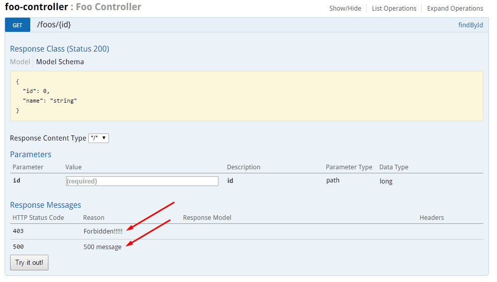
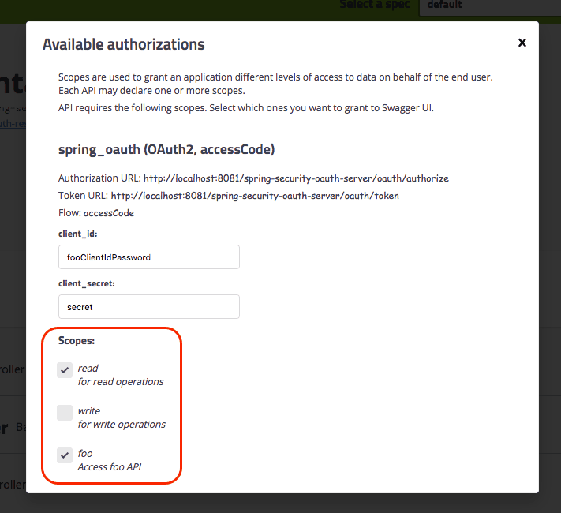
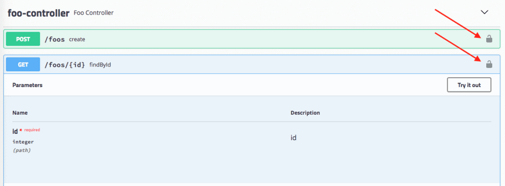

# [使用 Spring REST API 设置 Swagger 2](https://www.baeldung.com/swagger-2-documentation-for-spring-rest-api)

1. 概述

    如今，前端和后端组件通常会将网络应用程序分开。通常，我们会将 API 作为后端组件暴露给前端组件或第三方应用程序集成。

    在这种情况下，为后端 API 制定适当的规范至关重要。同时，应用程序接口文档应内容翔实、可读性强且易于理解。

    此外，参考文档应同时描述 API 中的每一个变化。手动完成这些工作非常乏味，因此流程自动化是不可避免的。

    在本教程中，我们将使用 Swagger 2 规范的 Springfox 实现，为 Spring REST 网络服务介绍 Swagger 2。如果您不熟悉 Swagger，请访问其[网页](https://swagger.io/)了解更多信息，然后再继续本教程。

    值得一提的是，Swagger 规范的最新版本（即现在的 OpenAPI 3.0）得到了 Springdoc 项目的更好支持，应该用于记录 [Spring REST API](https://www.baeldung.com/spring-rest-openapi-documentation)。此外，Spring Boot 3 并不支持该库。

2. 目标项目

    创建我们将使用的 REST 服务不在本文讨论范围之内。如果您已经有一个合适的项目，请使用它。如果没有，可以从以下链接开始：

    - [使用 Spring 和 Java 配置构建 REST API 一文](https://www.baeldung.com/building-a-restful-web-service-with-spring-and-java-based-configuration)
    - [构建 RESTful Web 服务](https://spring.io/guides/gs/rest-service/)

3. 添加 Maven 依赖项

    如上所述，我们将使用 Springfox 实现 Swagger 规范。最新版本可在 Maven Central 上找到。

    要将其添加到 Maven 项目中，我们需要在 pom.xml 文件中添加一个依赖项：

    ```xml
    <dependency>
        <groupId>io.springfox</groupId>
        <artifactId>springfox-swagger2</artifactId>
        <version>3.0.0</version>
    </dependency>
    ```

    1. Spring Boot 依赖关系

        对于基于 Spring Boot 的项目，只需添加一个 springfox-boot-starter 依赖即可：

        ```xml
        <dependency>
            <groupId>io.springfox</groupId>
            <artifactId>springfox-boot-starter</artifactId>
            <version>3.0.0</version>
        </dependency>
        ```

        我们可以添加我们需要的任何其他启动器，其版本由 Spring Boot 父版本管理：

        ```xml
        <dependency>
            <groupId>org.springframework.boot</groupId>
            <artifactId>spring-boot-starter-parent</artifactId>
            <version>3.1.5</version>
        </dependency>
        ```

4. 将 Swagger 2 集成到项目中

    1. Java 配置

        Swagger 的配置主要围绕 Docket Bean 进行：

        ```java
        @Configuration
        public class SpringFoxConfig {
            @Bean
            public Docket api() {
                return new Docket(DocumentationType.SWAGGER_2)
                .select()
                .apis(RequestHandlerSelectors.any())
                .paths(PathSelectors.any())
                .build();
            }
        }
        ```

        定义 Docket Bean 后，其 select() 方法会返回 ApiSelectorBuilder 的实例，该实例提供了一种控制 Swagger 公开的端点的方法。

        我们可以借助 RequestHandlerSelectors 和 PathSelectors 为选择请求处理程序配置谓词。在这两种情况下使用 any() 就可以通过 Swagger 提供整个 API 的文档。

    2. 不使用 Spring Boot 进行配置

        在普通 Spring 项目中，我们需要显式启用 Swagger 2。为此，我们必须在配置类中使用 @EnableSwagger2：

        ```java
        @Configuration
        @EnableSwagger2
        public class SpringFoxConfig {}
        ```

        此外，如果没有 Spring Boot，我们就无法自动配置资源处理程序。

        Swagger UI 添加了一组资源，我们必须将其配置为扩展 WebMvcConfigurerAdapter 并注释为 @EnableWebMvc 的类的一部分：

        ```java
        @Override
        public void addResourceHandlers(ResourceHandlerRegistry registry) {
            registry.addResourceHandler("swagger-ui.html")
            .addResourceLocations("classpath:/META-INF/resources/");
            registry.addResourceHandler("/webjars/**")
            .addResourceLocations("classpath:/META-INF/resources/webjars/");
        }
        ```

    3. 验证

        要验证 Springfox 是否正常工作，我们可以在浏览器中访问以下 URL：

        <http://localhost:8080/v2/api-docs>

        结果是一个包含大量键值对的 JSON 响应，这不是很适合人类阅读。幸运的是，Swagger 为此提供了 Swagger UI。

5. Swagger 用户界面

    Swagger UI 是一种内置解决方案，可使用户与 Swagger 生成的 API 文档的交互变得更加容易。

    1. 启用 Springfox 的 Swagger UI

        要使用 Swagger UI，我们需要添加一个额外的 Maven 依赖项：

        ```xml
        <dependency>
            <groupId>io.springfox</groupId>
            <artifactId>springfox-swagger-ui</artifactId>
            <version>3.0.0</version>
        </dependency>
        ```

        现在，我们可以在浏览器中进行测试，方法是访问：<http://localhost:8080/swagger-ui/>

    2. 探索 Swagger 文档

        Swagger 的响应中列出了我们应用程序中定义的所有控制器。点击任何一个控制器都会列出有效的 HTTP 方法（DELETE、GET、HEAD、OPTIONS、PATCH、POST、PUT）。

        展开每个方法可获得更多有用数据，如响应状态、内容类型和参数列表。还可以使用用户界面尝试每种方法。

        Swagger 与我们的代码库同步的能力至关重要。为了证明这一点，我们可以在应用程序中添加一个新的控制器：

        ```java
        @RestController
        public class CustomController {
            @RequestMapping(value = "/custom", method = RequestMethod.POST)
            public String custom() {
                return "custom";
            }
        }
        ```

        现在，如果我们刷新 Swagger 文档，就会在控制器列表中看到 custom-controller。我们知道，Swagger 的响应中只显示了一种方法（POST）。

6. Spring Data REST

    Springfox 通过其 [springfox-data-rest](https://mvnrepository.com/artifact/io.springfox/springfox-data-rest) 库为 Spring Data REST 提供支持。

    如果 Spring Boot 在类路径上发现了 spring-boot-starter-data-rest，它将负责自动配置。

    现在，让我们创建一个名为 User 的实体：

    ```java
    @Entity
    public class User {
        @Id
        private Long id;
        private String firstName;
        private int age;
        private String email;
        // getters and setters
    }
    ```

    然后，我们将创建 UserRepository，以便在 User 实体上添加 CRUD 操作：

    ```java
    @Repository
    public interface UserRepository extends CrudRepository<User, Long> {}
    ```

    最后，我们将 SpringDataRestConfiguration 类导入 SpringFoxConfig 类：

    ```java
    @EnableSwagger2
    @Import(SpringDataRestConfiguration.class)
    public class SpringFoxConfig {}
    ```

    注：我们将使用 @EnableSwagger2 注解启用 Swagger，因为 @EnableSwagger2WebMvc 在[第 3 版库](https://springfox.github.io/springfox/javadoc/current/springfox/documentation/swagger2/annotations/EnableSwagger2WebMvc.html)中已被弃用。

    让我们重启应用程序，为 Spring Data REST API 生成规范：

    

    我们可以看到，Springfox 已为用户实体生成了具有 GET、POST、PUT、PATCH 和 DELETE 等 HTTP 方法的规范。

7. Bean验证

    Springfox 还通过 [Springfox-bean-validators](https://mvnrepository.com/artifact/io.springfox/springfox-bean-validators) 库支持 [Bean](https://www.baeldung.com/javax-validation) 验证注解。

    首先，我们将在 pom.xml 中添加 Maven 依赖项：

    ```xml
    <dependency>
        <groupId>io.springfox</groupId>
        <artifactId>springfox-bean-validators</artifactId>
        <version>2.9.2</version>
    </dependency>
    ```

    同样，如果我们使用 Spring Boot，就不必明确提供上述依赖关系。

    接下来，让我们为 User 实体添加一些验证注解，如 [@NotNull](https://docs.oracle.com/javaee/7/api/javax/validation/constraints/NotNull.html) 和 [@Min](https://docs.oracle.com/javaee/7/api/javax/validation/constraints/Min.html)：

    ```java
    @Entity
    public class User {
        //...
        @NotNull(message = "First Name cannot be null")
        private String firstName;
        @Min(value = 15, message = "Age should not be less than 15")
        @Max(value = 65, message = "Age should not be greater than 65")
        private int age;
    }
    ```

    最后，我们将 [BeanValidatorPluginsConfiguration](http://springfox.github.io/springfox/javadoc/current/springfox/bean/validators/configuration/BeanValidatorPluginsConfiguration.html) 类导入 SpringFoxConfig 类：

    ```java
    @EnableSwagger2
    @Import(BeanValidatorPluginsConfiguration.class)
    public class SpringFoxConfig {}
    ```

    让我们来看看 API 规范中的变化：可以看到用户模型的 firstName 上有 _*required_ 。此外，还为年龄定义了最小值和最大值。

8. 插件

    为了向 API 规范添加特定功能，我们可以创建一个 Springfox 插件。插件可提供各种功能，从丰富模型和属性到自定义 API 列表和默认值。

    Springfox 通过其 [spi](https://github.com/springfox/springfox/tree/master/springfox-spi/src/main/java/springfox/documentation/spi) 模块支持插件创建。spi 模块提供了一些接口，如 [ModelBuilderPlugin](http://springfox.github.io/springfox/javadoc/current/springfox/documentation/spi/schema/ModelBuilderPlugin.html)、[ModelPropertyBuilderPlugin](http://springfox.github.io/springfox/javadoc/current/springfox/documentation/spi/schema/ModelPropertyBuilderPlugin.html) 和 [ApiListingBuilderPlugin](http://springfox.github.io/springfox/javadoc/current/springfox/documentation/spi/service/ApiListingBuilderPlugin.html)，它们是实现自定义插件的扩展钩子。

    为了演示这些功能，让我们创建一个插件来丰富用户模型的电子邮件属性。我们将使用 ModelPropertyBuilderPlugin 接口，并设置模式和示例的值。

    首先，让我们创建 EmailAnnotationPlugin 类，并重写 supports 方法以允许任何[文档类型](http://springfox.github.io/springfox/javadoc/current/springfox/documentation/spi/DocumentationType.html)，如 Swagger 1.2 和 Swagger 2：

    ```java
    @Component
    @Order(Validators.BEAN_VALIDATOR_PLUGIN_ORDER)
    public class EmailAnnotationPlugin implements ModelPropertyBuilderPlugin {
        @Override
        public boolean supports(DocumentationType delimiter) {
            return true;
        }
    }
    ```

    然后，我们将覆盖 ModelPropertyBuilderPlugin 的 apply 方法，以设置构建器属性的值：

    ```java
    @Override
    public void apply(ModelPropertyContext context) {
        Optional<Email> email = annotationFromBean(context, Email.class);
        if (email.isPresent()) {
            context.getSpecificationBuilder().facetBuilder(StringElementFacetBuilder.class)
            .pattern(email.get().regexp());
            context.getSpecificationBuilder().example("email@email.com");
        }
    }
    ```

    因此，API 规范将显示使用 @Email 注解的属性的模式和示例值。

    接下来，我们将在 User 实体中添加 @Email 注解：

    ```java
    @Entity
    public class User {
        //...
        @Email(regexp=".*@.*\\..*", message = "Email should be valid")
        private String email;
    }
    ```

    最后，我们将在 SpringFoxConfig 类中启用 EmailAnnotationPlugin，将其注册为一个 Bean：

    ```java
    @Import({BeanValidatorPluginsConfiguration.class})
    public class SpringFoxConfig {
        //...
        @Bean
        public EmailAnnotationPlugin emailPlugin() {
            return new EmailAnnotationPlugin();
        }
    }
    ```

    让我们来看看 EmailAnnotationPlugin 的实际效果：

    

    我们可以看到该模式的值与 User 实体的电子邮件属性中的 regex (`.*@.*\\..*`) 相同。

    同样，示例 (<email@email.com>) 的值也与 EmailAnnotationPlugin 的 apply 方法中定义的相同。

9. 高级配置

    我们可以对应用程序的 Docket Bean 进行配置，以便对 API 文档生成过程进行更多控制。

    1. 过滤 Swagger 响应的 API

        暴露整个 API 的文档并不总是可取的。我们可以通过向 Docket 类的 apis() 和 paths() 方法传递参数来限制 Swagger 的响应。

        如上所述，RequestHandlerSelectors 允许使用 any 或 none 谓词，但也可用于根据基础包、类注解和方法注解过滤 API。

        PathSelectors 通过谓词提供了额外的过滤功能，可以扫描应用程序的请求路径。我们可以使用 any()、none()、regex() 或 ant()。

        在下面的示例中，我们将使用 ant() 谓词指示 Swagger 只包含来自特定软件包、具有特定路径的控制器：

        ```java
        @Bean
        public Docket api() {                
            return new Docket(DocumentationType.SWAGGER_2)          
            .select()                                       
            .apis(RequestHandlerSelectors.basePackage("com.baeldung.web.controller"))
            .paths(PathSelectors.ant("/foos/*"))                     
            .build();
        }
        ```

    2. 自定义信息

        Swagger 还在其响应中提供了一些默认值，我们可以对其进行自定义，如 "Api Documentation"、"Created by Contact Email "和 "Apache 2.0"。

        要更改这些值，我们可以使用 apiInfo(ApiInfo apiInfo) 方法--ApiInfo 类包含有关 API 的自定义信息：

        ```java
        @Bean
        public Docket api() {                
            return new Docket(DocumentationType.SWAGGER_2)
            .select()
            .apis(RequestHandlerSelectors.basePackage("com.example.controller"))
            .paths(PathSelectors.ant("/foos/*"))
            .build()
            .apiInfo(apiInfo());
        }

        private ApiInfo apiInfo() {
            return new ApiInfo(
            "My REST API",
            "Some custom description of API.",
            "API TOS",
            "Terms of service",
            new Contact("John Doe", "www.example.com", "myeaddress@company.com"),
            "License of API", "API license URL", Collections.emptyList());
        }
        ```

    3. 自定义方法响应信息

        Swagger 允许通过 Docket 的 globalResponses() 方法全局覆盖 HTTP 方法的响应信息。

        首先，我们需要指示 Swagger 不要使用默认的响应消息。假设我们想覆盖所有 GET 方法的 500 和 403 响应信息。

        为此，必须在 Docket 的初始化块中添加一些代码（为清晰起见，不包括原始代码）：

        ```java
        .useDefaultResponseMessages(false)
        .globalResponses(HttpMethod.GET, newArrayList(
            new ResponseBuilder().code("500")
                .description("500 message").build(),
            new ResponseBuilder().code("403")
                .description("Forbidden!!!!!").build()
        ));
        ```

        

10. 带有 OAuth 安全 API 的 Swagger UI

    Swagger UI 提供了许多非常有用的功能，到目前为止我们已经很好地介绍了这些功能。但是，如果我们的 API 是安全且不可访问的，我们就无法真正使用其中的大部分功能。

    让我们看看如何在本示例中使用授权码授予类型允许 Swagger 访问 OAuth 加密的 API。

    我们将使用 SecurityScheme 和 SecurityContext 支持配置 Swagger 以访问安全 API：

    ```java
    @Bean
    public Docket api() {
        return new Docket(DocumentationType.SWAGGER_2).select()
            .apis(RequestHandlerSelectors.any())
            .paths(PathSelectors.any())
            .build()
            .securitySchemes(Arrays.asList(securityScheme()))
            .securityContexts(Arrays.asList(securityContext()));
    }
    ```

    1. 安全配置

        我们将在 Swagger 配置中定义一个 SecurityConfiguration Bean，并设置一些默认值：

        ```java
        @Bean
        public SecurityConfiguration security() {
            return SecurityConfigurationBuilder.builder()
                .clientId(CLIENT_ID)
                .clientSecret(CLIENT_SECRET)
                .scopeSeparator(" ")
                .useBasicAuthenticationWithAccessCodeGrant(true)
                .build();
        }
        ```

    2. 安全模式

        接下来，我们将定义 SecurityScheme；它用于描述如何确保 API 的安全（Basic Authentication、OAuth2......）。

        在这里，我们将定义用于[保护资源](https://www.baeldung.com/rest-api-spring-oauth2-angular)服务器的 OAuth 方案：

        ```java
        private SecurityScheme securityScheme() {
            GrantType grantType = new AuthorizationCodeGrantBuilder()
                .tokenEndpoint(new TokenEndpoint(AUTH_SERVER + "/token", "oauthtoken"))
                .tokenRequestEndpoint(
                new TokenRequestEndpoint(AUTH_SERVER + "/authorize", CLIENT_ID, CLIENT_SECRET))
                .build();
            SecurityScheme oauth = new OAuthBuilder().name("spring_oauth")
                .grantTypes(Arrays.asList(grantType))
                .scopes(Arrays.asList(scopes()))
                .build();
            return oauth;
        }
        ```

        请注意，我们使用的是授权码授予类型，为此我们需要提供一个令牌端点和 OAuth2 授权服务器的授权 URL。

        下面是我们需要定义的作用域：

        ```java
        private AuthorizationScope[] scopes() {
            AuthorizationScope[] scopes = {
            new AuthorizationScope("read", "for read operations"),
            new AuthorizationScope("write", "for write operations"),
            new AuthorizationScope("foo", "Access foo API")};
            return scopes;
        }
        ```

        这些与我们在应用程序中为 /foos API 实际定义的作用域同步。

    3. 安全上下文

        最后，我们需要为示例 API 定义一个 SecurityContext：

        ```java
        private SecurityContext securityContext() {
            return SecurityContext.builder()
            .securityReferences(
                Arrays.asList(new SecurityReference("spring_oauth", scopes())))
            .forPaths(PathSelectors.regex("/foos.*"))
            .build();
        }
        ```

        请注意，我们在引用中使用的名称 spring_oauth 与我们之前在 SecurityScheme 中使用的名称是同步的。

    4. 测试

        既然一切都已准备就绪，让我们来看看 Swagger UI 并尝试访问 Foo API。

        我们可以在本地访问 Swagger UI：

        <http://localhost:8082/spring-security-oauth-resource/swagger-ui.html>

        我们可以看到，由于我们的安全配置，现在存在一个新的授权按钮：点击 "授权" 按钮后，我们可以看到以下弹出窗口，授权我们的 Swagger UI 访问安全 API。

        

        请注意：

        - 我们已经可以看到 CLIENT_ID 和 CLIENT_SECRET，因为我们之前已经对它们进行了预配置（但我们仍然可以更改它们）。
        - 现在我们可以选择需要的作用域。

        下面是安全 API 的标记方式：

        

        现在，我们终于可以使用 API 了！

        当然，不用说我们也知道，既然安全配置已经激活，我们就需要小心翼翼地对外公开 Swagger UI。

11. 总结

    在本文中，我们设置了 Swagger 2，以便为 Spring REST API 生成文档。我们还探索了可视化和自定义 Swagger 输出的方法。最后，我们了解了 Swagger 的简单 OAuth 配置。
