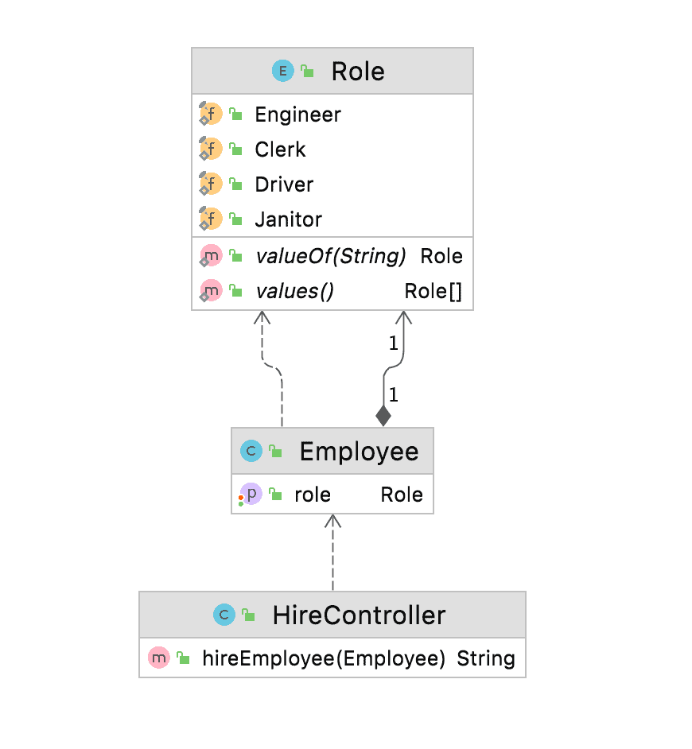

# Swagger 中的文档枚举

1. 概述

    在本教程中，我们将学习如何使用 swagger-maven-plugin 在 Swagger 中记录枚举，并在 swagger 编辑器中验证生成的 JSON 文档。

2. 什么是 Swagger？

    [Swagger](https://www.baeldung.com/spring-boot-rest-client-swagger-codegen) 是一种开源工具，用于定义基于休息的 API。在当今世界，大多数组织都在向微服务和 API 优先的方法发展。Swagger 在设计和记录 API 方面非常方便。它还提供了 Swagger 编辑器、Swagger UI 和 Swagger CodeGen 等各种工具来帮助 API 开发。

    此外，Swagger 是 OpenAPI 规范或 OAS 的实现，OAS 定义了一套用于其余 API 开发的标准；因此，它有助于全球各地的组织将编写 API 的过程标准化。

    我们的应用程序生成的 JSON 文件也将遵循 OpenAPI 规范。

    让我们来了解一下 Swagger 中 [Enum](https://www.baeldung.com/a-guide-to-java-enums) 的重要性。有些 API 需要用户坚持使用一组特定的预定义值。这些预定义的常量值被称为枚举。同样，当 Swagger 公开 API 时，我们要确保用户从这组预定义值中选择一个值，而不是自由文本。换句话说，我们需要在 swagger.json 文件中记录枚举，以便用户了解可能的值。

3. 实施

    让我们以 REST API 为例，跳转到实现部分。我们将实现一个 POST API，用于为组织招聘特定角色的员工。但是，一个角色只能是以下其中之一： 工程师、文员、司机或看门人。

    我们将创建一个名为 Role 的枚举，其中包含雇员角色的所有可能值，并创建一个 Employee 类，将角色作为其属性之一。让我们来看看 UML 图，以便更好地理解这些类及其关系：

    

    要在 Swagger 中记录这一点，首先，我们要在应用程序中导入并配置 swagger-maven-插件。其次，我们将在代码中添加所需的注释，最后，我们将构建项目并在 swagger 编辑器中验证生成的 swagger 文档或 swagger.json。

    1. 导入和配置插件

        我们将使用 swagger-maven-plugin，需要将其作为依赖项添加到应用程序的 pom.xml 中：

        ```xml
        <dependency>
            <groupId>com.github.kongchen</groupId>
            <artifactId>swagger-maven-plugin</artifactId>
            <version>3.1.1</version>
        </dependency>
        ```

        此外，为了配置并启用该插件，我们将把它添加到 pom.xml 的插件部分：

        - locations： 此标记指定包含 @Api 的包或类，以分号分隔
        - info： 此标签提供 API 的元数据。Swagger-ui 使用这些数据来显示信息
        - swaggerDirectory： 此标记定义了 swagger.json 文件的路径

        ```xml
        <plugin>
            <groupId>com.github.kongchen</groupId>
            <artifactId>swagger-maven-plugin</artifactId>
            <version>3.1.1</version>
            <configuration>
                <apiSources>
                    <apiSource>
                        <springmvc>false</springmvc>
                        <locations>com.baeldung.swaggerenums.controller</locations>
                        <schemes>http,https</schemes>
                        <host>baeldung.com</host>
                        <basePath>/api</basePath>
                        <info>
                            <title>Baeldung - Document Enum</title>
                            <version>v1</version>
                            <description>This is a Baeldung Document Enum Sample Code</description>
                            <contact>
                                <email>pmurria@baeldung.com</email>
                                <name>Test</name>
                            </contact>
                            <license>
                                <url>https://www.apache.org/licenses/LICENSE-2.0.html</url>
                                <name>Apache 2.0</name>
                            </license>
                        </info>
                        <swaggerDirectory>generated/swagger-ui</swaggerDirectory>
                    </apiSource>
                </apiSources>
            </configuration>
            <executions>
                <execution>
                    <phase>compile</phase>
                    <goals>
                        <goal>generate</goal>
                    </goals>
                </execution>
            </executions>
        </plugin>
        ```

    2. 记录枚举

        为了在 Swagger 中记录枚举，我们需要使用注解 @ApiModel 声明模型。

        在本例中，我们创建了一个枚举角色，它有四个可能的值--工程师、职员、司机和清洁工。由于我们需要记录这个枚举，我们将在枚举角色中添加 @ApiModel。换句话说，这将让 Swagger 知道模型的存在。在 Employee 类中，我们将用 @ApiModel 注解 Employee，用 @ApiModelProperty 注解 Role。

        我们的 Employee、Role 和 HireController 将看起来像这样：

        ```java
        @ApiModel
        public class Employee {
            @ApiModelProperty
            public Role role;
        // standard setters and getters
        }

        @ApiModel
        public enum Role {
            Engineer, Clerk, Driver, Janitor;
        }
        ```

        接下来，我们将创建一个 API，其 @Path 为"/hire"，并使用 Employee 模型作为 hireEmployee 方法的输入参数。我们必须在 HireController 中添加 @Api，这样 swagger-maven-plugin 就会感知并将其视为文档：

        ```java
        @Api
        @Path(value="/hire")
        @Produces({"application/json"})
        public class HireController {
            @POST
            @ApiOperation(value = "This method is used to hire employee with a specific role")
            public String hireEmployee(@ApiParam(value = "role", required = true) Employee employee) {
                return String.format("Hired for role: %s", employee.role.name());
            }
        }
        ```

        3.3. 生成 Swagger 文档

        要构建我们的项目并生成 Swagger 文档，请运行以下命令：

        `mvn clean install`

        构建完成后，插件将在 generated/swagger-ui 或插件中配置的位置生成 swagger.json 文件。在定义下，我们可以看到雇员属性中记录的枚举角色及其所有可能的值。

        ```json
        "definitions" : {
        "Employee" : {
            "type" : "object",
            "properties" : {
            "role" : {
                "type" : "string",
                "enum" : [ "Engineer", "Clerk", "Driver", "Janitor" ]
            }
            }
        }
        }
        ```

        现在，我们将使用在线 Swagger 编辑器对生成的 JSON 进行可视化，并查找枚举角色。

4. 总结

在本教程中，我们讨论了什么是 Swagger，并了解了 OpenAPI 规范及其在企业 API 开发中的重要性。此外，我们还使用 swagger-maven-plugin 创建并记录了包含 enum 的示例 API。最后，为了验证输出结果，我们使用 swagger 编辑器对生成的 JSON 文档进行了可视化。
