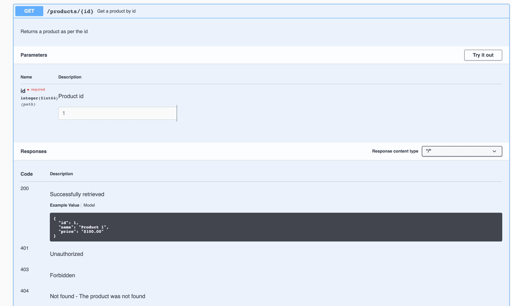

# [使用 Swagger 设置示例和描述](https://www.baeldung.com/swagger-set-example-description)

1. 概述

    在本教程中，我们将演示如何使用 Swagger 注释使我们的文档更具描述性。首先，我们将学习如何为 API 的不同部分（如方法、参数和错误代码）添加说明。然后，我们将了解如何添加请求/响应示例。

2. 项目设置

    我们将创建一个简单的产品 API，提供创建和获取产品的方法。

    要从头开始创建 REST API，我们可以按照 Spring 文档中的教程使用 Spring Boot 创建一个 [RESTful Web 服务](https://spring.io/guides/gs/rest-service/)。

    下一步是为项目设置依赖关系和配置。我们可以按照本文中的步骤，使用 Spring REST API 设置 Swagger 2。

3. 创建 API

    让我们创建产品 API 并检查生成的文档。

    1. 模型

        让我们定义实体 [Product](/src/main/java/com/baeldung/swaggerexample/entity/Product.java) 类。

    2. 控制器

        让我们定义两个 API 方法：

        ```java
        @RestController
        @Tag(name = "Products API")
        public class ProductController {

            @PostMapping("/products")
            public ResponseEntity<Void> createProduct(@RequestBody Product product) {
                //creation logic
                return new ResponseEntity<>(HttpStatus.CREATED);
            }

            @GetMapping("/products/{id}")
            public ResponseEntity<Product> getProduct(@PathVariable Long id) {
                //retrieval logic
                return ResponseEntity.ok(new Product(1, "Product 1", "$21.99"));
            }
        }
        ```

        当我们运行项目时（jdk17），库将读取所有公开的路径并创建相应的文档。

        让我们在默认 URL <http://localhost:8080/swagger-ui/index.html> 上查看文档。

        - [ ] Whitelabel Error Page
        This application has no explicit mapping for /error, so you are seeing this as a fallback.
        There was an unexpected error (type=Not Found, status=404).

        我们可以进一步扩展控制器方法，查看它们各自的文档。接下来，我们将详细介绍它们。

4. 让我们的文档更具描述性

    现在，让我们为方法的不同部分添加说明，使我们的文档更具描述性。

    1. 为方法和参数添加说明

        让我们来看看几种使方法具有描述性的方法。我们将为方法、参数和响应代码添加说明。让我们从 getProduct() 方法开始：

        ```java
        @Operation(summary = "Get a product by id", description = "Returns a product as per the id")
        @ApiResponses(value = {
                @ApiResponse(responseCode = "200", description = "Successfully retrieved"), 
                @ApiResponse(responseCode = "404", description = "Not found - The product was not found")
            })
        @GetMapping("/products/{id}")
        public ResponseEntity<Product> getProduct(@PathVariable("id") @Parameter(name = "id", description = "Product id", example = "1") Long id) {
            //retrieval logic
            return ResponseEntity.ok(new Product(1, "Product 1", "$21.99"));
        }
        ```

        @Operation 定义了 API 方法的属性。我们使用 value 属性为操作添加了名称，并使用 notes 属性添加了描述。

        @ApiResponses 用于覆盖伴随响应代码的默认信息。对于我们要更改的每一条响应信息，我们都需要添加一个 @ApiResponse 对象。

        例如，假设找不到产品，在这种情况下，我们的 API 会返回 HTTP 404 状态。如果我们不添加自定义消息，原始消息 "Not found" 可能很难理解。调用者可能会将其理解为 URL 有误。然而，添加 "The product was not found" 的描述会让它更清晰。

        @Parameter 定义了方法参数的属性。它可以与路径、查询、头和表单参数一起使用。我们为 "id" 参数添加了名称、值（描述）和示例。如果我们不添加自定义，库将只接收参数的名称和类型，如第一张图片所示。

        让我们看看这将如何改变文档：

        

        在这里，我们可以看到名称 "Get a product id" 和 API 路径 /products/{id}。我们还可以看到下面的说明。 此外，在参数部分，我们还可以看到 id 字段的描述和示例。最后，在 "Responses" 部分，我们可以看到 200 和 404 代码的错误描述发生了变化。

    2. 为模型添加说明和示例

        我们可以对 createProduct() 方法进行类似的改进。由于该方法接受一个 Product 对象，因此在 Product 类中提供说明和示例更有意义。

        为此，让我们对 Product 类做一些修改：

        ```java
        @Schema(name = "Product ID", example = "1", required = true)
        private Long id;
        @Schema(name = "Product name", example = "Product 1", required = false)
        private String name;
        @Schema(name = "Product price", example = "$100.00", required = true)
        private String price;
        ```

        @Schema 注解定义了字段的属性。我们在每个字段上使用此注解来设置其名称、示例和必填属性。

        让我们重启应用程序，再次查看 Product 模型的文档。

        如果我们将其与原始文档图像进行比较，就会发现新图像包含示例、说明和红色星号（*），以标识所需的参数。

        通过为模型添加示例，我们可以在每个使用模型作为输入或输出的方法中自动创建示例响应。例如，从与 getProduct() 方法相对应的图片中，我们可以看到响应中包含了一个示例，其中的值与我们在模型中提供的值相同。

        在文档中添加示例非常重要，因为这样可以使值格式更加精确。如果我们的模型包含日期、时间或价格等字段，那么精确的值格式是必要的。事先定义格式会使 API 提供商和 API 客户端的开发过程更加有效。

5. 结论

    在本文中，我们探讨了提高 API 文档可读性的各种方法。我们学习了如何使用注解 @Parameter、@Operation、@ApiResponses、@ApiResponse 和 @Schema 来记录方法、参数、错误信息和模型。
