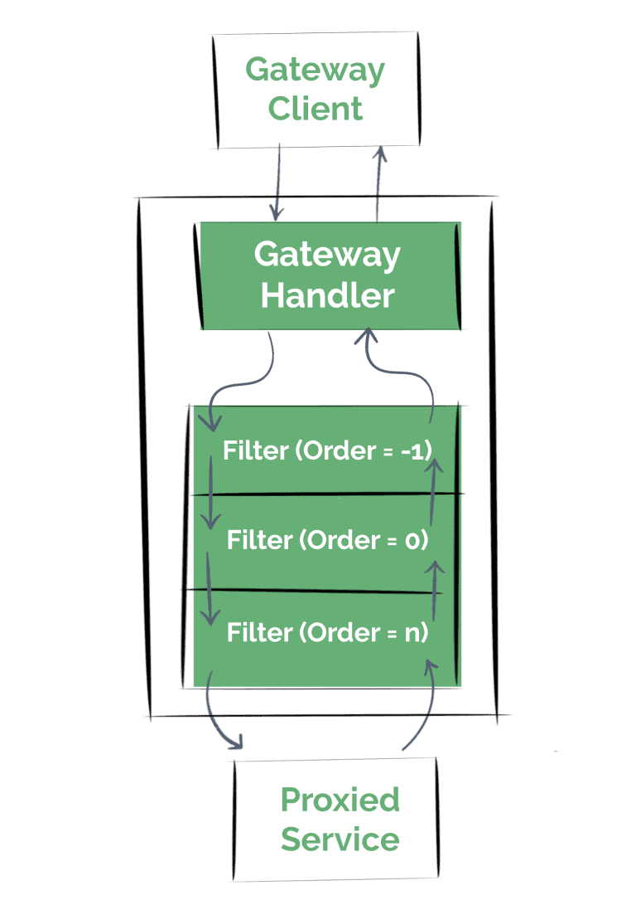

# [编写自定义Spring云网关过滤器](https://www.baeldung.com/spring-cloud-custom-gateway-filters)

1. 概述

    在本教程中，我们将学习如何编写自定义 Spring Cloud Gateway 过滤器。

    这一次，我们将更深入地学习，编写自定义过滤器，以充分利用 API Gateway。

    首先，我们将了解如何创建影响网关处理的每个请求的全局过滤器。然后，我们将编写网关过滤器工厂，将其细粒度地应用于特定路由和请求。

    最后，我们将讨论更高级的场景，学习如何修改请求或响应，甚至如何以被动方式将请求与调用其他服务的请求串联起来。

2. 项目设置

    我们将首先设置一个基本应用程序，并将其用作 API 网关。

    1. Maven 配置

        在使用 Spring Cloud 库时，设置一个依赖关系管理配置来为我们处理依赖关系总是一个不错的选择：

        ```xml
        <dependencyManagement>
            <dependencies>
                <dependency>
                    <groupId>org.springframework.cloud</groupId>
                    <artifactId>spring-cloud-dependencies</artifactId>
                    <version>2023.0.0</version>
                    <type>pom</type>
                    <scope>import</scope>
                </dependency>
            </dependencies>
        </dependencyManagement>
        ```

        现在，我们可以添加 Spring Cloud 库，而无需指定我们使用的实际版本：

        ```xml
        <dependency>
            <groupId>org.springframework.cloud</groupId>
            <artifactId>spring-cloud-starter-gateway</artifactId>
        </dependency>
        ```

        使用 Maven Central 搜索引擎可以找到最新的 Spring Cloud Release Train 版本。当然，我们应始终在 [Spring Cloud 文档](https://spring.io/projects/spring-cloud) 中检查该版本是否与我们正在使用的 Spring Boot 版本兼容。

    2. API 网关配置

        我们假设本地有第二个应用程序在 8081 端口运行，它在点击 /resource 时会暴露一个资源（为简单起见，只是一个简单的字符串）。

        有鉴于此，我们将配置网关，将请求代理到该服务。简而言之，当我们向网关发送一个 URI 路径中带有 /service 前缀的请求时，我们将把调用转发给这项服务。

        因此，当我们在网关中调用 /service/resource 时，应该会收到字符串响应。

        为此，我们将使用应用程序属性配置此路由：

        ```yaml
        spring:
        cloud:
            gateway:
            routes:
            - id: service_route
                uri: http://localhost:8081
                predicates:
                - Path=/service/**
                filters:
                - RewritePath=/service(?<segment>/?.*), $\{segment}
        ```

        此外，为了正确跟踪网关进程，我们还将启用一些日志：

        ```yaml
        logging:
        level:
            org.springframework.cloud.gateway: DEBUG
            reactor.netty.http.client: DEBUG
        ```

3. 创建全局过滤器

    一旦网关处理程序确定请求与路由相匹配，框架就会将请求传递给过滤器链。这些过滤器可以在请求发送前或发送后执行逻辑。

    在本节中，我们将从编写简单的全局过滤器开始。这意味着它将影响每一个请求。

    首先，我们将了解如何在代理请求发送前执行逻辑（也称为 “pre” 过滤器）

    1. 编写全局“pre”过滤逻辑

        如前所述，我们将在此时创建简单的过滤器，因为这里的主要目的只是查看过滤器是否在正确的时刻被执行；只需记录一条简单的消息即可。

        要创建自定义全局过滤器，我们只需实现 Spring Cloud Gateway GlobalFilter 接口，并将其作为 bean 添加到上下文中即可：

        main/.springcloudgateway.customfilters.gatewayapp.filters.global/LoggingGlobalPreFilter.java

        我们可以很容易地看到这里发生了什么；一旦调用该过滤器，我们将记录一条信息，并继续执行过滤器链。

        现在让我们定义一个 “post” 过滤器，如果我们不熟悉反应式编程模型和 [Spring Webflux API](https://www.baeldung.com/spring-webflux)，这可能会有点棘手。

    2. 编写全局“Post”过滤器逻辑

        关于我们刚刚定义的全局过滤器，还有一点需要注意，那就是 GlobalFilter 接口只定义了一个方法。因此，它可以用 lambda 表达式表示，使我们可以方便地定义过滤器。

        例如，我们可以在配置类中定义 “post” 过滤器：

        main/.springcloudgateway.customfilters.gatewayapp.filters.global/LoggingGlobalFiltersConfigurations.java

        简单地说，在这里我们是在链执行完毕后运行一个新的 Mono 实例。

        现在让我们在网关服务中调用 /service/resource URL 试试看，并查看日志控制台：

        ```log
        DEBUG --- o.s.c.g.h.RoutePredicateHandlerMapping:
        Route matched: service_route
        DEBUG --- o.s.c.g.h.RoutePredicateHandlerMapping:
        Mapping [Exchange: GET http://localhost/service/resource]
        to Route{id='service_route', uri=http://localhost:8081, order=0, predicate=Paths: [/service/**],
        match trailing slash: true, gatewayFilters=[[[RewritePath /service(?<segment>/?.*) = '${segment}'], order = 1]]}
        INFO  --- c.b.s.c.f.global.LoggingGlobalPreFilter:
        Global Pre Filter executed
        DEBUG --- r.netty.http.client.HttpClientConnect:
        [id: 0x58f7e075, L:/127.0.0.1:57215 - R:localhost/127.0.0.1:8081]
        Handler is being applied: {uri=http://localhost:8081/resource, method=GET}
        DEBUG --- r.n.http.client.HttpClientOperations:
        [id: 0x58f7e075, L:/127.0.0.1:57215 - R:localhost/127.0.0.1:8081]
        Received response (auto-read:false) : [Content-Type=text/html;charset=UTF-8, Content-Length=16]
        INFO  --- c.f.g.LoggingGlobalFiltersConfigurations:
        Global Post Filter executed
        DEBUG --- r.n.http.client.HttpClientOperations:
        [id: 0x58f7e075, L:/127.0.0.1:57215 - R:localhost/127.0.0.1:8081] Received last HTTP packet
        ```

        正如我们所见，在网关将请求转发给服务之前和之后，过滤器都会有效执行。

        当然，我们可以将 “pre” 和 “post” 逻辑合并到一个过滤器中：

        main/.springcloudgateway.customfilters.gatewayapp.filters.global/FirstPreLastPostGlobalFilter.java

        请注意，如果我们关心过滤器在链中的位置，也可以实现 Ordered 接口。

        由于过滤器链的性质，优先级较低（在链中的顺序较低）的过滤器将在较早阶段执行其 “pre” 逻辑，但其 “post” 实现将在较后阶段调用：

        

4. 创建网关过滤器

    全局过滤器非常有用，但我们经常需要执行仅适用于某些路由的细粒度自定义网关过滤器操作。

    1. 定义 GatewayFilterFactory

        为了实现 GatewayFilter，我们必须实现 GatewayFilterFactory 接口。Spring Cloud Gateway 还提供了一个抽象类来简化这一过程，即 AbstractGatewayFilterFactory 类：

        main/.springcloudgateway.customfilters.gatewayapp.filters.factories/LoggingGatewayFilterFactory.java

        这里我们定义了 GatewayFilterFactory 的基本结构。在初始化过滤器时，我们将使用 Config 类自定义过滤器。

        例如，在本例中，我们可以在配置中定义三个基本字段：

        ```java
        public static class Config {
            private String baseMessage;
            private boolean preLogger;
            private boolean postLogger;

            // contructors, getters and setters...
        }
        ```

        简单地说，这些字段是

        - 将包含在日志条目中的自定义信息
        - 指示过滤器是否应在转发请求前记录日志的标志
        - 表示过滤器是否应在收到代理服务的响应后记录日志的标志

        现在，我们可以使用这些配置来检索 GatewayFilter 实例，它同样可以用 lambda 函数来表示：

        main/.springcloudgateway.customfilters.gatewayapp.filters.factories/LoggingGatewayFilterFactory.java:apply()

    2. 使用属性注册 GatewayFilter

        现在，我们可以轻松地将过滤器注册到之前在应用程序属性中定义的路由上：

        ```properties
        ...
        filters:
        - RewritePath=/service(?<segment>/?.*), $\{segment}
        - name: Logging
        args:
            baseMessage: My Custom Message
            preLogger: true
            postLogger: true
        ```

        我们只需指出配置参数即可。这里有一点很重要，那就是我们需要在 LoggingGatewayFilterFactory.Config 类中配置无参数构造函数和设置器，这样这种方法才能正常工作。

        如果我们想使用紧凑的符号来配置过滤器，那么我们可以这样做：

        ```properties
        filters:
        - RewritePath=/service(?<segment>/?.*), $\{segment}
        - Logging=My Custom Message, true, true
        ```

        我们需要对我们的工厂再做一些调整。简而言之，我们必须覆盖 shortcutFieldOrder 方法，以指明快捷方式属性将使用的顺序和参数数量：

        ```java
        @Override
        public List<String> shortcutFieldOrder() {
            return Arrays.asList("baseMessage",
            "preLogger",
            "postLogger");
        }
        ```

    3. 为 GatewayFilter 排序

        如果要配置过滤器在过滤器链中的位置，我们可以从 AbstractGatewayFilterFactory#apply 方法中获取一个 OrderedGatewayFilter 实例，而不是使用普通的 lambda 表达式：

        ```java
        @Override
        public GatewayFilter apply(Config config) {
            return new OrderedGatewayFilter((exchange, chain) -> {
                // ...
            }, 1);
        }
        ```

    4. 以编程方式注册 GatewayFilter

        此外，我们还可以通过编程注册过滤器。让我们重新定义我们一直在使用的路由，这次要设置一个 RouteLocator Bean：

        ```java
        @Bean
        public RouteLocator routes(
        RouteLocatorBuilder builder,
        LoggingGatewayFilterFactory loggingFactory) {
            return builder.routes()
            .route("service_route_java_config", r -> r.path("/service/**")
                .filters(f -> 
                    f.rewritePath("/service(?<segment>/?.*)", "$\\{segment}")
                    .filter(loggingFactory.apply(
                    new Config("My Custom Message", true, true))))
                    .uri("http://localhost:8081"))
            .build();
        }
        ```

5. 高级场景

    到目前为止，我们所做的只是在网关流程的不同阶段记录信息。

    通常，我们需要过滤器提供更高级的功能。例如，我们可能需要检查或处理收到的请求，修改正在检索的响应，甚至将反应流与其他不同服务的调用串联起来。

    接下来，我们将举例说明这些不同的应用场景。

    1. 检查和修改请求

        让我们假设一个场景。我们的服务过去是根据本地查询参数来提供内容的。后来，我们将 API 改为使用 Accept-Language 标头，但有些客户端仍在使用该查询参数。

        因此，我们希望按照以下逻辑配置网关，使其正常化：

        1. 如果我们收到 Accept-Language 标头，就保留它
        2. 否则，使用本地查询参数值
        3. 如果没有，则使用默认 locale
        4. 最后，我们要删除 locale 查询参数

        注：为了保持简单，我们将只关注过滤器逻辑；要查看整个实现，我们可以在教程末尾找到代码库链接。

        让我们将网关过滤器配置为 “pre” 过滤器：

        ```java
        (exchange, chain) -> {
            if (exchange.getRequest()
            .getHeaders()
            .getAcceptLanguage()
            .isEmpty()) {
                // populate the Accept-Language header...
            }
            // remove the query param...
            return chain.filter(exchange);
        };
        ```

        在这里，我们处理了逻辑的第一个方面。我们可以看到，检查 ServerHttpRequest 对象非常简单。此时，我们只访问了其头部，但正如我们接下来将看到的，我们可以同样轻松地获取其他属性：

        ```java
        String queryParamLocale = exchange.getRequest()
        .getQueryParams()
        .getFirst("locale");

        Locale requestLocale = Optional.ofNullable(queryParamLocale)
        .map(l -> Locale.forLanguageTag(l))
        .orElse(config.getDefaultLocale());
        ```

        现在，我们已经涵盖了行为的下两点。但我们还没有修改请求。为此，我们必须使用突变功能。

        这样，框架将为实体创建一个装饰器，并保持原始对象不变。

        修改头信息很简单，因为我们可以获得 HttpHeaders 映射对象的引用：

        ```java
        exchange.getRequest()
        .mutate()
        .headers(h -> h.setAcceptLanguageAsLocales(
            Collections.singletonList(requestLocale)))
        ```

        但另一方面，修改 URI 并不是一件小事。

        我们必须从原始交换对象中获取一个新的 ServerWebExchange 实例，并修改原始 ServerHttpRequest 实例：

        ```java
        ServerWebExchange modifiedExchange = exchange.mutate()
        // Here we'll modify the original request:
        .request(originalRequest -> originalRequest)
        .build();
        return chain.filter(modifiedExchange);
        ```

        现在是删除查询参数更新原始请求 URI 的时候了：

        ```java
        originalRequest -> originalRequest.uri(
        UriComponentsBuilder.fromUri(exchange.getRequest()
            .getURI())
        .replaceQueryParams(new LinkedMultiValueMap<String, String>())
        .build()
        .toUri())
        ```

        好了，我们现在可以试试了。在代码库中，我们在调用下一个链过滤器之前添加了日志条目，以便查看请求中发送的具体内容。

    2. 修改响应

        按照同样的情况，我们现在定义一个 “post ”过滤器。我们假想的服务会检索一个自定义标头，以显示它最终选择的语言，而不是使用传统的 Content-Language 标头。

        因此，我们希望新的过滤器添加这个响应头，但前提是请求包含我们在上一节中介绍的 locale 头。

        ```java
        (exchange, chain) -> {
            return chain.filter(exchange)
            .then(Mono.fromRunnable(() -> {
                ServerHttpResponse response = exchange.getResponse();

                Optional.ofNullable(exchange.getRequest()
                    .getQueryParams()
                    .getFirst("locale"))
                    .ifPresent(qp -> {
                        String responseContentLanguage = response.getHeaders()
                        .getContentLanguage()
                        .getLanguage();

                        response.getHeaders()
                        .add("Bael-Custom-Language-Header", responseContentLanguage);
                        });
                }));
        }
        ```

        我们可以轻松获取响应对象的引用，而且无需像请求那样创建一个副本来修改它。

        这是一个很好的例子，说明了链中过滤器顺序的重要性；如果我们将此过滤器的执行配置在上一节创建的过滤器之后，那么此处的交换对象将包含对 ServerHttpRequest 的引用，而 ServerHttpRequest 永远不会有任何查询参数。

        在执行完所有 “pre” 过滤器后再触发这个过滤器也没有关系，因为通过突变逻辑，我们仍然可以获得对原始请求的引用。

    3. 将请求链接到其他服务

        我们假设场景的下一步是依靠第三个服务来指示我们应该使用哪种 Accept-Language 标头。

        因此，我们将创建一个新的过滤器来调用该服务，并将其响应体用作代理服务 API 的请求标头。

        在反应式环境中，这意味着要对请求进行链式处理，以避免阻塞异步执行。

        在我们的过滤器中，我们将首先向语言服务发出请求：

        ```java
        (exchange, chain) -> {
            return WebClient.create().get()
            .uri(config.getLanguageEndpoint())
            .exchange()
            // ...
        }
        ```

        请注意，我们将返回这个流畅的操作，因为正如我们所说，我们将把调用的输出与代理请求进行链式处理。

        下一步是提取语言（从响应正文中提取，如果响应不成功，则从配置中提取）并进行解析：

        ```java
        // ...
        .flatMap(response -> {
            return (response.statusCode()
            .is2xxSuccessful()) ? response.bodyToMono(String.class) : Mono.just(config.getDefaultLanguage());
        }).map(LanguageRange::parse)
        // ...
        ```

        最后，我们会像之前一样将 LanguageRange 值设置为请求头，并继续过滤链：

        ```java
        .map(range -> {
            exchange.getRequest()
            .mutate()
            .headers(h -> h.setAcceptLanguage(range))
            .build();
            return exchange;
        }).flatMap(chain::filter);
        ```

        就是这样，现在交互将以非阻塞方式进行。

6. 总结

    既然我们已经学会了如何编写自定义 Spring Cloud Gateway 过滤器，并了解了如何操作请求和响应实体，那么我们就可以充分利用这个框架了。

    请记住，为了进行测试，我们需要通过 Maven 运行集成测试和实时测试。
