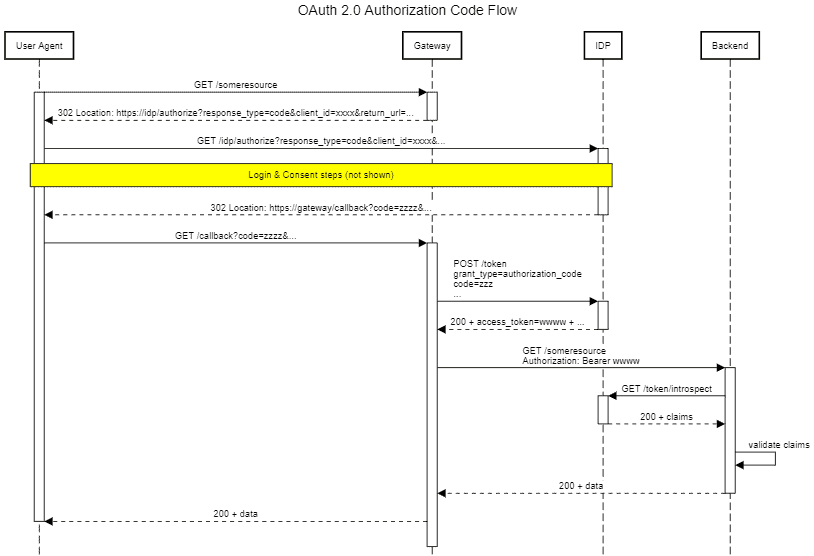
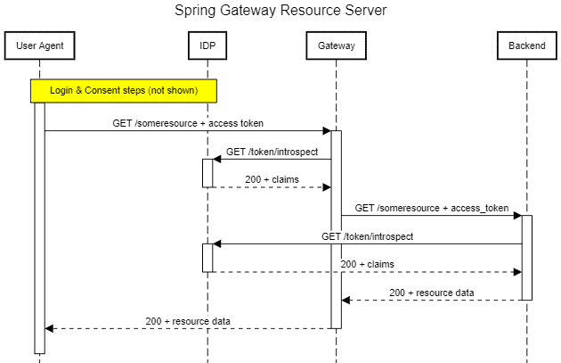

# [将 Spring 云网关与 OAuth 2.0 模式结合使用](https://www.baeldung.com/spring-cloud-gateway-oauth2)

1. 简介

    Spring Cloud Gateway 是一个允许我们快速创建基于 Spring Boot 的轻量级 API 网关的库，我们在前面的文章中已经介绍过它。

    这一次，我们将展示如何在其基础上快速实现 OAuth 2.0 模式。

2. OAuth 2.0 快速回顾

    OAuth 2.0 标准是一个成熟的标准，在互联网上广泛使用，是用户和应用程序安全访问资源的一种安全机制。

    虽然详细描述该标准超出了本文的范围，但我们还是先来快速回顾一下几个关键术语：

    - 资源(Resource)：只有经授权的客户端才能检索的任何类型的信息；
    - 客户端(Client)：消耗资源的应用程序，通常通过 REST API 消耗资源；
    - 资源服务器(Resource Server)：负责向授权客户端提供资源的服务；
    - 资源所有者(Resource Owner)：拥有资源的实体（人类或应用程序），最终负责向客户端授予资源访问权；
    - 令牌(Token)：客户端获取的信息，作为请求的一部分发送给资源服务器以验证其身份；
    - 身份供应商（Identity Provider, IdP）：验证用户凭证并向客户发放访问令牌；
    - 身份验证流程(Authentication Flow)：客户端获得有效令牌所必须经过的一系列步骤；

    要全面了解该标准，Auth0 的相关[文档](https://auth0.com/docs/get-started/authentication-and-authorization-flow)是一个很好的起点。

3. OAuth 2.0 模式

    Spring Cloud Gateway 主要用于以下角色之一：

    - OAuth Client
    - OAuth Resource Server

    让我们逐一详细讨论这些情况。

    1. Spring 云网关作为 OAuth 2.0 客户端

        在这种情况下，任何未经身份验证的传入请求都将启动一个授权码流。网关获取令牌后，就可以在向后端服务发送请求时使用该令牌：

        

        社交网络聚合应用程序就是这种模式的一个很好的应用实例：对于每个受支持的网络，网关都将充当 OAuth 2.0 客户端。

        因此，前端（通常是使用 Angular、React 或类似 UI 框架构建的 SPA 应用程序）可以代表最终用户无缝访问这些网络上的数据。更重要的是：用户无需向聚合器透露自己的凭据。

    2. 作为 OAuth 2.0 资源服务器的 Spring 云网关

        在这里，网关充当看门人的角色，在将每个请求发送到后端服务之前，强制确保该请求具有有效的访问令牌。此外，它还能根据相关作用域检查令牌是否具有访问给定资源的适当权限：

        

        需要注意的是，这种权限检查主要是在粗略的层面上进行。细粒度访问控制（如对象/领域级权限）通常在后端使用域逻辑实现。
        这种模式需要考虑的一个问题是，后端服务如何验证和授权任何转发请求。主要有两种情况：

        - 令牌传播(Token propagation)：API 网关将收到的令牌原封不动地转发到后端
        - 令牌替换(Token replacement)：API Gateway 在发送请求前用另一个令牌替换接收到的令牌。

        在本教程中，我们将只介绍令牌传播情况，因为这是最常见的情况。第二种情况也是可能的，但需要额外的设置和编码，这会分散我们的注意力，影响我们在这里要展示的要点。

4. 示例项目概述

    为了展示如何将 Spring Gateway 与我们迄今为止描述的 OAuth 模式结合使用，让我们构建一个示例项目来暴露一个端点： /quotes/{symbol}。访问该端点需要一个由配置的身份提供者签发的有效访问令牌。

    在本例中，我们将使用嵌入式 Keycloak 身份提供程序。唯一需要做的更改是添加一个新的客户端应用程序和几个用户进行测试。

    为了让事情更有趣一些，我们的后台服务将根据与请求相关联的用户返回不同的报价。拥有黄金角色的用户会得到较低的价格，而其他人则会得到正常价格（毕竟生活是不公平的）。

    我们将使用 Spring Cloud Gateway 对该服务进行前置，只需更改几行配置，就能将其角色从 OAuth 客户端转换为资源服务器。

5. 项目设置

    1. Keycloak IdP

        本教程将使用的嵌入式 Keycloak 只是一个普通的 SpringBoot 应用程序，我们可以从 GitHub 克隆并使用 Maven 构建它：

        ```shell
        git clone https://github.com/Baeldung/spring-security-oauth
        cd oauth-rest/oauth-authorization/server
        mvn install
        ```

        注意：该项目目前以 Java 13+ 为目标，但在 Java 11 下也能正常构建和运行。我们只需在 Maven 命令中添加 -Djava.version=11 即可。

        接下来，我们将把 src/main/resources/baeldung-domain.json 替换为这个[版本](https://github.com/eugenp/tutorials/blob/master/spring-cloud-modules/spring-cloud-gateway/baeldung-realm.json)。修改后的版本具有与原始版本相同的配置，另外还增加了一个客户端应用程序（quotes-client）、两个用户组（golden 和 silver_customers）以及两个角色（golden 和 silver）。

        现在，我们可以使用 spring-boot:run maven 插件启动服务器：

        ```shell
        $ mvn spring-boot:run
        ... many, many log messages omitted
        2022-01-16 10:23:20.318
        INFO 8108 --- [           main] c.baeldung.auth.AuthorizationServerApp   : Started AuthorizationServerApp in 23.815 seconds (JVM running for 24.488)
        2022-01-16 10:23:20.334
        INFO 8108 --- [           main] c.baeldung.auth.AuthorizationServerApp   : Embedded Keycloak started: http://localhost:8083/auth to use keycloak
        ```

        服务器启动后，我们可以将浏览器指向 <http://localhost:8083/auth/admin/master/console/#/realms/baeldung> 进行访问。使用管理员凭据（bael-admin/pass）登录后，我们将看到realm的管理界面。

        为了完成 IdP 设置，我们来添加几个用户。第一个用户是 Maxwell Smart，他是 golden_customer 组的成员。第二个用户是 John Snow，我们不会将其添加到任何组中。

        使用提供的配置，golden_customers 组的成员将自动承担黄金角色。

    2. 后台服务

        报价后台需要常规的 Spring Boot Reactive MVC 依赖项，外加资源服务器启动器依赖项：

        ```xml
        <dependency>
            <groupId>org.springframework.boot</groupId>
            <artifactId>spring-boot-starter-oauth2-resource-server</artifactId>
        </dependency>
        ```

        请注意，我们有意省略了依赖关系的版本。这是在依赖关系管理部分使用 SpringBoot 的父 POM 或相应 BOM 时推荐的做法。

        在主应用程序类中，我们必须使用 @EnableWebFluxSecurity 启用 Web 流量安全：

        ```java
        @SpringBootApplication
        @EnableWebFluxSecurity
        public class QuotesApplication {    
            public static void main(String[] args) {
                SpringApplication.run(QuotesApplication.class);
            }
        }
        ```

        端点实现使用提供的 BearerAuthenticationToken 来检查当前用户是否拥有黄金角色：

        

        现在，Spring 如何获取用户角色？毕竟，这不是像作用域或电子邮件那样的标准要求。事实上，这里并没有什么魔法：我们必须提供一个自定义的 ReactiveOpaqueTokenIntrospection，从 Keycloak 返回的自定义字段中提取这些角色。在线提供的这个 Bean 与 Spring [文档](https://docs.spring.io/spring-security/reference/servlet/oauth2/resource-server/opaque-token.html#oauth2resourceserver-opaque-authorization-extraction)中显示的基本相同，只是针对我们的自定义字段做了一些小改动。

        我们还必须提供访问身份提供程序所需的配置属性：

        ```properties
        spring.security.oauth2.resourceserver.opaquetoken.introspection-uri=http://localhost:8083/auth/realms/baeldung/protocol/openid-connect/token/introspect
        spring.security.oauth2.resourceserver.opaquetoken.client-id=quotes-client
        spring.security.oauth2.resourceserver.opaquetoken.client-secret=<CLIENT SECRET>
        ```

        最后，要运行应用程序，我们可以在集成开发环境中导入它，或者从 Maven 中运行它。为此，项目的 POM 中包含了一个配置文件：

        `$ mvn spring-boot:run -Pquotes-application`

        现在，应用程序就可以在 <http://localhost:8085/quotes> 上为请求提供服务了。我们可以使用 curl 检查它是否在响应：

        `$ curl -v http://localhost:8085/quotes/BAEL`

        不出所料，由于没有发送授权头，我们得到了 401 Unauthorized（未授权）响应。

6. 将 Spring Gateway 作为 OAuth 2.0 资源服务器

    确保作为资源服务器的 Spring Cloud Gateway [应用程序](https://mvnrepository.com/search?q=spring-cloud-starter-gateway)的安全与普通资源服务并无不同。因此，我们必须添加与后端服务相同的启动依赖关系，这一点并不奇怪：

    ```xml
    <dependency>
        <groupId>org.springframework.cloud</groupId>
        <artifactId>spring-cloud-starter-gateway</artifactId>
    </dependency>
    <dependency>
        <groupId>org.springframework.boot</groupId>
        <artifactId>spring-boot-starter-oauth2-resource-server</artifactId>
    </dependency>
    ```

    因此，我们还必须将 @EnableWebFluxSecurity 添加到启动类中：

    ```java
    @SpringBootApplication
    @EnableWebFluxSecurity
    public class ResourceServerGatewayApplication {
        public static void main(String[] args) {
            SpringApplication.run(ResourceServerGatewayApplication.class,args);
        }
    }
    ```

    与安全相关的配置属性与后台使用的相同：

    ```yml
    spring:
    security:
        oauth2:
        resourceserver:
            opaquetoken:
            introspection-uri: http://localhost:8083/auth/realms/baeldung/protocol/openid-connect/token/introspect
            client-id: quotes-client
            client-secret: <CLIENT SECRET>
    ```

    接下来，我们只需添加路由声明即可，方法与之前关于 Spring Cloud Gateway 设置的[文章](https://www.baeldung.com/spring-cloud-gateway)相同：

    ```yml
    ... other properties omitted
    cloud:
        gateway:
        routes:
        - id: quotes
            uri: http://localhost:8085
            predicates:
            - Path=/quotes/**
    ```

    请注意，除了安全依赖和属性外，网关本身没有任何变化。要运行网关应用程序，我们将使用 spring-boot:run，并使用带有所需设置的特定配置文件：

    `$ mvn spring-boot:run -Pgateway-as-resource-server`

    1. 测试资源服务器

        现在，我们已经拿到了拼图的所有部分，让我们把它们拼在一起吧。首先，我们必须确保 Keycloak、报价后台和网关都在运行。

        接下来，我们需要从 Keycloak 获取访问令牌。在这种情况下，最直接的方法就是使用密码授权流（又称 "资源所有者"）。这意味着向 Keycloak 发送 POST 请求，传递其中一个用户的用户名/密码，以及客户端 ID 和引用客户端应用程序的密文：

        ```shell
        $ curl -L -X POST \
        'http://localhost:8083/auth/realms/baeldung/protocol/openid-connect/token' \
        -H 'Content-Type: application/x-www-form-urlencoded' \
        --data-urlencode 'client_id=quotes-client' \
        --data-urlencode 'client_secret=0e082231-a70d-48e8-b8a5-fbfb743041b6' \
        --data-urlencode 'grant_type=password' \
        --data-urlencode 'scope=email roles profile' \
        --data-urlencode 'username=john.snow' \
        --data-urlencode 'password=1234'
        ```

        响应将是一个 JSON 对象，其中包含访问令牌和其他值：

        ```json
        {
            "access_token": "...omitted",
            "expires_in": 300,
            "refresh_expires_in": 1800,
            "refresh_token": "...omitted",
            "token_type": "bearer",
            "not-before-policy": 0,
            "session_state": "7fd04839-fab1-46a7-a179-a2705dab8c6b",
            "scope": "profile email"
        }
        ```

        现在我们可以使用返回的访问令牌访问 /quotes API：

        ```shell
        $ curl --location --request GET 'http://localhost:8086/quotes/BAEL' \
        --header 'Accept: application/json' \
        --header 'Authorization: Bearer xxxx...'
        ```

        这将产生一个 JSON 格式的报价：

        ```json
        {
        "symbol":"BAEL",
        "price":12.0
        }
        ```

        让我们重复这个过程，这次使用 Maxwell Smart 的访问令牌：

        ```json
        {
        "symbol":"BAEL",
        "price":10.0
        }
        ```

        我们看到价格降低了，这意味着后台能够正确识别相关用户。我们还可以使用不带授权标头的 curl 请求，检查未经身份验证的请求是否会传播到后台：

        `$ curl http://localhost:8086/quotes/BAEL`

        检查网关日志，我们发现没有与请求转发过程相关的信息。这表明响应是在网关生成的。

7. 将 Spring Gateway 作为 OAuth 2.0 客户端

    对于启动类，我们将使用与资源服务器版本相同的类。我们将用它来强调所有安全行为都来自可用库和属性。

    事实上，比较两个版本时，唯一明显的区别在于配置属性。在这里，我们需要使用 issuer-uri 属性或各种端点（授权、令牌和自省）的单独设置来配置提供程序的详细信息。

    我们还需要定义应用程序客户端注册详细信息，其中包括请求的作用域。这些作用域会告知 IdP 哪些信息项将通过自省机制提供：

    ```yml
    ... other propeties omitted
    security:
        oauth2:
        client:
            provider:
            keycloak:
                issuer-uri: http://localhost:8083/auth/realms/baeldung
            registration:
            quotes-client:
                provider: keycloak
                client-id: quotes-client
                client-secret: <CLIENT SECRET>
                scope:
                - email
                - profile
                - roles
    ```

    最后，路由定义部分有一个重要改动。我们必须在任何需要传播访问令牌的路由中添加 TokenRelay 过滤器：

    ```yml
    spring:
    cloud:
        gateway:
        routes:
        - id: quotes
            uri: http://localhost:8085
            predicates:
            - Path=/quotes/**
            filters:
            - TokenRelay=
    ```

    或者，如果我们希望所有路由都启动授权流，可以在默认过滤器（default-filters）部分添加 TokenRelay 过滤器：

    ```yml
    spring:
    cloud:
        gateway:
        default-filters:
        - TokenRelay=
        routes:
    ... other routes definition omitted
    ```

    1. 测试 Spring Gateway 作为 OAuth 2.0 客户端

        在测试设置中，我们还需要确保项目的三个部分都在运行。不过，这次我们将使用不同的 [Spring 配置文件](https://www.baeldung.com/spring-profiles)来运行网关，该配置文件包含使网关成为 OAuth 2.0 客户端所需的属性。示例项目的 POM 中包含一个配置文件，我们可以使用该配置文件启动项目：

        `$ mvn spring-boot:run -Pgateway-as-oauth-client`

        网关运行后，我们可以将浏览器指向 <http://localhost:8087/quotes/BAEL> 进行测试。如果一切正常，我们将被重定向到 IdP 的登录页面。

        由于我们使用了 Maxwell Smart 的凭据，我们再次获得了一个价格更低的报价。

        为了结束测试，我们将使用匿名/隐身浏览器窗口，并使用 John Snow 的凭据测试该端点。这次我们得到的是常规报价。

8. 结论

    在本文中，我们探讨了一些 OAuth 2.0 安全模式以及如何使用 Spring Cloud Gateway 实现这些模式。
