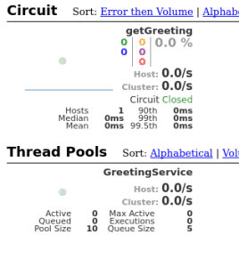

# [Spring Cloud Netflix 指南 - Hystrix](https://www.baeldung.com/spring-cloud-netflix-hystrix)

1. 概述

    在本教程中，我们将介绍 Spring Cloud Netflix Hystrix（容错库）。我们将使用该库并实现断路器企业模式，该模式描述了针对应用程序中不同级别故障级联的策略。

    其原理类似于电子技术： [Hystrix](https://www.baeldung.com/introduction-to-hystrix) 正在监视相关服务调用失败的方法。如果出现这种故障，它就会打开电路，并将调用转发给后备方法。

    该库可容忍的故障最高可达阈值。超过阈值后，它将保持电路开放。这意味着，它将把所有后续调用转发给后备方法，以防止未来发生故障。这就为相关服务从故障状态恢复创造了缓冲时间。

2. REST 生产者

    要创建一个演示断路器模式的场景，我们首先需要一个服务。我们将其命名为 “REST生产者”，因为它为下一步创建的支持 Hystrix 的 “REST 消费者” 提供数据。

    让我们使用 Spring-boot-starter-web 依赖关系创建一个新的 Maven 项目：

    ```xml
    <dependency>
        <groupId>org.springframework.boot</groupId>
        <artifactId>spring-boot-starter-web</artifactId>
        <version>2.2.6.RELEASE</version>
    </dependency>
    ```

    项目本身有意保持简单。它由一个控制器接口（带有一个 [@RequestMapping](https://www.baeldung.com/spring-requestmapping) 注解的 GET 方法，仅返回一个字符串）、一个实现该接口的 @RestController 和一个 [@SpringBootApplication](https://www.baeldung.com/spring-boot-application-configuration) 组成。

    我们从接口开始：

    main/.spring.cloud.hystrix.rest.producer/GreetingController.java

    以及实现：

    main/.spring.cloud.hystrix.rest.producer/GreetingControllerImpl.java

    接下来，我们将编写主应用程序类：

    main/.spring.cloud.hystrix.rest.producer/RestProducerApplication.java

    要完成这一部分，剩下要做的就是配置我们要监听的应用程序端口。我们不会使用默认的 8080 端口，因为该端口应保留给下一步描述的应用程序使用。

    此外，我们还要定义一个应用程序名称，以便从稍后介绍的客户端应用程序中查找我们的生产者。

    让我们在 application.properties 文件中指定端口为 9090，名称为 rest-producer。

    现在，我们可以使用 cURL 测试我们的生产者了：

    `$> curl http://localhost:9090/greeting/Cid`

3. 使用 使用 Hystrix 的 REST 消费者

    在演示场景中，我们将使用 RestTemplate 和 Hystrix 实现一个网络应用程序，该程序将消费上一步中的 REST 服务。为简单起见，我们称其为 “REST Consumer”。

    因此，我们创建一个新的 Maven 项目，并将 spring-cloud-starter-hystrix、spring-boot-starter-web 和 spring-boot-starter-thymeleaf 作为依赖项：

    ```xml
    <dependency>
        <groupId>org.springframework.cloud</groupId>
        <artifactId>spring-cloud-starter-hystrix</artifactId>
        <version>1.4.7.RELEASE</version>
    </dependency>
    <dependency>
        <groupId>org.springframework.boot</groupId>
        <artifactId>spring-boot-starter-web</artifactId>
        <version>2.2.6.RELEASE</version>
    </dependency>
    <dependency>
        <groupId>org.springframework.boot</groupId>
        <artifactId>spring-boot-starter-thymeleaf</artifactId>
        <version>2.2.6.RELEASE</version>
    </dependency>
    ```

    为了让断路器工作，Hystix 会扫描 @Component 或 @Service 注解类中的 @HystixCommand 注解方法，为其实现代理并监控其调用。

    我们将首先创建一个 @Service 类，并将其注入到 @Controller 中。由于我们使用 Thymeleaf 构建的是网络应用，因此还需要一个 HTML 模板作为视图。

    这将是我们的可注入 @Service 实现 @HystrixCommand 以及相关的回退方法。回退方法必须使用与原始方法相同的签名：

    main/.spring.cloud.hystrix.rest.consumer/GreetingService.java

    我们将使用 GreetingService 设置控制器：

    main/.spring.cloud.hystrix.rest.consumer/GreetingController.java

    下面是 HTML 模板：

    ```html
    <!DOCTYPE html>
    <html xmlns:th="http://www.thymeleaf.org">
        <head>
            <title>Greetings from Hystrix</title>
        </head>
        <body>
            <h2 th:text="${greeting}"/>
        </body>
    </html>
    ```

    为确保应用程序在定义的端口上监听，我们在 application.properties 文件中加入以下内容：

    `server.port=8080`

    为了查看 Hystix 断路器的运行情况，我们启动消费者，将浏览器指向 <http://localhost:8080/get-greeting/Cid> 正常情况下，将显示如下内容：Hello Cid!

    要模拟生产者发生故障，我们只需停止生产者，然后刷新浏览器，就会看到从 @Service 中的回退方法返回的通用消息：Hello User!

4. Hystrix 和 Feign 的 REST 消费者

    现在，我们要修改上一步的项目，使用 Spring Netflix Feign 代替 Spring RestTemplate 作为声明式 REST 客户端。

    这样做的好处是，我们以后可以轻松重构 Feign 客户端接口，使用 [Spring Netflix Eureka](https://www.baeldung.com/spring-cloud-netflix-eureka) 进行服务发现。

    为了启动新项目，我们将复制消费者，并添加生产者和 Spring-cloud-starter-feign 作为依赖项：

    ```xml
    <dependency>
        <groupId>com.baeldung.spring.cloud</groupId>
        <artifactId>spring-cloud-hystrix-rest-producer</artifactId>
        <version>1.0.0-SNAPSHOT</version>
    </dependency>
    <dependency>
        <groupId>org.springframework.cloud</groupId>
        <artifactId>spring-cloud-starter-feign</artifactId>
        <version>1.1.5.RELEASE</version>
    </dependency>
    ```

    现在，我们可以使用 GreetingController 来扩展 Feign 客户端。我们将以静态内部类的形式实现 Hystrix 回退，并用 @Component 加以注解。

    或者，我们也可以定义一个 @Bean 注解方法，返回该回退类的实例。

    @FeignClient 的 name 属性是必须的。如果给定了该属性，它将用于通过 Eureka 客户端的服务发现或通过 URL 查找应用程序：

    [main/.spring.cloud.hystrix.rest.consumer/GreetingClient](./spring-cloud-hystrix-feign-rest-consumer/src/main/java/com/baeldung/spring/cloud/hystrix/rest/consumer/GreetingClient.java)

    有关使用 Spring Netflix Eureka 进行服务发现的更多信息，请[参阅本文](https://www.baeldung.com/spring-cloud-netflix-eureka)。

    在 RestConsumerFeignApplication 中，我们将在主应用程序类中添加一个额外的注解来启用 Feign 集成，实际上就是 @EnableFeignClients：

    main/.spring.cloud.hystrix.rest.consumer/RestConsumerFeignApplication.java

    我们将修改控制器，使用自动连接的 Feign Client（而不是之前注入的 @Service）来获取问候语：

    [main/.spring.cloud.hystrix.rest.consumer/GreetingController.java](./spring-cloud-hystrix-feign-rest-consumer/src/main/java/com/baeldung/spring/cloud/hystrix/rest/consumer/GreetingController.java)

    为了将本示例与前一示例区分开来，我们将更改 application.properties 中的应用程序监听端口：

    `server.port=8082`

    最后，我们将像上一节一样测试这个启用了 Feign 的消费者。预期结果应该是一样的。

5. 使用 Hystrix 实现缓存回退

    现在，我们要将 Hystrix 添加到 [Spring Cloud ](https://www.baeldung.com/spring-cloud-securing-services)项目中。在这个云项目中，我们有一个评级服务，它与数据库对话并获取书籍的评级。

    假设我们的数据库是一个有需求的资源，它的响应延迟可能在时间上有所不同，也可能在时间上不可用。我们将使用 Hystrix 断路器回退到数据缓存来处理这种情况。

    1. 设置和配置

        让我们在评级模块中添加 Spring-cloud-starter-hystrix 依赖关系：

        ```xml
        <dependency>
            <groupId>org.springframework.cloud</groupId>
            <artifactId>spring-cloud-starter-hystrix</artifactId>
        </dependency>
        ```

        在数据库中插入/更新/删除评级时，我们将通过 Repository 将同样的内容复制到 Redis 缓存中。要了解有关 Redis 的更多信息，请查看本文。

        让我们更新 RatingService，用 @HystrixCommand 命令将数据库查询方法封装在 Hystrix 命令中，并配置为从 Redis 读取的回退：

        ```java
        @HystrixCommand(
        commandKey = "ratingsByIdFromDB", 
        fallbackMethod = "findCachedRatingById", 
        ignoreExceptions = { RatingNotFoundException.class })
        public Rating findRatingById(Long ratingId) {
            return Optional.ofNullable(ratingRepository.findOne(ratingId))
            .orElseThrow(() -> 
                new RatingNotFoundException("Rating not found. ID: " + ratingId));
        }

        public Rating findCachedRatingById(Long ratingId) {
            return cacheRepository.findCachedRatingById(ratingId);
        }
        ```

        请注意，回退方法应具有与封装方法相同的签名，并且必须位于同一个类中。现在，当 findRatingById 失败或延迟超过给定阈值时，Hystrix 会回退到 findCachedRatingById。

        由于 Hystrix 功能是作为 AOP 建议(advice)透明注入的，我们必须调整建议的堆叠顺序，以防有其他建议（如 Spring 的事务建议）。在这里，我们调整了 Spring 的事务 AOP 建议，使其优先级低于 Hystrix AOP 建议：

        ```java
        @EnableHystrix
        @EnableTransactionManagement(
        order=Ordered.LOWEST_PRECEDENCE, 
        mode=AdviceMode.ASPECTJ)
        public class RatingServiceApplication {
            @Bean
            @Primary
            @Order(value=Ordered.HIGHEST_PRECEDENCE)
            public HystrixCommandAspect hystrixAspect() {
                return new HystrixCommandAspect();
            }
            // other beans, configurations
        }
        ```

        在此，我们调整了 Spring 的事务 AOP 建议，使其优先级低于 Hystrix AOP 建议。

    2. 测试 Hystrix 回退

        现在，我们已经配置好了电路，可以通过关闭与存储库交互的 H2 数据库来测试它。但首先，让我们将 H2 实例作为外部进程运行，而不是作为嵌入式数据库运行。

        将 H2 库（h2-1.4.193.jar）复制到已知目录，然后启动 H2 服务器：

        ```bash
        >java -cp h2-1.4.193.jar org.h2.tools.Server -tcp
        TCP server running at tcp://192.168.99.1:9092 (only local connections)
        ```

        现在，让我们更新 rating-service.properties 中模块的数据源 URL，使其指向该 H2 服务器：

        `spring.datasource.url = jdbc:h2:tcp://localhost/~/ratings`

        我们可以按照 Spring Cloud 系列上一篇[文章](https://www.baeldung.com/spring-cloud-bootstrapping)中的说明启动我们的服务，并通过关闭我们正在运行的外部 H2 实例来测试每本书的评分。

        我们可以看到，当 H2 数据库无法访问时，Hystrix 会自动回退到 Redis 读取每本书的评分。在[这里](https://github.com/eugenp/tutorials/tree/master/spring-cloud-modules/spring-cloud-bootstrap)可以找到演示此用例的源代码。

6. 使用作用域

    通常，@HytrixCommand 注释的方法在线程池上下文中执行。但有时它需要在本地作用域（例如 @SessionScope 或 @RequestScope）中运行。这可以通过为命令注解提供参数来实现：

    ```java
    @HystrixCommand(fallbackMethod = "getSomeDefault", commandProperties = {
    @HystrixProperty(name = "execution.isolation.strategy", value = "SEMAPHORE")
    })
    ```

7. Hystrix 控制面板

    Hystrix 的一个不错的可选功能是在仪表盘上监控其状态。

    为了启用它，我们将在消费者的 pom.xml 中加入 spring-cloud-starter-hystrix-dashboard 和 spring-boot-starter-actuator：

    ```xml
    <dependency>
        <groupId>org.springframework.cloud</groupId>
        <artifactId>spring-cloud-starter-hystrix-dashboard</artifactId>
        <version>1.4.7.RELEASE</version>
    </dependency>
    <dependency>
        <groupId>org.springframework.boot</groupId>
        <artifactId>spring-boot-starter-actuator</artifactId>
        <version>2.2.6.RELEASE</version>
    </dependency>
    ```

    前者需要通过在 @Configuration 中注释 @EnableHystrixDashboard 来启用，后者则会在我们的网络应用程序中自动启用所需的指标。

    重启应用程序后，我们将浏览器指向 <http://localhost:8080/hystrix> ，输入 Hystrix 数据流的度量 URL 并开始监控。

    最后，我们应该会看到类似下面这样的内容：

    

    监控一个 Hystrix 数据流没什么问题，但如果要监控多个支持 Hystrix 的应用程序，就会变得很不方便。为此，Spring Cloud 提供了一个名为 Turbine 的工具，它可以聚合流，在一个 Hystrix 面板中显示。

    配置 Turbine 不在本文讨论范围之内，但应在此提及这种可能性。因此，也可以使用 Turbine 流通过消息收集这些流。

8. 总结

    正如我们到目前为止所看到的，我们现在可以使用 Spring Netflix Hystrix 和 Spring RestTemplate 或 Spring Netflix Feign 来实现断路器模式。这意味着我们能够使用默认数据消费包含回退功能的服务，并且能够监控这些数据的使用情况。
