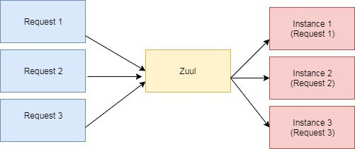

# [使用 Zuul 和 Eureka 实现负载平衡的实例](https://www.baeldung.com/zuul-load-balancing)

1. 概述

    本文将介绍如何使用 Zuul 和 Eureka 实现[负载平衡](https://www.baeldung.com/cs/load-balancer)。

    我们将通过 Zuul 代理将请求路由到 Spring Cloud Eureka 发现的 REST 服务。

2. 初始设置

    我们需要按照 [Spring Cloud Netflix-Eureka](https://www.baeldung.com/spring-cloud-netflix-eureka) 一文所示设置 Eureka 服务器/客户端。

3. 配置 Zuul

    Zuul 除其他许多功能外，还可从 Eureka 服务位置获取内容并进行服务器端负载平衡。

    1. Maven 配置

        首先，我们要在 pom.xml 中添加 Zuul 服务器和 Eureka 的依赖关系：

        ```xml
        <dependency>
            <groupId>org.springframework.cloud</groupId>
            <artifactId>spring-cloud-starter-netflix-zuul</artifactId>
        </dependency>
        <dependency>
            <groupId>org.springframework.cloud</groupId>
            <artifactId>spring-cloud-starter-netflix-eureka-client</artifactId>
        </dependency>
        ```

    2. 与 Eureka 通信

        其次，我们将在 Zuul 的 [application.properties](./zuul-server/src/main/resources/application.properties) 文件中添加必要的属性。

        在这里，我们告诉 Zuul 在 Eureka 中将自己注册为服务，并在 8762 端口运行。

        接下来，我们将使用 @EnableZuulProxy 和 @EnableDiscoveryClient 实现主类。@EnableZuulProxy 表示这是 Zuul 服务器，而 @EnableDiscoveryClient 表示这是 Eureka 客户端：

        public class [ZuulConfig](./zuul-server/src/main/java/com/baeldung/spring/cloud/zuul/config/ZuulConfig.java)

        我们将浏览器指向 <http://localhost:8762/routes。这将显示>示 Eureka 发现的 Zuul 所有可用路由：

        `{"/spring-cloud-eureka-client/**":"spring-cloud-eureka-client"}`

        现在，我们将使用获得的 Zuul 代理路由与 Eureka 客户端通信。将我们的浏览器指向 <http://localhost:8762/spring-cloud-eureka-client/greeting> 应该会产生类似的响应：

        `Hello from 'SPRING-CLOUD-EUREKA-CLIENT with Port Number 8081'!`

4. 使用 Zuul 实现负载平衡

    当 Zuul 收到请求时，它会从可用的物理位置中选择一个，并将请求转发到实际的服务实例。缓存服务实例位置并将请求转发到实际位置的整个过程都是开箱即用，无需额外配置。

    在这里，我们可以看到 Zuul 是如何封装同一服务的三个不同实例的：

    

    在内部，Zuul 使用 Netflix Ribbon 从服务发现（Eureka 服务器）中查找服务的所有实例。

    让我们观察一下多个实例出现时的行为。

    1. 注册多个实例

        我们先运行两个实例（8081 和 8082 端口）。

        所有实例启动后，我们可以从日志中观察到实例的物理位置已在 DynamicServerListLoadBalancer 中注册，路由已映射到 Zuul Controller，后者负责将请求转发到实际实例：

        ```log
        Mapped URL path [/spring-cloud-eureka-client/**] onto handler of type [class org.springframework.cloud.netflix.zuul.web.ZuulController]
        Client:spring-cloud-eureka-client instantiated a LoadBalancer:
        DynamicServerListLoadBalancer:{NFLoadBalancer:name=spring-cloud-eureka-client,
        current list of Servers=[],Load balancer stats=Zone stats: {},Server stats: []}ServerList:null
        Using serverListUpdater PollingServerListUpdater
        DynamicServerListLoadBalancer for client spring-cloud-eureka-client initialized: 
        DynamicServerListLoadBalancer:{NFLoadBalancer:name=spring-cloud-eureka-client,
        current list of Servers=[0.0.0.0:8081, 0.0.0.0:8082],
        Load balancer stats=Zone stats: {defaultzone=[Zone:defaultzone;	Instance count:2;	
        Active connections count: 0;	Circuit breaker tripped count: 0;	
        Active connections per server: 0.0;]},
        Server stats: 
            [[Server:0.0.0.0:8080;	Zone:defaultZone;......],
            [Server:0.0.0.0:8081;	Zone:defaultZone; ......],
        ```

        注：为提高可读性，对日志进行了格式化。

    2. 负载平衡示例

        让我们将浏览器导航到 <http://localhost:8762/spring-cloud-eureka-client/greeting> 上几次。

        每次看到的结果都会略有不同：

        Hello from 'SPRING-CLOUD-EUREKA-CLIENT with Port Number 8081'!
        Hello from 'SPRING-CLOUD-EUREKA-CLIENT with Port Number 8082'!
        Hello from 'SPRING-CLOUD-EUREKA-CLIENT with Port Number 8081'!

        Zuul 收到的每个请求都会以循环方式转发到不同的实例。

        如果我们启动另一个实例并在 Eureka 中注册，Zuul 会自动注册它并开始将请求转发给它：

        `Hello from 'SPRING-CLOUD-EUREKA-CLIENT with Port Number 8083'!`

        我们还可以将 Zuul 的负载平衡策略更改为任何其他 Netflix Ribbon 策略，更多信息请参阅我们的 Ribbon 文章。

5. 结论

    正如我们所见，Zuul 为休息服务的所有实例提供了一个 URL，并通过负载均衡以循环方式将请求转发到其中一个实例。
