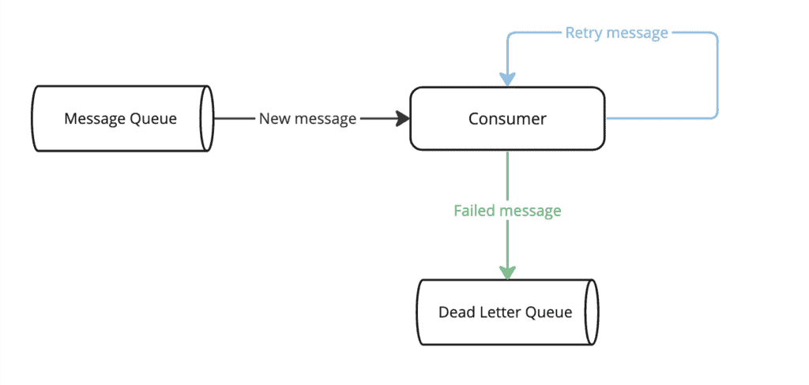

# [卡夫卡与Spring的死信队列](https://www.baeldung.com/kafka-spring-dead-letter-queue)

1. 简介

    在本教程中，我们将学习如何使用 Spring 为 Apache Kafka 配置死信队列机制。

2. 死信队列

    死信队列（DLQ）用于存储由于各种原因（如间歇性系统故障、消息模式无效或内容损坏）而无法正确处理的消息。这些报文稍后可从 DLQ 中删除，以便进行分析或重新处理。

    下图是 DLQ 机制的简化流程：

    

    使用 DLQ 通常是个好主意，但在某些情况下还是应该避免。例如，如果队列中报文的确切顺序很重要，则不建议使用 DLQ，因为重新处理 DLQ 报文会破坏报文到达时的顺序。

3. Spring Kafka 中的死信队列

    Spring Kafka 中与 DLQ 概念相对应的是死信队列（Dead Letter Topic，DLT）。在下面的章节中，我们将看到 DLT 机制如何在一个简单的支付系统中发挥作用。

    1. 模型类

        让我们从模型类开始：

        main/.spring.kafka.dlt/Payment.java

        我们还要实现一个用于创建事件的实用方法：

        main/.spring.kafka.dlt/PaymentTestUtils.java:createPayment(String reference)

    2. 设置

        接下来，让我们添加所需的 Spring-kafka 和 jackson-databind 依赖项：

        ```xml
        <dependency>
            <groupId>org.springframework.kafka</groupId>
            <artifactId>spring-kafka</artifactId>
            <version>3.1.2</version> </dependency>
        <dependency>
            <groupId>com.fasterxml.jackson.core</groupId>
            <artifactId>jackson-databind</artifactId>
            <version>2.14.3</version>
        </dependency>
        ```

        现在我们可以创建 ConsumerFactory 和 ConcurrentKafkaListenerContainerFactory Bean：

        main/.spring.kafka.dlt/KafkaConsumerConfig.java:consumerFactory()

        main/.spring.kafka.dlt/KafkaConsumerConfig.java:containerFactory()

        最后，让我们来实现主主题的消费者：

        ```java
        @KafkaListener(topics = { "payments" }, groupId = "payments")
        public void handlePayment(
        Payment payment, @Header(KafkaHeaders.RECEIVED_TOPIC) String topic) {
            log.info("Event on main topic={}, payload={}", topic, payment);
        }
        ```

        在继续讨论 DLT 示例之前，我们先讨论重试配置。

    3. 关闭重试

        在实际项目中，在将事件发送到 DLT 之前，如果出现错误，重试处理是很常见的。使用 Spring Kafka 提供的[非阻塞重试机制](https://www.baeldung.com/spring-retry-kafka-consumer)可以轻松实现这一点。

        不过，在本文中，我们将关闭重试，以突出 DLT 机制。当主主题的消费者处理失败时，事件将直接发布到 DLT。

        首先，我们需要定义 producerFactory 和 retryableTopicKafkaTemplate Bean：

        main/.spring.kafka.dlt/KafkaRetryConfig.java:producerFactory()

        main/.spring.kafka.dlt/KafkaRetryConfig.java:retryableTopicKafkaTemplate()

        现在我们可以定义主主题的消费者，无需额外重试，如前所述：

        ```java
        @RetryableTopic(attempts = "1", kafkaTemplate = "retryableTopicKafkaTemplate")
        @KafkaListener(topics = { "payments"}, groupId = "payments")
        public void handlePayment(
        Payment payment, @Header(KafkaHeaders.RECEIVED_TOPIC) String topic) {
            log.info("Event on main topic={}, payload={}", topic, payment);
        }
        ```

        @RetryableTopic 注解中的 attempts 属性表示将消息发送到 DLT 之前尝试的次数。

4. 配置死信主题

    现在我们准备实现 DLT 消费者：

    ```java
    @DltHandler
    public void handleDltPayment(
    Payment payment, @Header(KafkaHeaders.RECEIVED_TOPIC) String topic) {
        log.info("Event on dlt topic={}, payload={}", topic, payment);
    }
    ```

    带有 @DltHandler 注解的方法必须与带有 @KafkaListener 注解的方法放在同一个类中。

    在下面的章节中，我们将探讨 Spring Kafka 中可用的三种 DLT 配置。我们将为每种策略使用专门的主题和消费者，以便于逐一了解每个示例。

    1. 出错即失败的 DLT

        使用 FAIL_ON_ERROR 策略，我们可以配置 DLT 消费者在 DLT 处理失败时结束执行而不重试：

        ```java
        @RetryableTopic(
        attempts = "1", 
        kafkaTemplate = "retryableTopicKafkaTemplate", 
        dltStrategy = DltStrategy.FAIL_ON_ERROR)
        @KafkaListener(topics = { "payments-fail-on-error-dlt"}, groupId = "payments")
        public void handlePayment(
        Payment payment, @Header(KafkaHeaders.RECEIVED_TOPIC) String topic) {
            log.info("Event on main topic={}, payload={}", topic, payment);
        }

        @DltHandler
        public void handleDltPayment(
        Payment payment, @Header(KafkaHeaders.RECEIVED_TOPIC) String topic) {
            log.info("Event on dlt topic={}, payload={}", topic, payment);
        }
        ```

        值得注意的是，@KafkaListener 消费者从 payments-fail-on-error-dlt 主题读取消息。

        让我们验证一下，当主消费者成功时，事件是否没有发布到 DLT：

        ```java
        @Test
        public void whenMainConsumerSucceeds_thenNoDltMessage() throws Exception {
            CountDownLatch mainTopicCountDownLatch = new CountDownLatch(1);

            doAnswer(invocation -> {
                mainTopicCountDownLatch.countDown();
                return null;
            }).when(paymentsConsumer)
                .handlePayment(any(), any());

            kafkaProducer.send(TOPIC, createPayment("dlt-fail-main"));

            assertThat(mainTopicCountDownLatch.await(5, TimeUnit.SECONDS)).isTrue();
            verify(paymentsConsumer, never()).handleDltPayment(any(), any());
        }
        ```

        让我们看看当主消费者和 DLT 消费者都无法处理事件时会发生什么：

        test/.spring.kafka.dlt/KafkaDltManualTest.java:whenDltConsumerFails_thenDltProcessingStops()

        在上述测试中，主消费者处理了一次事件，DLT 消费者只处理了一次。

    2. DLT 重试

        我们可以使用 ALWAYS_RETRY_ON_ERROR 策略配置 DLT 消费者，以便在 DLT 处理失败时尝试重新处理该事件。这是默认使用的策略：

        ```java
        @RetryableTopic(
        attempts = "1", 
        kafkaTemplate = "retryableTopicKafkaTemplate", 
        dltStrategy = DltStrategy.ALWAYS_RETRY_ON_ERROR)
        @KafkaListener(topics = { "payments-retry-on-error-dlt"}, groupId = "payments")
        public void handlePayment(
        Payment payment, @Header(KafkaHeaders.RECEIVED_TOPIC) String topic) {
            log.info("Event on main topic={}, payload={}", topic, payment);
        }

        @DltHandler
        public void handleDltPayment(
        Payment payment, @Header(KafkaHeaders.RECEIVED_TOPIC) String topic) {
            log.info("Event on dlt topic={}, payload={}", topic, payment);
        }
        ```

        值得注意的是，@KafkaListener 消费者会从 payments-retry-on-error-dlt 主题读取消息。

        接下来，让我们测试一下当主消费者和 DLT 消费者无法处理事件时会发生什么：

        test/.spring.kafka.dlt/KafkaDltManualTest.java:whenDltConsumerFails_thenDltConsumerRetriesMessage()

        不出所料，DLT 消费者会尝试重新处理该事件。

    3. 禁用 DLT

        也可以使用 NO_DLT 策略关闭 DLT 机制：

        ```java
        @RetryableTopic(
        attempts = "1", 
        kafkaTemplate = "retryableTopicKafkaTemplate", 
        dltStrategy = DltStrategy.NO_DLT)
        @KafkaListener(topics = { "payments-no-dlt" }, groupId = "payments")
        public void handlePayment(
        Payment payment, @Header(KafkaHeaders.RECEIVED_TOPIC) String topic) {
            log.info("Event on main topic={}, payload={}", topic, payment);
        }

        @DltHandler
        public void handleDltPayment(
        Payment payment, @Header(KafkaHeaders.RECEIVED_TOPIC) String topic) {
            log.info("Event on dlt topic={}, payload={}", topic, payment);
        }
        ```

        值得注意的是，@KafkaListener 消费者从 payments-no-dlt 主题读取消息。

        让我们检查一下，当主主题上的消费者无法处理某个事件时，该事件是否会被转发到 DLT：

        test/.spring.kafka.dlt/KafkaDltManualTest.java:whenMainConsumerFails_thenDltConsumerDoesNotReceiveMessage()

        不出所料，虽然我们实现了一个注释为 @DltHandler 的消费者，但事件并未转发到 DLT。

5. 结论

    在本文中，我们学习了三种不同的 DLT 策略。第一种是 FAIL_ON_ERROR 策略，即 DLT 消费者不会在发生故障时尝试重新处理某个事件。相比之下，ALWAYS_RETRY_ON_ERROR 策略可确保 DLT 消费者在发生故障时尝试重新处理事件。在没有明确设置其他策略的情况下，这是默认使用的值。最后一种是 NO_DLT 策略，它可以完全关闭 DLT 机制。
