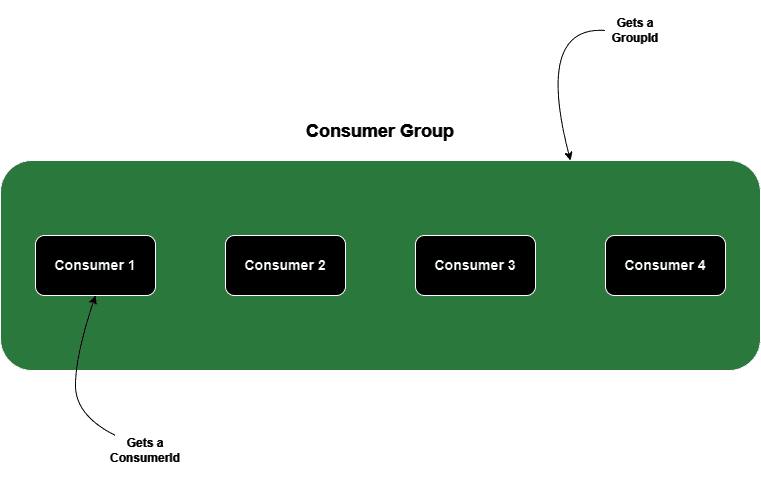

# [Apache Kafka 中 GroupId 和 ConsumerId 的区别](https://www.baeldung.com/apache-kafka-groupid-vs-consumerid)

[Data](https://www.baeldung.com/category/data)

[Kafka](https://www.baeldung.com/tag/kafka)

1. 简介

    在本教程中，我们将阐明 Apache Kafka 中 GroupId 和 ConsumerId 的区别，这对于理解如何正确设置消费者非常重要。此外，我们还将讨论 ClientId 和 ConsumerId 的区别，并了解它们之间的关系。

2. 消费者组

    在探讨 Apache Kafka 中标识符类型之间的差异之前，我们先来了解一下消费者组。

    消费者组由多个消费者组成，他们共同消费来自一个或多个主题的消息，完成并行消息处理。在分布式 Kafka 环境中，消费者组可以实现消息的可扩展性、容错性和高效并行处理。

    最重要的是，组内的每个消费者只负责处理其主题的一个子集，即所谓的分区。

3. 了解标识符

    接下来，让我们从高层定义本教程中考虑的所有标识符：

    - GroupId 唯一标识一个用户组。
    - ClientId 唯一标识传递给服务器的请求。
    - ConsumerId 分配给消费者组中的单个消费者，是 client.id 消费者属性和消费者唯一标识符的组合。

    

4. 标识符的目的

    接下来，让我们了解每个标识符的用途。

    GroupId 是负载平衡机制的核心，可以在消费者之间分配分区。消费者组管理同一组内消费者之间的协调、负载平衡和分区分配。Kafka 确保在任何时候都只有一个消费者能访问每个分区。如果组内的某个消费者出现故障，Kafka 会无缝地将分区重新分配给其他消费者，以保持消息处理的连续性。

    Kafka 使用 ConsumerIds 来确保组内的每个消费者在与 Kafka 代理交互时都是唯一可识别的。该标识符完全由 Kafka 管理，用于管理消费者偏移和跟踪分区消息的处理进度。

    最后，ClientId 可跟踪请求的来源，而不仅仅是 IP/port，它允许开发人员配置逻辑应用程序名称，该名称将包含在服务器端请求日志中。因为我们可以控制这个值，所以我们可以创建两个具有相同 ClientId 的独立客户端。不过，在这种情况下，Kafka 生成的 ConsumerId 会有所不同。

5. 配置 GroupId 和 ConsumerId

    1. 使用 Spring Kafka

        让我们在 Spring Kafka 中为消费者定义 GroupId 和 ConsumerId。我们将利用 @KafkaListener 注解来实现这一点：

        src/.spring.kafka.groupId/MyKafkaConsumer.java: receive()

        请注意，我们将 groupId 属性指定为我们选择的任意值。

        此外，我们还将 clientIdPrefix 属性设置为包含自定义前缀。让我们检查应用程序日志，验证 ConsumerId 是否包含此前缀：

        `c.b.s.kafka.groupId.MyKafkaConsumer      : Consumer='neo-1-bae916e4-eacb-485a-9c58-bc22a0eb6187' received payload='Test 123...'`

        consumerId 也称为 memberId，其值遵循特定模式。它以 clientIdPrefix 开头，然后是一个基于组内消费者数量的计数器，最后是一个 UUID。

    2. 使用 Kafka CLI

        我们也可以通过 CLI 配置 GroupId 和 ConsumerId。我们将使用 kafka-console-consumer.sh 脚本。让我们启动一个控制台消费者，将 group.id 设置为 test-consumer-group，将 client.id 属性设置为 `neo<sequence_number>`：

        `$ kafka-console-consumer.sh --bootstrap-server localhost:9092 --topic Test --group test-consumer-group --consumer-property "client.id=neo-1"`

        在这种情况下，我们必须确保为每个客户端分配一个唯一的 client.id。这种行为与 Spring Kafka 不同，在 Spring Kafka 中，我们设置 clientIdPrefix，然后框架会为其添加一个序列号。如果我们描述消费者组，就会看到 Kafka 为每个消费者生成的 ConsumerId：

        `kafka-consumer-groups.sh --bootstrap-server localhost:9092 --group test-consumer-group --describe`

        ```log
        GROUP               TOPIC           PARTITION  CURRENT-OFFSET  LOG-END-OFFSET  LAG             CONSUMER-ID                                HOST            CLIENT-ID
        test-consumer-group Test            0          0               0               0               neo-1-975feb3f-9e5a-424b-9da3-c2ec3bc475d6 /127.0.0.1      neo-1
        test-consumer-group Test            1          0               0               0               neo-1-975feb3f-9e5a-424b-9da3-c2ec3bc475d6 /127.0.0.1      neo-1
        test-consumer-group Test            2          0               0               0               neo-1-975feb3f-9e5a-424b-9da3-c2ec3bc475d6 /127.0.0.1      neo-1
        test-consumer-group Test            3          0               0               0               neo-1-975feb3f-9e5a-424b-9da3-c2ec3bc475d6 /127.0.0.1      neo-1
        test-consumer-group Test            7          0               0               0               neo-3-09b8d4ee-5f03-4386-94b1-e068320b5e6a /127.0.0.1      neo-3
        test-consumer-group Test            8          0               0               0               neo-3-09b8d4ee-5f03-4386-94b1-e068320b5e6a /127.0.0.1      neo-3
        test-consumer-group Test            9          0               0               0               neo-3-09b8d4ee-5f03-4386-94b1-e068320b5e6a /127.0.0.1      neo-3
        test-consumer-group Test            4          0               0               0               neo-2-6a39714e-4bdd-4ab8-bc8c-5463d78032ec /127.0.0.1      neo-2
        test-consumer-group Test            5          0               0               0               neo-2-6a39714e-4bdd-4ab8-bc8c-5463d78032ec /127.0.0.1      neo-2
        test-consumer-group Test            6          0               0               0               neo-2-6a39714e-4bdd-4ab8-bc8c-5463d78032ec /127.0.0.1      neo-2
        ```

6. 总结

    让我们总结一下我们讨论过的三种标识符之间的主要区别：

    | Dimension        | GroupId                                | ConsumerId ID                                | ClientId                                     |
    |-----------|-------------------------------------|---------------------------------------|-------------------------------------------|
    | 它能识别什么？   | 消费者组                                | 消费者组中的单个消费者                           | 消费者组中的单个消费者                               |
    | 它的价值来自哪里？ | 开发人员设置 GroupId                      | Kafka 根据 client.id 消费者属性生成 ConsumerId | 开发人员设置 client.id 消费者属性                    |
    | 它是独一无二的吗？ | 如果两个消费者组具有相同的 GroupId，它们实际上就是一个消费者组 | Kafka 确保每个消费者都有唯一的值                   | 不一定要唯一。根据使用情况，两个消费者的 client.id 消费者属性值可以相同 |

7. 结论

    在本文中，我们了解了与 Kafka 消费者相关的一些关键标识符： GroupId、ClientId 和 ConsumerId。现在我们了解了它们的用途以及如何配置它们。
