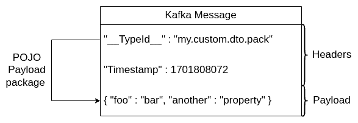

# [Spring Kafka 可信软件包功能](https://www.baeldung.com/spring-kafka-trusted-packages-feature)

1. 简介

    在本教程中，我们将回顾 Spring Kafka 可信包功能。我们将了解其背后的动机及其用法。并一如既往地提供实际示例。

2. 前提条件

    一般来说，Spring Kafka 模块允许我们作为用户指定一些关于我们要发送的 POJO 的元数据。它通常采用 Kafka 消息头的形式。例如，我们可以这样配置 ProducerFactory：

    test/.spring.kafka.trusted.packages/ProducerConfiguration.java:producerFactory()

    main/.spring.kafka.trusted.packages/SomeData.java

    然后，例如，我们将使用上面用 producerFactory 配置的 KafkaTemplate 在一个主题中生成一条新消息：

    ```java
    public void sendDataIntoKafka() {
        SomeData someData = new SomeData("1", "active", "sent", Instant.now());
        kafkaTemplate.send(new ProducerRecord<>("sourceTopic", null, someData));
    }
    ```

    然后，在这种情况下，我们会在 Kafka 消费者的控制台中收到以下消息：

    `CreateTime:1701021806470 __TypeId__:com.baeldung.example.SomeData null {"id":"1","type":"active","status":"sent","timestamp":1701021806.153965150}`

    我们可以看到，消息中 POJO 的类型信息就在头信息中。当然，这是 Spring Kafka 独有的特性。也就是说，从 Kafka 或其他框架的角度来看，这些头只是元数据。因此，我们可以假设消费者和生产者都使用 Spring 来处理 Kafka 消息。

3. 可信包功能

    说到这里，我们可以说，在某些情况下，这是一个相当有用的功能。当主题中的消息具有不同的有效载荷模式时，为消费者提示有效载荷类型将非常有用。

    

    不过，一般情况下，我们知道主题中会出现哪些模式的消息。因此，限制消费者可能接受的有效载荷模式可能是个好主意。这就是 Spring Kafka 可信包功能的意义所在。

4. 使用示例

    Spring Kafka 的受信任包功能是在反序列化器级别配置的。如果配置了可信包，Spring 就会对传入消息的类型头进行查找。然后，它会检查消息中提供的所有类型（包括键和值）是否都是可信的。

    这基本上意味着，在[相应标头中指定的键和值](https://github.com/spring-projects/spring-kafka/blob/1a18d288dc80e7e94db0fd8a2242f1d6c92c3b1e/spring-kafka/src/main/java/org/springframework/kafka/support/mapping/AbstractJavaTypeMapper.java#L48)的 Java 类必须位于受信任的包内。如果一切正常，Spring 就会将信息进一步反序列化。如果头文件不存在，Spring 将直接反序列化对象，而不会检查受信任的包：

    test/.spring.kafka.trusted.packages/ListenerConfiguration.java:someDataConsumerFactory()

    值得一提的是，如果我们用星号 (*) 代替具体包，Spring 可以信任所有包：

    ```java
    JsonDeserializer<SomeData> payloadJsonDeserializer = new JsonDeserializer<>();
    payloadJsonDeserializer.trustedPackages("*");
    ```

    然而，在这种情况下，使用受信任的包没有任何作用，只会产生额外的开销。现在让我们来了解一下我们刚才看到的功能背后的动机。

    1. 第一个动机： 一致性

        这项功能之所以出色，主要有两个原因。首先，如果集群中出现问题，我们可以快速故障。想象一下，某个生产者不小心在一个主题中发布了他本不该发布的消息。这会导致很多问题，尤其是当我们成功反序列化了传入的消息时。在这种情况下，整个系统的行为都可能是未定义的。

        因此，如果生产者发布的信息包含类型信息，而消费者知道它信任哪些类型，那么这一切都可以避免。当然，前提是生产者的信息类型与消费者所期望的类型不同。但这一假设非常合理，因为生产者根本就不应该向这个主题发布信息。

    2. 第二个动机： 安全性

        最重要的是安全问题。在前面的例子中，我们强调生产者无意中向主题发布了信息。但这也可能是有意的攻击。恶意生产者可能故意将信息发布到特定主题中，以利用反序列化漏洞。因此，通过防止不需要的消息反序列化，Spring 提供了额外的安全措施来降低安全风险。

        这里真正需要理解的是，可信包功能并不能解决 "标题欺骗" 攻击。在这种情况下，攻击者会篡改报文的报文头，欺骗收件人，使其相信报文是合法的，并且来自受信任的来源。因此，通过提供正确类型的报头，攻击者可以欺骗 Spring，后者将继续进行信息反序列化。但这个问题相当复杂，不是讨论的主题。总的来说，Spring 只是提供了一种额外的安全措施，以尽量降低黑客得逞的风险。

5. 结论

    在本文中，我们探讨了 Spring Kafka 的可信包功能。该功能为我们的分布式消息系统提供了额外的一致性和安全性。不过，关键是要记住，受信任的包仍然容易受到头欺骗攻击。不过，Spring Kafka 在提供额外的安全措施方面还是做得很好的。
