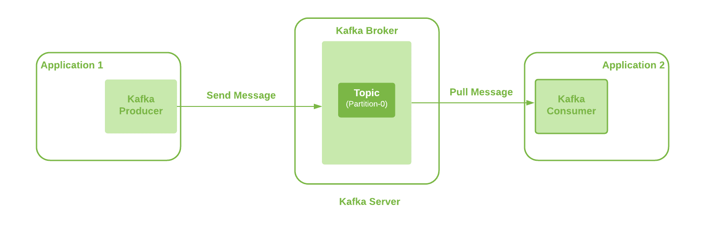

# [用 Kafka 发送大消息](https://www.baeldung.com/java-kafka-send-large-message)

1. 概述

    Apache Kafka 是一个功能强大、开源、分布式、容错的事件流平台。然而，当我们使用 Kafka 发送大于配置大小限制的信息时，它会给出一个错误。

    在本教程中，我们将介绍如何使用 Kafka 发送大容量消息。

2. 问题陈述

    Kafka 配置限制了允许发送的消息大小。默认情况下，这个限制是 1MB。但是，如果需要发送大型消息，我们就需要根据自己的要求调整这些配置。

    在本教程中，我们使用的是 Kafka v2.5。在跳转到配置之前，让我们先看看我们的 Kafka 设置。

3. 设置

    在这里，我们将使用单个代理的基本 Kafka 设置。此外，生产者应用程序可以使用 Kafka 客户端（Kafka Client）通过定义的主题向 Kafka 代理发送消息。此外，我们使用的是单一分区主题：

    

    我们可以在这里观察到多个交互点，如 Kafka 生产者、Kafka 经纪、主题和 Kafka 消费者。因此，所有这些都需要配置更新，才能将大型消息从一端发送到另一端。

    让我们详细了解一下这些配置，以发送 20MB 的大消息。

4. Kafka 生产者配置

    这是我们发送消息的第一个地方。我们使用 Spring Kafka 将消息从应用程序发送到 Kafka 服务器。

    因此，首先需要更新属性 "max.request.size"。有关生产者配置的更多详情，请参阅 [Kafka 文档](https://kafka.apache.org/documentation/#producerconfigs_max.request.size)。 在 Kafka 客户端库中，它可以作为常量 ProducerConfig.MAX_REQUEST_SIZE_CONFIG 提供，该库是 Spring Kafka 依赖关系的一部分。

    让我们将该值配置为 20971520 字节：

    main/.spring.kafka/KafkaProducerConfig.java:producerFactory()

5. Kafka 主题配置

    我们的消息生成应用程序会根据定义的 Topic 向 Kafka Broker 发送消息。因此，下一个需求是配置所使用的 Kafka Topic。这意味着我们需要更新默认值为 1MB 的 "max.message.bytes" 属性。

    该值是 Kafka 压缩后的最大记录批大小（如果启用了压缩）。更多详情可参阅 [Kafka 文档](https://kafka.apache.org/25/documentation.html#max.message.bytes)。

    让我们在创建主题时使用 CLI 命令手动配置该属性：

    `./kafka-topics.sh --bootstrap-server localhost:9092 --create --topic longMessage --partitions 1 \
    --replication-factor 1 --config max.message.bytes=20971520`

    或者，我们也可以通过 Kafka 客户端配置该属性：

    main/.spring.kafka/KafkaTopicConfig.java:topic5()

    我们至少需要配置这两个属性。

6. Kafka 代理配置

    可选配置属性 "message.max.bytes" 可用于允许 Broker 上的所有主题接受超过 1MB 大小的消息。

    这也是 Kafka 在压缩（如果启用了压缩）后允许的最大记录批大小的值。更多详情，请参阅 [Kafka 文档](https://kafka.apache.org/25/documentation.html#message.max.bytes)。

    让我们在 Kafka Broker 的 "server.properties" 配置文件中添加该属性：

    `message.max.bytes=20971520`

    此外，"message.max.bytes" 和 "max.message.bytes" 中的最大值将成为有效值。

7. 消费者配置

    让我们来看看 Kafka 消费者可用的配置设置。虽然这些更改对于消费大型消息不是强制性的，但避免这些更改可能会对消费者应用程序的性能产生影响。因此，最好也能设置这些配置：

    - max.partition.fetch.bytes： 该属性限制了消费者从 Topic 分区中获取的字节数。更多详情，请参阅 [Kafka 文档](https://kafka.apache.org/documentation/#consumerconfigs_max.partition.fetch.bytes)。在 Kafka 客户端库中，该属性可作为名为 ConsumerConfig.MAX_PARTITION_FETCH_BYTES_CONFIG 的常量使用。
    - fetch.max.bytes： 该属性限制了消费者从 Kafka 服务器获取的字节数。Kafka 消费者也可以监听多个分区。更多详情，请参阅 [Kafka 文档](https://kafka.apache.org/documentation/#consumerconfigs_fetch.max.bytes)。在 Kafka 客户端库中，这可以作为常量 ConsumerConfig.FETCH_MAX_BYTES_CONFIG 来使用。

    因此，为了配置我们的消费者，我们需要创建一个 KafkaConsumerFactory。请记住，与 Topic/Broker 配置相比，我们总是需要使用更高的值：

    main/.spring.kafka/KafkaConsumerConfig.java:consumerFactory()

    在这里，我们为两个属性使用了相同的配置值 20971520 Bytes，因为我们使用的是单分区 Topic。但是，FETCH_MAX_BYTES_CONFIG 的值应该大于 MAX_PARTITION_FETCH_BYTES_CONFIG。 当我们在多个分区上监听消费者时，FETCH_MAX_BYTES_CONFIG 表示可以从多个分区获取的消息大小。另一方面，配置 MAX_PARTITION_FETCH_BYTES_CONFIG 表示从单个分区获取信息的大小。

8. 替代配置

    我们看到了如何更新 Kafka producer、Topic、Broker 和 Kafka consumer 中的不同配置来发送大消息。不过，我们一般应避免使用 Kafka 发送大消息。处理大型消息会消耗生产者和消费者更多的 CPU 和内存。因此，最终会在一定程度上限制它们处理其他任务的能力。而且，这会给终端用户带来明显的高延迟。

    让我们来看看其他可能的选择：

    - Kafka 生产者提供了压缩消息的功能。此外，它还支持不同的压缩类型，我们可以使用 compression.type 属性对其进行配置。
    - 我们可以将大型消息存储在共享存储位置的文件中，然后通过 Kafka 消息发送该位置。这种方法速度更快，处理开销也最小。
    - 另一种方法是在生产者端将大报文分割成每个大小为 1KB 的小报文。之后，我们可以使用分区密钥将所有这些消息发送到一个分区，以确保顺序正确。因此，稍后在消费者端，我们可以从较小的信息中重建大信息。

    如果上述方案都不符合我们的要求，我们可以采用前面讨论过的配置。

9. 结论

    在本文中，我们介绍了发送大小超过 1MB 的大型消息所需的不同 Kafka 配置。

    我们涵盖了生产者、主题、代理和消费者端所需的配置。不过，其中有些配置是必须的，有些则是可选的。此外，消费者配置是可选的，但为了避免对性能造成负面影响，最好还是要有。

    最后，我们还介绍了发送大型消息的其他可能选项。
