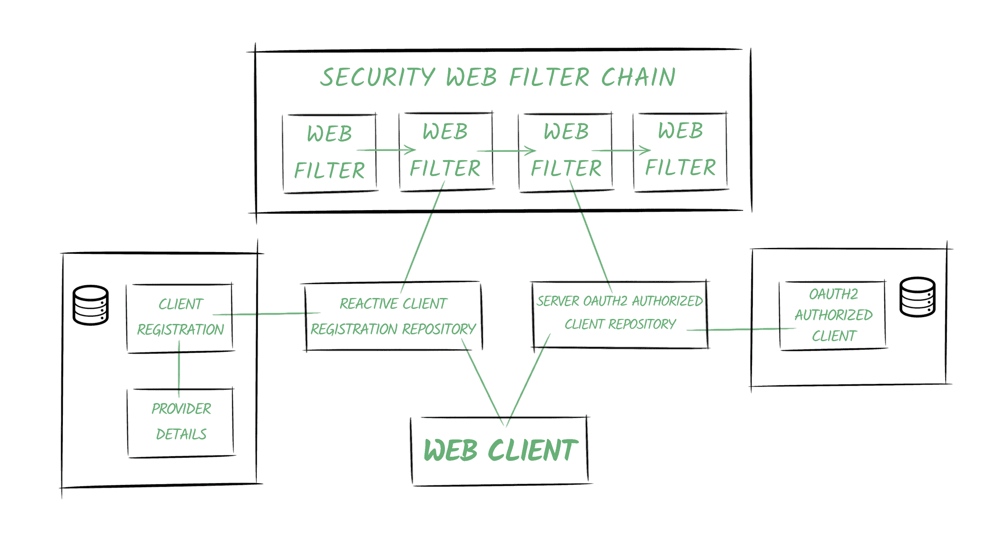

# [支持 WebClient 和 OAuth2](https://www.baeldung.com/spring-webclient-oauth2)

1. 概述

    Spring Security 5 为 Spring Webflux 的非阻塞 [WebClient](https://www.baeldung.com/spring-5-webclient) 类提供了 OAuth2 支持。

    在本教程中，我们将分析使用该类访问安全资源的不同方法。我们还将深入了解 Spring 如何处理 OAuth2 授权过程。

2. 设置场景

    根据 [OAuth2](https://tools.ietf.org/html/rfc6749) 规范，除了本教程的重点--客户端（Client）之外，我们自然还需要一个授权服务器（Authorization Server）和资源服务器（Resource Server）。

    我们可以使用知名的授权提供商，如 Google 或 Github。为了更好地理解 OAuth2 客户端的作用，我们也可以使用自己的服务器，[这里](https://github.com/Baeldung/spring-security-oauth)有一个实现方法。由于这不是本教程的主题，因此我们不会详细介绍全部配置，知道这些就足够了：

    - 授权服务器将
    - 运行于 8081 端口
    - 公开 /oauth/authorize、/oauth/token 和 oauth/check_token 端点，以实现所需的功能
    - 配置示例用户（如 john/123）和单个 OAuth 客户端（fooClientIdPassword/secret）
    - 资源服务器将与身份验证服务器分离，并将
    - 运行于 8082 端口
    - 使用 /foos/{id} 端点访问简单的 Foo 对象安全资源

    注：需要了解的是，多个 Spring 项目都提供了不同的 OAuth 相关功能和实现。我们可以在 Spring 项目[矩阵](https://github.com/spring-projects/spring-security/wiki/OAuth-2.0-Features-Matrix)中查看每个库都提供了哪些功能。

    WebClient 和所有与 Webflux 相关的反应式功能都是 Spring Security 5 项目的一部分。因此，在本教程中我们将主要使用该框架。

3. Spring Security 5 底层

    为了充分理解我们将要讨论的示例，最好先了解 Spring Security 如何在内部管理 OAuth2 功能。

    该框架提供了以下功能

    - 依靠 OAuth2 提供者账户将用户[登录到应用程序中](https://www.baeldung.com/spring-security-5-oauth2-login)
    - 将我们的服务配置为 OAuth2 客户端
    - 为我们管理授权程序
    - 自动刷新令牌
    - 必要时存储凭证

    下图描述了 Spring Security 的 OAuth2 世界的一些基本概念：

    

    1. 提供商

        Spring 定义了 OAuth2 Provider 角色，负责公开受 OAuth 2.0 保护的资源。

        在我们的示例中，我们的身份验证服务将提供 Provider 功能。

    2. 客户注册

        客户注册是一个实体，包含在 OAuth2（或 OpenID）提供程序中注册的特定客户的所有相关信息。

        在我们的方案中，它是在身份验证服务器中注册的客户端，由 bael-client-id id 标识。

    3. 授权客户端

        一旦终端用户（又称资源所有者）授予客户端访问其资源的权限，就会创建一个 OAuth2AuthorizedClient 实体。

        它将负责把访问令牌与客户端注册和资源所有者（由 Principal 对象表示）关联起来。

    4. 存储库

        此外，Spring Security 还提供了用于访问上述实体的存储库类。

        特别是 ReactiveClientRegistrationRepository 和 ServerOAuth2AuthorizedClientRepository 类用于反应式堆栈，它们默认使用内存存储。

        Spring Boot 2.x 会创建这些存储库类的 Bean，并自动将它们添加到上下文中。

    5. 安全网络过滤器链

        Spring Security 5 的关键概念之一是反应式 SecurityWebFilterChain 实体。

        正如其名称所示，它代表了 [WebFilter](https://www.baeldung.com/spring-webflux-filters) 对象的链式集合。

        当我们在应用程序中启用 OAuth2 功能时，Spring Security 会在链中添加两个过滤器：

        - 其中一个过滤器会响应授权请求（/oauth2/authorization/{registrationId} URI）或抛出 ClientAuthorizationRequiredException。它包含对 ReactiveClientRegistrationRepository 的引用，负责创建授权请求以重定向用户代理。
        - 第二个过滤器根据我们添加的功能（OAuth2 客户端功能或 OAuth2 登录功能）而有所不同。在这两种情况下，该过滤器的主要职责都是创建 OAuth2AuthorizedClient 实例，并使用 ServerOAuth2AuthorizedClientRepository 进行存储。
        3.6. 网络客户端

        网络客户端将配置一个 ExchangeFilterFunction，其中包含对存储库的引用。

        它将使用这些引用来获取访问令牌，并将其自动添加到请求中。

4. Spring Security 5 支持--客户端凭证流

    Spring Security 允许我们将应用程序配置为 OAuth2 客户端。

    在本文中，我们将使用 WebClient 实例，使用 “Client Credentials” 授权类型，然后使用 “Authorization Code” 流程来检索资源。

    我们首先要做的是配置客户端注册和用于获取访问令牌的提供程序。

    1. 客户端和提供程序配置

        正如我们在 OAuth2 登录[一文](https://www.baeldung.com/spring-security-5-oauth2-login#setup)中所看到的，我们既可以通过编程进行配置，也可以通过使用属性定义注册来依赖 Spring Boot 的自动配置：

        ```properties
        spring.security.oauth2.client.registration.bael.authorization-grant-type=client_credentials
        spring.security.oauth2.client.registration.bael.client-id=bael-client-id
        spring.security.oauth2.client.registration.bael.client-secret=bael-secret
        spring.security.oauth2.client.provider.bael.token-uri=http://localhost:8085/oauth/token
        ```

        这些就是我们使用 client_credentials 流程检索资源所需的全部配置。

    2. 使用 WebClient

        我们在没有终端用户与应用程序交互的机器对机器通信中使用这种授予类型。

        例如，假设有一个 cron 作业试图使用应用程序中的 WebClient 获取安全资源：

        ```java
        @Autowired
        private WebClient webClient;

        @Scheduled(fixedRate = 5000)
        public void logResourceServiceResponse() {

            webClient.get()
            .uri("http://localhost:8084/retrieve-resource")
            .retrieve()
            .bodyToMono(String.class)
            .map(string 
                -> "Retrieved using Client Credentials Grant Type: " + string)
            .subscribe(logger::info);
        }
        ```

    3. 配置 WebClient

        接下来，我们将设置在计划任务中自动连线的 WebClient 实例：

        ```java
        @Bean
        WebClient webClient(ReactiveClientRegistrationRepository clientRegistrations) {
            ServerOAuth2AuthorizedClientExchangeFilterFunction oauth =
            new ServerOAuth2AuthorizedClientExchangeFilterFunction(
                clientRegistrations,
                new UnAuthenticatedServerOAuth2AuthorizedClientRepository());
            oauth.setDefaultClientRegistrationId("bael");
            return WebClient.builder()
            .filter(oauth)
            .build();
        }
        ```

        如前所述，Spring Boot 会自动创建客户端注册存储库并将其添加到上下文中。

        接下来需要注意的是，我们使用的是 UnAuthenticatedServerOAuth2AuthorizedClientRepository 实例。这是因为没有终端用户会参与这一过程，因为这是机器对机器的通信。最后，如前所述，我们将默认使用 bael 客户端注册。

        否则，我们必须在 cron 作业中定义请求时指定它：

        ```java
        webClient.get()
        .uri("http://localhost:8084/retrieve-resource")
        .attributes(
            ServerOAuth2AuthorizedClientExchangeFilterFunction
            .clientRegistrationId("bael"))
        .retrieve()
        // ...
        ```

    4. 测试

        如果我们启用 DEBUG 日志级别运行应用程序，就能看到 Spring Security 为我们执行的调用：

        ```log
        o.s.w.r.f.client.ExchangeFunctions:
        HTTP POST http://localhost:8085/oauth/token
        o.s.http.codec.json.Jackson2JsonDecoder:
        Decoded [{access_token=89cf72cd-183e-48a8-9d08-661584db4310,
            token_type=bearer,
            expires_in=41196,
            scope=read
            (truncated)...]
        o.s.w.r.f.client.ExchangeFunctions:
        HTTP GET http://localhost:8084/retrieve-resource
        o.s.core.codec.StringDecoder:
        Decoded "This is the resource!"
        c.b.w.c.service.WebClientChonJob:
        We retrieved the following resource using Client Credentials Grant Type: This is the resource!
        ```

        我们还会注意到，在任务第二次运行时，应用程序请求资源时没有首先请求令牌，因为上一个令牌尚未过期。

5. Spring Security 5 支持 - 使用授权代码流实现

    这种授权类型通常用于不那么受信任的第三方应用程序需要访问资源的情况。

    1. 客户端和提供程序配置

        为了使用授权代码流执行 OAuth2 流程，我们还需要为客户端注册和提供程序定义几个属性：

        ```properties
        spring.security.oauth2.client.registration.bael.client-name=bael
        spring.security.oauth2.client.registration.bael.client-id=bael-client-id
        spring.security.oauth2.client.registration.bael.client-secret=bael-secret
        spring.security.oauth2.client.registration.bael
        .authorization-grant-type=authorization_code
        spring.security.oauth2.client.registration.bael
        .redirect-uri=http://localhost:8080/login/oauth2/code/bael

        spring.security.oauth2.client.provider.bael.token-uri=http://localhost:8085/oauth/token
        spring.security.oauth2.client.provider.bael
        .authorization-uri=http://localhost:8085/oauth/authorize
        spring.security.oauth2.client.provider.bael.user-info-uri=http://localhost:8084/user
        spring.security.oauth2.client.provider.bael.user-name-attribute=name
        ```

        除了在上一节中使用的属性外，这次我们还需要包含

        - 在身份验证服务器上进行身份验证的端点
        - 包含用户信息的端点的 URL
        - 应用程序中用户代理在通过身份验证后将被重定向到的端点的 URL

        当然，对于知名提供商来说，前两点无需指定。

        重定向端点由 Spring Security 自动创建。

        默认情况下，为其配置的 URL 是 `/[action]/oauth2/code/[registrationId]`，只允许授权和登录操作（以避免无限循环）。

        该端点负责

        - 接收作为查询参数的验证码
        - 使用验证码获取访问令牌
        - 创建授权客户端实例
        - 将用户代理重定向回原始端点

    2. HTTP 安全配置

        接下来，我们需要配置 SecurityWebFilterChain。

        最常见的情况是使用 Spring Security 的 OAuth2 登录功能对用户进行身份验证，并允许他们访问我们的端点和资源。

        如果是这种情况，那么只需在 ServerHttpSecurity 定义中包含 oauth2Login 指令，就足以让我们的应用程序也能作为 OAuth2 客户端运行：

        ```java
        @Bean
        public SecurityWebFilterChain springSecurityFilterChain(ServerHttpSecurity http) {
            http.authorizeExchange()
            .anyExchange()
            .authenticated()
            .and()
            .oauth2Login();
            return http.build();
        }
        ```

    3. 配置 WebClient

        现在是时候安装 WebClient 实例了：

        ```java
        @Bean
        WebClient webClient(
        ReactiveClientRegistrationRepository clientRegistrations,
        ServerOAuth2AuthorizedClientRepository authorizedClients) {
            ServerOAuth2AuthorizedClientExchangeFilterFunction oauth =
            new ServerOAuth2AuthorizedClientExchangeFilterFunction(
                clientRegistrations,
                authorizedClients);
            oauth.setDefaultOAuth2AuthorizedClient(true);
            return WebClient.builder()
            .filter(oauth)
            .build();
        }
        ```

        这一次，我们将从上下文中注入客户端注册存储库和授权客户端存储库。

        我们还启用了 setDefaultOAuth2AuthorizedClient 选项。这样，框架将尝试从 Spring Security 管理的当前身份验证对象中获取客户端信息。

        我们必须考虑到，有了它，所有 HTTP 请求都将包含访问令牌，这可能不是我们想要的行为。

        稍后，我们将分析可指示特定 WebClient 事务将使用的客户端的替代方案。

    4. 使用 WebClient

        授权代码需要一个能进行重定向的用户代理（如浏览器）来执行程序。

        因此，当用户与我们的应用程序交互时，我们可以使用这种授权类型，通常是调用 HTTP 端点：

        ```java
        @RestController
        public class ClientRestController {

            @Autowired
            WebClient webClient;

            @GetMapping("/auth-code")
            Mono<String> useOauthWithAuthCode() {
                Mono<String> retrievedResource = webClient.get()
                .uri("http://localhost:8084/retrieve-resource")
                .retrieve()
                .bodyToMono(String.class);
                return retrievedResource.map(string ->
                "We retrieved the following resource using Oauth: " + string);
            }
        }
        ```

    5. 测试

        最后，我们将调用端点，并通过检查日志条目来分析发生了什么。

        调用端点后，应用程序会验证我们是否尚未通过应用程序的身份验证：

        ```log
        o.s.w.s.adapter.HttpWebHandlerAdapter: HTTP GET "/auth-code"
        ...
        HTTP/1.1 302 Found
        Location: /oauth2/authorization/bael
        ```

        应用程序重定向到授权服务的端点，使用提供商注册表中现有的凭据进行身份验证（在本例中，我们将使用 bael-user/bael-password 身份验证）：

        ```log
        HTTP/1.1 302 Found
        Location: http://localhost:8085/oauth/authorize
        ?response_type=code
        &client_id=bael-client-id
        &state=...
        &redirect_uri=http%3A%2F%2Flocalhost%3A8080%2Flogin%2Foauth2%2Fcode%2Fbael
        ```

        身份验证后，用户代理将连同作为查询参数的代码和首次发送的状态值（以避免 [CSRF](https://spring.io/blog/2011/11/30/cross-site-request-forgery-and-oauth2) 攻击）一起发回重定向 URI：

        `o.s.w.s.adapter.HttpWebHandlerAdapter:HTTP GET "/login/oauth2/code/bael?code=...&state=...`

        然后，应用程序使用该代码获取访问令牌：

        `o.s.w.r.f.client.ExchangeFunctions:HTTP POST http://localhost:8085/oauth/token`

        获取用户信息：

        `o.s.w.r.f.client.ExchangeFunctions:HTTP GET http://localhost:8084/user`

        并将用户代理重定向到原始端点：

        ```log
        HTTP/1.1 302 Found
        Location: /auth-code
        ```

        最后，我们的 WebClient 实例就能成功请求安全资源了：

        ```log
        o.s.w.r.f.client.ExchangeFunctions:HTTP GET http://localhost:8084/retrieve-resource
        o.s.w.r.f.client.ExchangeFunctions:Response 200 OK
        o.s.core.codec.StringDecoder :Decoded "This is the resource!"
        ```

6. 另一种方法--在呼叫中进行客户端注册

    前面我们了解到，使用 setDefaultOAuth2AuthorizedClient 意味着应用程序将在我们与客户端实现的任何调用中包含访问令牌。

    如果我们从配置中删除这条命令，就需要在定义请求时明确指定客户端注册。

    当然，一种方法是使用 clientRegistrationId，就像我们之前在客户端凭证流程中做的那样。

    由于我们将 Principal 与授权客户关联起来，因此可以使用 @RegisteredOAuth2AuthorizedClient 注解获取 OAuth2AuthorizedClient 实例：

    ```java
    @GetMapping("/auth-code-annotated")
    Mono<String> useOauthWithAuthCodeAndAnnotation(
    @RegisteredOAuth2AuthorizedClient("bael") OAuth2AuthorizedClient authorizedClient) {
        Mono<String> retrievedResource = webClient.get()
        .uri("http://localhost:8084/retrieve-resource")
        .attributes(
            ServerOAuth2AuthorizedClientExchangeFilterFunction.oauth2AuthorizedClient(authorizedClient))
        .retrieve()
        .bodyToMono(String.class);
        return retrievedResource.map(string -> 
        "Resource: " + string 
            + " - Principal associated: " + authorizedClient.getPrincipalName() 
            + " - Token will expire at: " + authorizedClient.getAccessToken()
            .getExpiresAt());
    }
    ```

7. 避免使用 OAuth2 登录功能

    如前所述，最常见的情况是依赖 OAuth2 授权提供程序在应用程序中登录用户。

    但如果我们想避免这种情况，但仍能使用 OAuth2 协议访问安全资源，该怎么办呢？那么我们就需要对配置进行一些更改。

    首先，为了全面明确，我们可以在定义重定向 URI 属性时使用授权操作，而不是登录操作：

    ```properties
    spring.security.oauth2.client.registration.bael
    .redirect-uri=http://localhost:8080/login/oauth2/code/bael
    ```

    我们还可以放弃与用户相关的属性，因为我们不会使用它们在应用程序中创建 Principal。

    现在我们将配置 SecurityWebFilterChain，但不包含 oauth2Login 命令，而是包含 oauth2Client 命令。

    尽管我们不想依赖 OAuth2 登录，但我们仍然希望在访问端点前对用户进行身份验证。因此，我们还将在此处加入 formLogin 指令：

    ```java
    @Bean
    public SecurityWebFilterChain springSecurityFilterChain(ServerHttpSecurity http) {
        http.authorizeExchange()
        .anyExchange()
        .authenticated()
        .and()
        .oauth2Client()
        .and()
        .formLogin();
        return http.build();
    }
    ```

    现在让我们运行应用程序，看看使用 `/auth-code-annotated` 端点时会发生什么。

    首先，我们必须使用登录表单登录应用程序。

    然后，应用程序将重定向我们到授权服务登录，以授予我们对资源的访问权限。

    注意：完成这些操作后，我们应该被重定向回我们调用的原始端点。然而，Spring Security 似乎会重定向回根路径“/”，这似乎是一个错误。在触发 OAuth2 舞步的请求之后，接下来的请求都能成功运行。

    我们可以从端点响应中看到，这次授权客户端关联的是名为 bael-client-id 的 principal，而不是 bael-user，后者是根据身份验证服务中配置的用户命名的。

8. Spring 框架支持 - 手动方法

    在开箱即用的情况下，Spring 5 只提供了一种与 OAuth2 相关的服务方法，可轻松将 Bearer 标记头添加到请求中。这就是 HttpHeaders#setBearerAuth 方法。

    现在我们来看一个示例，演示如何通过手动执行 OAuth2 舞步来获取我们的安全资源。

    简单地说，我们需要串联两个 HTTP 请求，一个是从授权服务器获取一个身份验证令牌，另一个是使用该令牌获取资源：

    ```java
    @Autowired
    WebClient client;

    public Mono<String> obtainSecuredResource() {
        String encodedClientData = 
        Base64.getEncoder().encodeToString("bael-client-id:bael-secret".getBytes());
        Mono<String> resource = client.post()
        .uri("localhost:8085/oauth/token")
        .header("Authorization", "Basic " + encodedClientData)
        .body(BodyInserters.fromFormData("grant_type", "client_credentials"))
        .retrieve()
        .bodyToMono(JsonNode.class)
        .flatMap(tokenResponse -> {
            String accessTokenValue = tokenResponse.get("access_token")
                .textValue();
            return client.get()
                .uri("localhost:8084/retrieve-resource")
                .headers(h -> h.setBearerAuth(accessTokenValue))
                .retrieve()
                .bodyToMono(String.class);
            });
        return resource.map(res ->
        "Retrieved the resource using a manual approach: " + res);
    }
    ```

    这个示例可以帮助我们理解按照 OAuth2 规范利用请求是多么麻烦，并向我们展示 setBearerAuth 方法是如何使用的。

    这个示例应该能帮助我们理解按照 OAuth2 规范利用请求是多么麻烦，并向我们展示 setBearerAuth 方法是如何使用的。

    在现实生活中，我们会让 Spring Security 以透明的方式为我们处理所有繁琐的工作，就像我们在前面章节中所做的那样。

9. 结束语

    在本文中，我们学习了如何将应用程序设置为 OAuth2 客户端，更具体地说，我们学习了如何配置和使用 WebClient 在全反应堆栈中检索安全资源。

    然后，我们分析了 Spring Security 5 OAuth2 机制如何在引擎盖下运行，以符合 OAuth2 规范。
