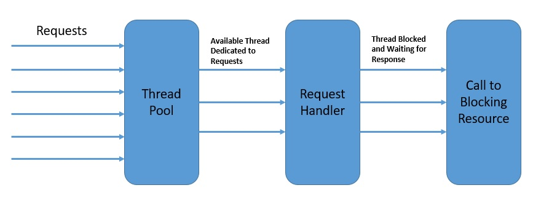

# [Spring WebFlux的并发性](https://www.baeldung.com/spring-webflux-concurrency)

1. 简介

    在本教程中，我们将探讨用Spring WebFlux编写的反应式程序中的并发性。

    我们将首先讨论与反应式编程有关的并发性。然后，我们将学习Spring WebFlux如何在不同的反应式服务器库中提供并发性抽象。

2. 反应式编程的动因

    一个典型的Web应用程序包括几个复杂的、相互作用的部分。这些交互中有许多是阻塞性的，比如那些涉及到数据库调用以获取或更新数据的交互。然而，其他几个是独立的，可以并发执行，可能是并行的。

    例如，两个用户对网络服务器的请求可以由不同的线程来处理。在多核平台上，这在整体响应时间方面有明显的好处。因此，这种并发模型被称为 "每请求线程(thread-per-request)模型"。

    

    每个线程一次只处理一个请求。

    虽然基于线程的并发为我们解决了一部分问题，但它没有解决我们在单个线程中的大部分交互仍然是阻塞的问题。此外，我们在Java中用来实现并发的本地线程在上下文切换方面付出了巨大的代价。

    同时，随着Web应用程序面临越来越多的请求，每请求一个线程的模式开始不能满足人们的期望。

    因此，我们需要一个能够帮助我们以相对较少的线程数量处理越来越多的请求的并发模型。这就是采用[反应式编程](https://www.baeldung.com/java-reactive-systems)的主要动机之一。

3. 反应式编程中的并发性

    反应式编程帮助我们从数据流和通过数据流传播变化的角度来构造程序。在一个完全无阻塞的环境中，这可以使我们以更好的资源利用率实现更高的并发性。

    然而，反应式编程是否完全脱离了基于线程的并发性？虽然这是一个强有力的声明，但在使用线程实现并发方面，反应式编程肯定有一个非常不同的方法。因此，反应式编程带来的根本区别是异步性。

    换句话说，程序流从一连串的同步操作转变为一个异步的事件流。

    例如，在反应式模型下，当数据被获取时，对数据库的读取调用并不会阻塞调用线程。该调用立即返回一个其他人可以订阅的发布者。订阅者可以在事件发生后进行处理，甚至可以自己进一步产生事件。

    

    最重要的是，反应式编程并不强调哪个线程的事件应该被生成和消费。相反，重点是将程序结构化为一个异步的事件流。

    这里的发布者和订阅者不需要是同一个线程的一部分。这有助于我们更好地利用可用的线程，从而实现更高的整体并发性。

4. 事件循环

    有几个编程模型描述了对并发性的反应式方法。

    在本节中，我们将研究其中的几个，以了解反应式编程如何用较少的线程实现更高的并发性。

    其中一个用于服务器的反应式异步编程模型是事件循环模型。

    

    上面是一个事件循环的抽象设计，展示了反应式异步编程的思想。

    - 事件循环在一个单线程中连续运行，尽管我们可以拥有与可用内核数量一样多的事件循环。
    - 事件循环按顺序处理来自事件队列的事件，并在向平台注册回调后立即返回。
    - 平台可以触发一个操作的完成，如数据库调用或外部服务调用。
    - 事件循环可以在操作完成的通知上触发回调，并将结果发回给原始调用者。

    事件循环模型在许多平台上实现，包括[Node.js](https://nodejs.org/en/)、[Netty](https://netty.io/)和[Ngnix](https://www.nginx.com/)。它们提供了比传统平台更好的可扩展性，如[Apache HTTP Server](https://httpd.apache.org/)、[Tomcat](https://www.baeldung.com/tomcat)或[JBoss](https://www.redhat.com/fr/technologies/jboss-middleware/application-platform)。

5. 使用Spring WebFlux的反应式编程

    现在我们对反应式编程及其并发模型有了足够的了解，可以在Spring WebFlux中探索这一主题。

    WebFlux是Spring的反应式堆栈网络框架，在5.0版本中被加入。

    让我们来探索Spring WebFlux的服务器端栈，以了解它是如何补充Spring的传统Web栈的。

    

    我们可以看到，Spring WebFlux与Spring中的传统Web框架是平行的，不一定会取代它。

    这里有几个重要的点需要注意。

    - Spring WebFlux用功能路由扩展了传统的基于注解的编程模型。
    - 此外，它将底层的HTTP运行时与Reactive Streams API相适应，使运行时可以互操作。
    - 它能够支持各种反应式运行时，包括Tomcat、Reactor、Netty或[Undertow](https://www.baeldung.com/jboss-undertow)等Servlet 3.1+容器。

    最后，它包括WebClient，一个为HTTP请求提供功能和流畅的API的反应式和非阻塞式客户端。

6. 支持运行时中的线程模型

    正如我们前面所讨论的，反应式程序往往只使用少数线程并充分利用它们。然而，线程的数量和性质取决于我们选择的实际反应流API运行时。

    为了澄清，SpringWebFlux可以通过HttpHandler提供的公共API来适应不同的运行时。这个API是一个简单的契约，只有一个方法提供了对不同服务器API的抽象，如Reactor Netty、Servlet 3.1 API或Undertow API。

    让我们来看看其中一些实现的线程模型。

    虽然Netty是WebFlux应用程序中的默认服务器，但只需声明正确的依赖关系即可切换到任何其他受支持的服务器：

    ```xml
    <dependency>
        <groupId>org.springframework.boot</groupId>
        <artifactId>spring-boot-starter-webflux</artifactId>
        <exclusions>
            <exclusion>
                <groupId>org.springframework.boot</groupId>
                <artifactId>spring-boot-starter-reactor-netty</artifactId>
            </exclusion>
        </exclusions>
    </dependency>
    <dependency>
        <groupId>org.springframework.boot</groupId>
        <artifactId>spring-boot-starter-tomcat</artifactId>
    </dependency>
    ```

    虽然可以通过多种方式观察在Java虚拟机中创建的线程，但只需从Thread类本身中提取它们是非常容易的：

    ```java
    Thread.getAllStackTraces()
    .keySet()
    .stream()
    .collect(Collectors.toList());
    ```

    1. 反应器网

        正如我们所说，Reactor Netty是Spring Boot WebFlux启动器中的默认嵌入式服务器。让我们看看Netty默认创建的线程。首先，我们不会添加任何其他依赖项或使用WebClient。因此，如果我们启动使用SpringBoot启动器创建的SpringWebFlux应用程序，我们可以看到它创建的一些默认线程：

        

        请注意，除了服务器的正常线程之外，Netty还生成了一组用于请求处理的工作线程。这些通常是可用的CPU内核。这是四核机器的输出。我们还将看到JVM环境中典型的一堆内务线程，但它们在这里并不重要。

        Netty使用事件循环模型以反应式异步方式提供高度可扩展的并发。让我们看看Netty是如何利用Java NIO实现事件循环以提供这种可伸缩性的：

        

        这里，EventLoopGroup管理一个或多个EventLoop，它必须持续运行。因此，不建议创建比可用内核数量更多的EventLoops。

        EventLoopGroup还为每个新创建的频道分配一个EventLoop。因此，在通道的生命周期内，所有操作都由同一线程执行。

    2. Apache Tomcat

        传统的Servlet容器（如Apache Tomcat）也支持SpringWebFlux。

        WebFlux依赖于具有非阻塞I/O的Servlet 3.1 API。虽然它在低级适配器后面使用Servlet API，但Servlet API不能直接使用。

        让我们看看在Tomcat上运行的WebFlux应用程序中需要什么样的线程：

        

        我们在这里看到的线程的数量和类型与我们之前观察到的完全不同。

        首先，Tomcat从更多的工作线程开始，默认为10个。当然，我们还将看到JVM和Catalina容器的一些典型内务处理线程，在本次讨论中我们可以忽略这些线程。

        我们需要了解Tomcat与Java NIO的体系结构，以将其与上面看到的线程相关联。

        Tomcat 5及其以后版本在其连接器组件中支持NIO，该组件主要负责接收请求。

        另一个Tomcat组件是Container组件，它负责容器管理功能。

        这里我们感兴趣的是连接器组件实现的线程模型，以支持NIO。它由Acceptor、Poller和Worker组成，作为NioEndpoint模块的一部分：

        

        Tomcat为Acceptor、Poller和Worker生成一个或多个线程，通常使用专用于Worker的线程池。

        虽然对Tomcat体系结构的详细讨论超出了本文的范围，但我们现在应该有足够的洞察力来理解前面看到的线程。

7. WebClient中的线程模型

    WebClient是Spring WebFlux的一部分，是反应式HTTP客户端。我们可以在需要基于REST的通信时使用它，这使我们能够创建端到端反应式的应用。

    正如我们之前所看到的，反应式应用程序只用几个线程来工作，所以应用程序的任何部分都没有余地来阻塞线程。因此，WebClient在帮助我们实现WebFlux的潜力方面起着至关重要的作用。

    1. 使用WebClient

        使用WebClient也很简单。我们不需要包含任何特定的依赖性，因为它是Spring WebFlux的一部分。

        让我们创建一个简单的REST端点，返回一个[Mono](https://www.baeldung.com/java-string-from-mono)。

        ```java
        @GetMapping("/index")
        public Mono<String> getIndex() {
            return Mono.just("Hello World!");
        }
        ```

        然后我们将使用WebClient来调用这个REST端点，并反应性地消耗数据。

        ```java
        WebClient.create("http://localhost:8080/index").get()
        .retrieve()
        .bodyToMono(String.class)
        .doOnNext(s -> printThreads());
        ```

        这里我们也在打印使用我们前面讨论的方法创建的线程。

    2. 了解线程模型

        那么，线程模型在WebClient中是如何工作的呢？

        嗯，毫不奇怪，WebClient也是使用事件循环模型来实现并发的。当然，它依赖于底层运行时来提供必要的基础设施。

        如果我们在Reactor Netty上运行WebClient，它就会共享Netty用于服务器的事件循环。因此，在这种情况下，我们可能不会注意到所创建的线程有什么不同。

        然而，WebClient也支持Servlet 3.1+容器，如Jetty，但它的工作方式是不同的。

        如果我们比较一下运行[Jetty](https://www.eclipse.org/jetty/)的WebFlux应用程序在有无WebClient的情况下所创建的线程，我们会发现有一些额外的线程。

        在这里，WebClient必须创建其事件循环。所以我们可以看到这个事件循环所创建的处理线程的固定数量。

        

        在某些情况下，为客户端和服务器设置一个单独的线程池可以提供更好的性能。虽然这不是Netty的默认行为，但如果需要，总是可以为WebClient声明一个专用的线程池。

        我们将在后面的章节中看到这是如何做到的。

8. 数据访问库的线程模型

    正如我们前面所看到的，即使是一个简单的应用程序，通常也由几个需要连接的部分组成。

    这些部分的典型例子包括数据库和消息代理。现有的与其中许多部分连接的库仍然是阻塞式的，但这正在迅速改变。

    现在有几个数据库提供了用于连接的反应式库。这些库中有许多在Spring Data中可用，而我们也可以直接使用其他库。

    这些库使用的线程模型是我们特别感兴趣的。

    1. Spring Data MongoDB

        [Spring Data MongoDB](https://www.baeldung.com/spring-data-mongodb-tutorial)为建立在[MongoDB Reactive Streams驱动](https://mongodb.github.io/mongo-java-driver/)之上的MongoDB提供反应式存储库支持。最值得注意的是，该驱动完全实现了Reactive Streams API，以提供具有非阻塞反压的异步流处理。

        在Spring Boot应用程序中设置对MongoDB的反应式存储库的支持，就像添加一个依赖项一样简单。

        org.springframework.boot.spring-boot-starter-data-mongodb-reactive

        这将允许我们创建一个存储库，并使用它以非阻塞的方式对MongoDB进行一些基本操作。

        ```java
        public interface PersonRepository extends ReactiveMongoRepository<Person, ObjectId> {
        }
        .....
        personRepository.findAll().doOnComplete(this::printThreads);
        ```

        那么，当我们在Netty服务器上运行这个应用程序时，我们可以期待看到什么样的线程呢？

        毫不奇怪，我们不会看到太大的区别，因为Spring Data的反应式仓库利用了服务器上的相同事件循环。

    2. 反应式Kafka

        Spring仍在建立对反应式Kafka的全面支持。然而，我们确实有Spring之外的选择。

        [Reactor Kafka](https://projectreactor.io/docs/kafka/release/reference/#_introduction)是一个基于Reactor的Kafka反应式API。Reactor Kafka使消息能够使用功能性API进行发布和消费，也可以使用非阻塞式的反压。

        首先，我们需要在我们的应用程序中添加所需的依赖性，以开始使用Reactor Kafka。

        io.projectreactor.kafka.reactor-kafka.1.3.10

        这应该能让我们以非阻塞的方式向Kafka生产消息。

        ```java
        // producerProps: Map of Standard Kafka Producer Configurations
        SenderOptions<Integer, String> senderOptions = SenderOptions.create(producerProps);
        KafkaSender<Integer, String> sender =  KafkaSender.create(senderOptions);
        Flux<SenderRecord<Integer, String, Integer>> outboundFlux = Flux
        .range(1, 10)
        .map(i -> SenderRecord.create(new ProducerRecord<>("reactive-test", i, "Message_" + i), i));
        sender.send(outboundFlux).subscribe();
        ```

        同样地，我们应该能够从Kafka中消费消息，也是以非阻塞的方式。

        ```java
        // consumerProps: Map of Standard Kafka Consumer Configurations
        ReceiverOptions<Integer, String> receiverOptions = ReceiverOptions.create(consumerProps);
        receiverOptions.subscription(Collections.singleton("reactive-test"));
        KafkaReceiver<Integer, String> receiver = KafkaReceiver.create(receiverOptions);
        Flux<ReceiverRecord<Integer, String>> inboundFlux = receiver.receive();
        inboundFlux.doOnComplete(this::printThreads)
        ```

        这是很简单的，不言自明的。

        我们在Kafka中订阅了一个主题reactive-test，并获得了一个Flux的消息。

        对我们来说，有趣的事情是被创建的线程。

        

        我们可以看到有几个线程并不是Netty服务器的典型。

        这表明Reactor Kafka管理着自己的线程池，有几个工作线程专门参与Kafka消息处理。当然，我们会看到一堆与Netty和JVM有关的其他线程，我们可以忽略不计。

        Kafka生产者使用一个单独的网络线程来向代理发送请求。此外，他们在一个单线程的池化调度器上向应用程序交付响应。

        另一方面，Kafka消费者，每个消费者组有一个线程，用于阻塞监听传入的消息。然后，传入的消息被安排在不同的线程池上进行处理。

9. WebFlux中的调度选项

    到目前为止，我们已经看到，在只有几个线程的完全无阻塞的环境中，反应式编程确实大放异彩。但这也意味着，如果确实有一个部分是阻塞的，它将导致性能大大降低。这是因为一个阻塞的操作会完全冻结事件循环。

    那么，我们如何在反应式编程中处理长期运行的进程或阻塞操作？

    老实说，最好的选择是直接避免它们。然而，这可能并不总是可能的，我们可能需要一个专门的调度策略来处理我们应用程序的这些部分。

    Spring WebFlux提供了一种机制，在数据流链之间将处理切换到不同的线程池。这可以为我们提供对某些任务所需的调度策略的精确控制。当然，WebFlux能够提供这一点是基于底层反应式库中的线程池抽象，即所谓的调度器。

    1. 反应器

        在[Reactor](https://projectreactor.io/)中，Scheduler类定义了执行模型，以及执行发生的地方。

        [Schedulers](https://projectreactor.io/docs/core/release/api/reactor/core/scheduler/Schedulers.html)类提供了许多执行上下文，如即时、单一、弹性和并行。这些都提供了不同类型的线程池，这对不同的工作是很有用的。此外，我们总是可以用一个预先存在的[ExecutorService](https://docs.oracle.com/en/java/javase/11/docs/api/java.base/java/util/concurrent/ExecutorService.html)来创建我们自己的Scheduler。

        虽然Scheduler给了我们几个执行上下文，但Reactor也为我们提供了不同的方式来切换执行上下文。这些方法是publishOn和subscribeOn。

        我们可以在链中的任何地方与一个Scheduler一起使用publishOn，该Scheduler会影响所有后续的操作者。

        虽然我们也可以在链中的任何地方与一个Scheduler一起使用subscribeOn，但它只会影响排放源的上下文。

        如果我们记得，Netty上的WebClient共享为服务器创建的相同的事件循环作为默认行为。然而，我们可能有合理的理由为WebClient创建一个专门的线程池。

        让我们看看如何在Reactor中实现这一点，它是WebFlux中默认的反应式库。

        ```java
        Scheduler scheduler = Schedulers.newBoundedElastic(5, 10, "MyThreadGroup");
        WebClient.create("http://localhost:8080/index").get()
        .retrieve()
        .bodyToMono(String.class)
        .publishOn(scheduler)
        .doOnNext(s -> printThreads());
        ```

        早些时候，我们没有观察到有无WebClient在Netty上创建的线程有什么不同。但是，如果我们现在运行上面的代码，我们会观察到有一些新的线程被创建。

        

        在这里，我们可以看到创建的线程是我们有边界的弹性线程池的一部分。一旦订阅，WebClient的响应就会在这里发布。

        这使得主线程池可以处理服务器的请求。

    2. RxJava

        [RxJava](https://github.com/ReactiveX/RxJava)中的默认行为与Reactor中的行为没有太大区别。

        观察者（Observable）以及我们应用于它的操作链，在调用订阅的同一线程上完成它们的工作并通知观察者。另外，RxJava和Reactor一样，提供了将前缀或自定义调度策略引入链中的方法。

        RxJava还具有一个Schedulers类，它为[Observable](http://reactivex.io/RxJava/javadoc/io/reactivex/Observable.html)链提供了许多执行模型。其中包括新线程、即时、蹦床、io、计算和测试。当然，它也允许我们从一个Java Executor中定义一个Scheduler。

        此外，RxJava还提供了两个扩展方法来实现这一点，即subscribeOn和observeOn。

        subscribeOn方法通过指定Observable应该操作的不同Scheduler来改变默认行为。另一方面，observeOn方法指定了一个不同的Scheduler，Observable可以用它来向观察者发送通知。

        正如我们之前讨论的，Spring WebFlux默认使用Reactor作为其反应式库。但由于它与Reactive Streams API完全兼容，所以可以切换到另一个Reactive Streams实现，比如RxJava（用于RxJava 1.x及其Reactive Streams适配器）。

        我们需要明确地添加该依赖性。

        io.reactivex.rxjava2.rxjava.2.2.21

        然后我们可以开始在我们的应用程序中使用RxJava类型，如Observable，以及RxJava特定的Schedulers。

        ```java
        io.reactivex.Observable
        .fromIterable(Arrays.asList("Tom", "Sawyer"))
        .map(s -> s.toUpperCase())
        .observeOn(io.reactivex.schedulers.Schedulers.trampoline())
        .doOnComplete(this::printThreads);
        ```

        因此，如果我们运行这个应用程序，除了常规的Netty和JVM相关的线程外，我们应该看到一些与我们的RxJava Scheduler相关的线程。

        

10. 总结

    在这篇文章中，我们从并发性的角度探讨了反应式编程的前提。我们观察了传统编程和反应式编程中并发模型的差异。这使我们能够研究Spring WebFlux中的并发模型，以及它采取的线程模型来实现它。

    然后我们探索了WebFlux中的线程模型与不同的HTTP运行时和反应式库的结合。我们还了解了当我们使用WebClient与数据访问库时，线程模型有什么不同。

    最后，我们谈到了在WebFlux中控制我们的反应式程序的调度策略的选项。
