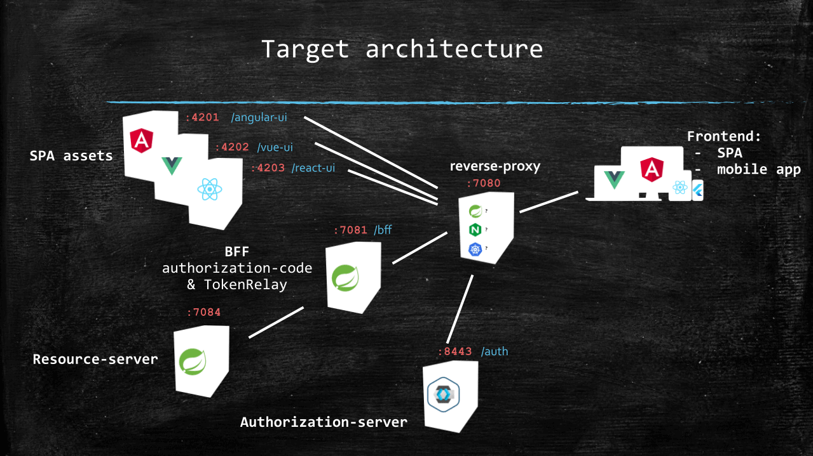

# [使用 Spring 云网关为前端创建 OAuth2 后端](https://www.baeldung.com/spring-cloud-gateway-bff-oauth2)

1. 概述

    在本教程中，我们将使用 Spring Cloud Gateway 和 [spring-addons](https://github.com/ch4mpy/spring-addons) 实现 OAuth2 Backend for Frontend (BFF) 模式，以便从三个不同的单页面应用程序（Angular、React 和 Vue）消费无状态 REST API。

    使用调试工具检查时，我们在使用 OAuth2 的主要网站（Google、Facebook、Github 或 LinkedIn）上都找不到任何 Bearer 标记。这是为什么呢？

    [安全专家认为](https://github.com/spring-projects/spring-authorization-server/issues/297#issue-896744390)，即使使用 PKCE，我们也不应该将用户设备上运行的应用程序配置为 "public" OAuth2 客户端。建议的替代方案是，在我们信任的服务器上运行的 BFF 上，通过会话对移动应用程序和网络应用程序进行授权。

    在这里，我们将看到单页面应用程序（SPA）如何通过 OAuth2 BFF 轻松消费 REST API。我们还将了解到，现有的资源服务器（使用 Bearer 访问令牌授权的无状态 REST API）无需进行任何修改。

2. 前端模式的 OAuth2 后端

    在深入实施之前，我们先来了解一下什么是 OAuth2 BFF、它能带来什么以及代价是什么。

    1. 定义

        前端后端（Backend for Frontend）是前端和 REST API 之间的中间件，可以有不同的用途。在这里，我们感兴趣的是 OAuth2 BFF，它是使用会话 cookie（前端）进行请求授权和使用 Bearer 令牌（资源服务器所期望的）进行授权之间的桥梁。其职责如下

        - 使用 "保密(confidential)" OAuth2 客户端驱动授权代码和刷新令牌流
        - 维护会话并在其中存储令牌
        - 在会话中用访问令牌替换会话 cookie，然后再将请求从前端转发到资源服务器

    2. 与公共 OAuth2 客户端相比的优势

        主要的附加值是安全性：

        - 当 BFF 在我们信任的服务器上运行时，授权服务器令牌端点就能受到秘密(secret)和防火墙规则的保护，只允许来自我们后端的请求。这大大降低了向恶意客户端发放令牌的风险。
        - 令牌保存在服务器上（会话中），这可以防止它们在终端用户设备上被恶意程序窃取。使用会话 cookie 需要防止 CSRF，但 cookie 可以标记为 HttpOnly、Secure 和 SameSite，在这种情况下，设备上的 cookie 保护由浏览器本身执行。相比之下，配置为公共客户端的 SPA 需要访问令牌，我们必须非常小心地处理这些令牌的存储方式： 如果恶意程序读取了访问令牌，后果将不堪设想。如果是刷新令牌，情况会更糟，因为身份篡夺可能会持续很长时间。

        它的另一个好处是可以完全控制用户会话，并能立即撤销访问。需要提醒的是，JSON Web 标记（JWT）无法失效，而且在服务器上终止会话时，我们很难删除存储在终端用户设备上的标记。如果我们通过网络发送 JWT 访问令牌，我们所能做的就是等待它过期，因为在此之前，对资源服务器的访问将继续得到授权。但是，如果令牌从未离开过后台，那么我们就可以在 BFF 上连同用户会话一起删除令牌，从而立即取消对资源的访问权限。

    3. 成本

        BFF 是系统中的一个附加层，它处于关键路径上。在生产中，这意味着需要更多的资源和更长的延迟。它还需要一些监控。

        此外，BFF 后面的资源服务器可以（也应该）是无状态的，但 OAuth2 BFF 本身需要会话，这就需要特定的操作使其具有可扩展性和容错性。

        我们可以轻松地将 Spring Cloud Gateway 打包成本地映像。这让它变得超级轻量级，只需几分之一秒即可启动，但单个实例所能承受的流量总是有限的。当流量增加时，我们就必须在 BFF 实例之间共享会话。Spring Session 项目将为此提供很大帮助。另一种方法是使用智能代理，将来自特定设备的所有请求路由到同一个 BFF 实例。

    4. 实现方式的选择

        有些框架在实现 OAuth2 BFF 模式时并没有明确告知或调用该模式。例如 NextAuth 库就是这种情况，它使用服务器组件来实现 OAuth2（服务器上 Node 实例中的保密客户端）。这足以从 OAuth2 BFF 模式的安全性中获益。

        但由于 Spring 生态系统的存在，在监控、可扩展性和容错方面，很少有解决方案能像 Spring Cloud Gateway 一样得心应手：

        - spring-boot-starter-actuator 依赖项提供了强大的审计功能。
        - Spring Session 是一种相当简单的分布式会话解决方案。
        s- pring-boot-starter-oauth2-client 和 oauth2Login() 处理授权代码和刷新令牌流。它还在会话中存储令牌。

        当把请求从前端转发到资源服务器时，TokenRelay= 过滤器会把会话 cookie 替换为会话中的访问令牌。

3. 架构

    到目前为止，我们列出了许多服务：前端（SPA）、REST API、BFF 和授权服务器。让我们来看看这些服务是如何组成一个连贯的系统的。

    1. 系统概述

        以下是我们将与主配置文件一起使用的服务、端口和路径前缀：

        

        使用 Spring-cloud-gateway 的 Backend For Frontend 模式。前端的唯一接触点是反向代理，它会根据路径前缀将请求路由到暴露 SPA 资产的服务、BFF 或授权服务器之一。资源服务器位于 BFF 后面，只能通过它访问。

        本模式有两点值得注意：

        - 从终端用户设备的角度来看，至少有一个 BFF 和 SPA 资产的单一接触点：反向代理。
        - 资源服务器通过 BFF 访问。

        稍后我们将看到，通过反向代理为授权服务器提供服务是可选的。

        当进入类似生产环境时，我们可以使用（子）域而不是路径前缀来区分不同的 SPA。

        3.2. 快速启动

        配套软件仓库包含一个构建脚本，用于构建和启动上述各项服务的 docker 镜像。

        为了让一切都能正常运行，我们应该确保

        - 路径上有介于 17 和 21 之间的 JDK。我们可以运行 java -version 来检查。
        - 已安装并运行 Docker Desktop。
        - 路径上有最新的 node LTS（nvm 或 nvm-windows 对此有很大帮助）。

        然后，我们可以运行下面的 shell 脚本（在 Windows 上，我们可以使用 Git bash）：

        ```shell
        git clone https://github.com/eugenp/tutorials.git
        cd tutorials/spring-security-modules/spring-security-oauth2-bff/
        sh ./build.sh
        ```

        在接下来的章节中，我们将看到如何用手头的东西替换每个容器。

4. 使用 Spring Cloud Gateway 和 spring-addons-starter-oidc 实现 BFF

    首先，使用集成开发环境或 <https://start.spring.io/>，创建一个名为 bff 的 Spring Boot 项目，并将 Reactive Gateway 和 OAuth2 客户端作为依赖项。

    然后，将 src/main/resources/application.properties 重命名为 src/main/resources/application.yml。

    最后，将 spring-addons-starter-oidc 添加到依赖项中：

    ```xml
    <dependency>
        <groupId>com.c4-soft.springaddons</groupId>
        <artifactId>spring-addons-starter-oidc</artifactId>
        <version>7.7.0</version>
    </dependency>
    ```

    1. 重用属性

        让我们从 [application.yml](/backend/bff/src/main/resources/application.yml) 中的几个常量开始，它们将在其他部分以及需要覆盖命令行或 IDE 启动配置中的某些值时为我们提供帮助：

        ```yml
        scheme: http
        hostname: localhost
        reverse-proxy-port: 7080
        reverse-proxy-uri: ${scheme}://${hostname}:${reverse-proxy-port}
        authorization-server-prefix: /auth
        issuer: ${reverse-proxy-uri}${authorization-server-prefix}/realms/baeldung
        client-id: baeldung-confidential
        client-secret: secret
        username-claim-json-path: $.preferred_username
        authorities-json-path: $.realm_access.roles
        bff-port: 7081
        bff-prefix: /bff
        resource-server-port: 7084
        audience: 
        ```

        当然，我们还需要用环境变量、命令行参数或 IDE 启动配置来覆盖 client-secret 的值。

    2. 服务器属性

        下面是常用的服务器属性：

        ```yml
        server:
          port: ${bff-port}
        ```

    3. Spring 云网关路由

        由于网关后面只有一个资源服务器，我们只需要一个路由定义：

        ```yml
        spring:
          cloud:
            gateway:
              routes:
              - id: bff
                uri: ${scheme}://${hostname}:${resource-server-port}
                predicates:
                - Path=/api/**
                filters:
                - DedupeResponseHeader=Access-Control-Allow-Credentials Access-Control-Allow-Origin
                - TokenRelay=
                - SaveSession
                - StripPrefix=1
        ```

        最重要的部分是 SaveSession 和 TokenRelay=，它们是实现 OAuth2 BFF 模式的基石。第一个部分确保会话与 oauth2Login() 获取的令牌一起被持久化，第二个部分在路由请求时用会话中的访问令牌替换会话 cookie。

        在路由请求时，StripPrefix=1 过滤器会删除路径中的 /api 前缀。值得注意的是，在反向代理路由过程中，/bff 前缀已被去除。因此，从前端发送到 /bff/api/me 的请求在资源服务器上会显示为 /me。

    4. Spring 安全性

        现在我们可以使用标准 Boot 属性来配置 OAuth2 客户端安全性：

        ```yml
        spring:
          security:
            oauth2:
              client:
                provider:
                  baeldung:
                    issuer-uri: ${issuer}
                registration:
                  baeldung:
                    provider: baeldung
                    authorization-grant-type: authorization_code
                    client-id: ${client-id}
                    client-secret: ${client-secret}
                    scope: openid,profile,email,offline_access
        ```

        这里其实没什么特别的，只是一个标准的 OpenID Provider 声明，使用授权码和刷新令牌进行一次注册。

    5. Spring-addons-starter-oidc

        为了完成配置，让我们用 [spring-addons-starter-oidc](https://github.com/ch4mpy/spring-addons/tree/master/spring-addons-starter-oidc#spring-addons-starter-oidc) 来调整 Spring Security：

        ```yml
        com:
          c4-soft:
            springaddons:
              oidc:
                # Trusted OpenID Providers configuration (with authorities mapping)
                ops:
                - iss: ${issuer}
                  authorities:
                  - path: ${authorities-json-path}
                  aud: ${audience}
                # SecurityFilterChain with oauth2Login() (sessions and CSRF protection enabled)
                client:
                  client-uri: ${reverse-proxy-uri}${bff-prefix}
                  security-matchers:
                  - /api/**
                  - /login/**
                  - /oauth2/**
                  - /logout
                  permit-all:
                  - /api/**
                  - /login/**
                  - /oauth2/**
                  csrf: cookie-accessible-from-js
                  oauth2-redirections:
                    rp-initiated-logout: ACCEPTED
                # SecurityFilterChain with oauth2ResourceServer() (sessions and CSRF protection disabled)
                resourceserver:
                  permit-all:
                  - /login-options
                  - /error
                  - /actuator/health/readiness
                  - /actuator/health/liveness
        ```

        让我们了解一下这三个主要部分：

        - ops 的特定值： 通过该属性，我们可以指定要转换为 Spring 权限的声明的 JSON 路径（可选前缀和大小写转换）。如果 aud 属性不为空，spring-addons 会向 JWT 解码器添加受众验证器。
        - 客户端： 如果 security-matchers 不为空，该部分会触发使用 oauth2Login() 创建 SecurityFilterChain Bean。在这里，我们使用 client-uri 属性强制使用反向代理 URI 作为所有重定向的基础（而不是 BFF 内部 URI）。此外，由于我们使用的是 SPA，我们要求 BFF 在 Javascript 可访问的 cookie 中公开 CSRF 标记。最后，为防止 CORS 错误，我们要求 BFF 以 201 状态（而不是 3xx）响应 [RP 发起的注销](https://openid.net/specs/openid-connect-rpinitiated-1_0.html)，这样 SPA 就能拦截此响应，并要求浏览器以新的起源在请求中处理此响应。
        - 资源服务器： 这要求使用 oauth2ResourceServer() 创建第二个 SecurityFilterChain Bean。该过滤链的 @Order 优先级最低，它将处理所有未被客户端 SecurityFilterChain 的安全匹配器匹配的请求。我们将其用于所有不需要会话的资源：不涉及登录或使用 TokenRelay 路由的端点。

    6. /login-options 端点

        BFF 是我们定义登录配置的地方： 带有授权码的 Spring OAuth2 客户端注册。为避免在每个 SPA 中重复配置（以及可能出现的不一致），我们将在 BFF 上托管一个 REST 端点，为用户提供其支持的登录选项。

        为此，我们只需在 @RestController 中公开一个端点，该端点将返回由配置属性构建的有效载荷：

        

        现在，我们可以停止 baeldung-bff.bff docker 容器并运行 BFF 应用程序，小心地在命令行或运行配置中提供以下信息：

        - hostname：hostname 命令或 HOSTNAME 环境变量的值，转换为小写字母
        - client-secret：授权服务器中声明的 baeldung-confidential 客户端的秘密值（"secret"，除非明确更改）。

    7. 非标准 RP 启动的注销

        RP 启动注销是 OpenID 标准的一部分，但有些提供商并未严格执行。例如 Auth0 和 Amazon Cognito 就没有在 OpenID 配置中提供 end_session 端点，而是使用自己的查询参数注销。

        spring-addons-starter-oidc 支持这种 "almost" 符合标准的注销端点。配套项目中的 BFF 配置包含具有所需配置的配置文件：

        ```yml
        ---
        spring:
          config:
            activate:
              on-profile: cognito
        issuer: https://cognito-idp.us-west-2.amazonaws.com/us-west-2_RzhmgLwjl
        client-id: 12olioff63qklfe9nio746es9f
        client-secret: change-me
        username-claim-json-path: username
        authorities-json-path: $.cognito:groups
        com:
          c4-soft:
            springaddons:
              oidc:
                client:
                  oauth2-logout:
                    baeldung:
                      uri: https://spring-addons.auth.us-west-2.amazoncognito.com/logout
                      client-id-request-param: client_id
                      post-logout-uri-request-param: logout_uri

        ---
        spring:
          config:
            activate:
              on-profile: auth0
        issuer: https://dev-ch4mpy.eu.auth0.com/
        client-id: yWgZDRJLAksXta8BoudYfkF5kus2zv2Q
        client-secret: change-me
        username-claim-json-path: $['https://c4-soft.com/user']['name']
        authorities-json-path: $['https://c4-soft.com/user']['roles']
        audience: bff.baeldung.com
        com:
          c4-soft:
            springaddons:
              oidc:
                client:
                  authorization-params:
                    baeldung:
                    audience: ${audience}
                  oauth2-logout:
                    baeldung:
                      uri: ${issuer}v2/logout
                      client-id-request-param: client_id
                      post-logout-uri-request-param: returnTo
        ```

        在上面的代码段中，baeldung 是对 Spring Boot 属性中客户端注册的引用。如果我们在 spring.security.oauth2.client.registration 中使用了不同的密钥，那么这里也必须使用该密钥。

        除了所需的属性重载外，我们还可以在第二个配置文件中注意到向 Auth0 发送授权请求时额外请求参数的规范： audience。

5. 使用 spring-addons-starter-oidc 的资源服务器

    我们对该系统的需求很简单：使用 JWT 访问令牌授权一个无状态 REST API，暴露一个端点以反映令牌中包含的一些用户信息（如果请求未获授权，则暴露一个带空值的有效载荷）。

    为此，我们将创建一个名为 resource-server 的新 Spring Boot 项目，并将 Spring Web 和 OAuth2 Resource Server 作为依赖项。

    然后，将 src/main/resources/application.properties 重命名为 [src/main/resources/application.yml](/backend/resource-server/src/main/resources/application.yml)。

    最后，我们将在依赖项中添加 spring-addons-starter-oidc：

    ```xml
    <dependency>
        <groupId>com.c4-soft.springaddons</groupId>
        <artifactId>spring-addons-starter-oidc</artifactId>
        <version>7.7.0</version>
    </dependency>
    ```

    1. 配置

        让我们看看资源服务器所需的属性：

        ```yml
        scheme: http
        hostname: localhost
        reverse-proxy-port: 7080
        reverse-proxy-uri: ${scheme}://${hostname}:${reverse-proxy-port}
        authorization-server-prefix: /auth
        issuer: ${reverse-proxy-uri}${authorization-server-prefix}/realms/baeldung
        username-claim-json-path: $.preferred_username
        authorities-json-path: $.realm_access.roles
        resource-server-port: 7084
        audience: 

        server:
          port: ${resource-server-port}

        com:
          c4-soft:
            springaddons:
              oidc:
                ops:
                - iss: ${issuer}
                  username-claim: ${username-claim-json-path}
                  authorities:
                  - path: ${authorities-json-path}
                  aud: ${audience}
                resourceserver:
                  permit-all:
                  - /me
        ```

        多亏了 spring-addons-starter-oidc，这足以声明一个无状态资源服务器：

        - 从我们选择的权利要求（realm_access.roles，在 Keycloak 使用 realm roles 的情况下）中获得授权映射
        - 让匿名请求可以访问 /me

        配套软件仓库中的 application.yaml 包含其他 OpenID 提供商使用其他私有角色声明的配置文件。

    2. @RestController

        让我们实现一个 REST 端点，从安全上下文（如有）中的身份验证返回一些数据：

        

        就像在 BFF 上所做的那样，我们现在可以停止 _baeldung-bff.resource-server docker_ 容器，在命令行或运行配置中提供主机名。

    3. 资源服务器多租户

        如果使用我们的 REST API 的前端并不都在同一授权服务器或领域（或提供多种授权服务器选择）上对用户进行授权，该怎么办？

        有了 spring-security-starter-oidc，这个问题就变得简单了：com.c4-soft.springaddons.oidc.ops 配置属性是一个数组，我们可以添加任意多的发行者，每个发行者都有用户名和授权的映射。我们的资源服务器将接受这些发行者中任何一个发行的有效令牌，并将角色正确映射到 Spring 权限。

6. SPA

    由于用于将 SPA 连接到 OAuth2 BFF 的框架之间存在一些差异，我们将介绍三个主要框架： Angular、React 和 Vue。

    但是，创建 SPA 不在本文讨论范围之内。下面，我们将只关注网络应用程序如何通过 OAuth2 BFF 登录用户并查询其背后的 REST API。有关完整的实现，请参阅配套软件仓库。

    我们努力使这些应用程序具有相同的结构：

    - 两个路由演示了如何在验证后恢复当前路由。
    - 登录组件在 iframe 和默认值都可用的情况下提供登录体验的选择。它还能处理 iframe 显示状态或重定向到授权服务器。
    - 注销组件向 BFF /logout 端点发送 POST 请求，然后重定向到授权服务器，进行 RP 发起的注销。
    - UserService 通过 BFF 从资源服务器获取当前用户数据。在 BFF 上的访问令牌过期之前，它还拥有一些安排刷新这些数据的逻辑。

    不过，由于框架处理状态的方式截然不同，因此管理当前用户数据的方式也有所不同：

    - 在 Angular 应用程序中，UserService 是一个管理当前用户和 BehaviorSubject 的单例。
    - 在 React 应用程序中，我们在 app/layout.tsx 中使用 createContext 向所有组件公开当前用户，并在需要访问的地方使用 useContext。
    - 在 Vue 应用程序中，UserService 是一个单例（在 main.ts 中实例化），通过 ref 管理当前用户。

    1. 在同伴 Repo 中运行 SPA

        首先要做的是进入我们要运行的项目文件夹。

        然后，运行 "npm install"（安装 npm），调出所有需要的 npm 包。

        最后，在停止了相应的 docker 容器后，根据框架的不同，我们可以执行以下操作：

        - Angular：运行 "npm run start" 并打开 <http://{hostname}:7080/angular-ui/>
        - Vue：运行 "npm run dev" 并打开 <http://{hostname}:7080/vue-ui/>
        - React (Next.js)：运行 "npm run dev" 并打开 <http://{hostname}:7080/react-ui/>

        我们应注意只使用指向反向代理而非 SPA 开发服务器的 URL（`http://{hostname}:7080，而非 http://{hostname}:4201、http://{hostname}:4202 或 http://{hostname}:4203`）。

    2. 用户服务

        用户服务的职责是

        - 定义用户表示（内部和 DTO）。
        - 公开一个函数，以便通过 BFF 从资源服务器获取用户数据。
        - 在访问令牌过期前调用 refresh()（保持会话有效）。

    3. 登录

        正如我们已经看到的，在可能的情况下，我们会提供两种不同的登录体验：

        - 用户使用当前浏览器标签页重定向到授权服务器（SPA 暂时 "退出(exits)"）。这是默认行为，并且始终可用。
        - 授权服务器表单显示在 SPA 内部的 iframe 中，这就要求 SPA 和授权服务器使用 SameOrigin，因此只有当 BFF 和资源服务器使用默认配置文件（带 Keycloak）运行时才会起作用。

        逻辑由登录组件实现，该组件显示一个下拉菜单，用于选择登录体验（iframe 或 default）和一个按钮。

        登录选项在组件初始化时从 BFF 获取。在本教程中，我们预计只有一个选项，因此我们只选择响应有效载荷中的第一个条目。

        当用户点击登录(Login)按钮时，会发生什么取决于所选择的登录体验：

        - 如果选择 iframe，则 iframe 源将设置为登录 URI，并显示包含 iframe 的模态 div。
        - 否则，window.location.href 将被设置为登录 URI，从而 "exits" SPA，并将当前标签页设置为全新的原点。

        当用户选择 iframe 登录体验时，我们会为 iframe 加载事件注册一个事件监听器，以检查用户验证是否成功，并隐藏模态。每次在 iframe 中发生重定向时，都会运行该回调。

        Spring-addons-starter-oidc 会在会话中保存此参数的值，并在授权码与令牌交换后，使用它来构建返回给前端的重定向 URI。

    4. 注销

        注销按钮和相关逻辑由注销组件处理。

        默认情况下，Spring /logout 端点需要一个 POST 请求，并且与任何修改会话服务器状态的请求一样，该请求应包含一个 CSRF 标记。Angular 和 React 会透明地处理 CSRF cookie，并在请求头中标记 http-only=false。但我们必须手动读取 XSRF-TOKEN cookie，并在 Vue 中为每个 POST、PUT、PATCH 和 DELETE 请求设置 X-XSRF-TOKEN 标头。我们还应经常参考所选前端框架的文档，因为其中可能存在一些微妙的障碍。例如，Angular 会为我们设置 X-XSRF-TOKEN 标头，但仅限于没有授权的 URL（我们应该查询 /bff/api/me，而不是 <http://localhost:7080/bff/api/me>，即使窗口位置是 <http://localhost:7080/angular-ui/>）。

        当涉及 Spring OAuth2 客户端时，RP-Initiated Logout（RP 发起的注销）分两个请求进行：

        - 首先，向 Spring OAuth2 客户端发送一个 POST 请求，关闭自己的会话。
        - 第一个请求的响应带有一个 Location 标头，其中包含一个授权服务器上的 URI，用于关闭用户在该服务器上的其他会话。

        Spring 的默认行为是对第一个请求使用 302 状态，这将使浏览器自动跟踪到授权服务器，并保持相同的原点。为了避免 CORS 错误，我们将 BFF 配置为使用 2xx 字段中的状态。这就要求 SPA 手动跟踪重定向，但它有机会使用 window.location.href（使用新的原点）来跟踪重定向。

        最后，我们可以注意到 SPA 是如何在注销请求中使用 X-POST-LOGOUT-SUCCESS-URI 标头来提供注销后 URI 的。spring-addons-starter-oidc 使用该标头的值在来自授权服务器的注销请求 URI 中插入一个请求参数。

    5. 客户端多租户

        在配套项目中，只有一个带有授权代码的 OAuth2 客户端注册。但如果我们有更多的客户端呢？例如，如果我们在多个前端共享一个 BFF，其中一些前端有不同的发行方或范围，就可能出现这种情况。

        我们应该提示用户只能在他可以进行身份验证的 OpenID 提供商中进行选择，而且在很多情况下，我们可以过滤登录选项。

        以下是一些示例，在这些情况下，我们可以大幅减少可能的选择数量，最好是减少到一个，这样就不会提示用户做出选择：

        - SPA 配置了特定的使用选项。
        - 有多个反向代理，每个反向代理都可以设置一个类似于头的选项。
        - 一些技术信息（如前端设备的 IP）会告诉我们，用户应该在这里或那里获得授权。

        在这种情况下，我们有两种选择：

        - 将过滤条件连同请求一起发送到 /login-options 并在 BFF 控制器中进行过滤。
        - 在前端过滤 /login-options 响应。

7. 后端注销

    如果在 SSO 配置中，BFF 上已打开会话的用户使用另一个 OAuth2 客户端注销，该怎么办？

    在 OIDC 中，"后向通道注销"（[Back-Channel Logout](https://openid.net/specs/openid-connect-backchannel-1_0.html)）规范就是针对这种情况制定的：在授权服务器上声明客户端时，我们可以注册一个 URL，以便在用户注销时调用。

    由于 BFF 是在服务器上运行的，因此它可以暴露一个端点，以接收此类注销事件的通知。自 6.2 版起，[Spring Security 支持后端注销（Back-Channel Logout）](https://docs.spring.io/spring-security/reference/reactive/oauth2/login/logout.html#configure-provider-initiated-oidc-logout)，spring-addons-starter-oidc 提供了启用后端注销的标志。

    一旦会话在 BFF 上以 "Back-Channel Logout"（注销）方式结束，前端向资源服务器发出的请求将不再获得授权（即使在令牌过期之前）。因此，为了获得完美的用户体验，当在 BFF 上激活 "后向通道注销 "时，我们或许还应该添加类似 WebSockets 的机制，以通知前端用户状态的变化。

8. 反向代理

    我们需要为 SPA 及其 BFF 提供相同的来源，因为：

    - 请求在前端和 BFF 之间使用会话 cookie 进行授权。
    - Spring 会话 cookie 标记为 SameSite=Lax。

    为此，我们将使用反向代理作为浏览器的单一联络点。不过，实现这种反向代理有许多不同的解决方案，我们的选择取决于具体情况：

    - 在 Docker 中，我们使用 Nginx 容器。
    - 在 K8s 上，我们可能会配置一个 Ingress。
    - 在集成开发环境中工作时，我们可能会选择 Spring Cloud Gateway 实例。如果运行服务的数量很重要，我们甚至可以在用作 BFF 的网关实例上使用一些额外路由，而不是像本文中那样使用专用路由。

    1. 是否将授权服务器隐藏在反向代理后面

        出于安全考虑，授权服务器应始终设置 [X-Frame-Options 头信息](https://developer.mozilla.org/fr/docs/Web/HTTP/Headers/X-Frame-Options)。由于 Keycloak 允许将其设置为 SAMEORIGIN，如果授权服务器和 SPA 共享相同的起源，那么就有可能在嵌入此 SPA 的 iframe 中显示 Keycloak 登录和注册表单。

        从最终用户的角度来看，与其在 SPA 和授权服务器之间来回重定向，不如留在同一个网络应用程序中，以模态方式显示授权表单，这样的体验可能更好。

        另一方面，单点登录（SSO）依赖于标记为 SameOrigin 的 cookie。因此，要从单点登录中获益，两个 SPA 不仅要在同一授权服务器上对用户进行身份验证，还要使用相同的授权（<https://appa.net> 和 <https://appy.net> 都在 <https://sso.net> 上对用户进行身份验证）。

        符合这两个条件的解决方案是，所有 SPA 和授权服务器使用相同的起源，URI 如下：

        - <https://domain.net/appa>
        - <https://domain.net/appy>
        - <https://domain.net/auth>

        这是我们在使用 Keycloak 时会用到的方案，但在 SPA 和授权服务器之间共享相同的起源并不是 BFF 模式工作的必要条件，只有在 SPA 和 BFF 之间共享相同的起源才是必要条件。

        配套软件仓库中的项目已预先配置为使用亚马逊 Cognito 和 Auth0 作为原点（没有智能代理临时重写重定向 URL）。因此，只有在使用默认配置文件（带 Keycloak）时，才能通过 iframe 登录。

    2. 使用 Spring 云网关实施

        首先，使用集成开发环境或 <https://start.spring.io/>，创建一个名为 reverse-proxy 的新 Spring Boot 项目，并将 Reactive Gateway 作为依赖项。

        然后将 src/main/resources/application.properties 重命名为 [src/main/resources/application.yml](/backend/reverse-proxy/src/main/resources/application.yml)。

        然后，我们应为 Spring Cloud Gateway 定义路由属性：

        ```yml
        # Custom properties to ease configuration overrides
        # on command-line or IDE launch configurations
        scheme: http
        hostname: localhost
        reverse-proxy-port: 7080
        angular-port: 4201
        angular-prefix: /angular-ui
        angular-uri: http://${hostname}:${angular-port}${angular-prefix}
        vue-port: 4202
        vue-prefix: /vue-ui
        vue-uri: http://${hostname}:${vue-port}${vue-prefix}
        react-port: 4203
        react-prefix: /react-ui
        react-uri: http://${hostname}:${react-port}${react-prefix}
        authorization-server-port: 8080
        authorization-server-prefix: /auth
        authorization-server-uri: ${scheme}://${hostname}:${authorization-server-port}${authorization-server-prefix}
        bff-port: 7081
        bff-prefix: /bff
        bff-uri: ${scheme}://${hostname}:${bff-port}

        server:
          port: ${reverse-proxy-port}

        spring:
          cloud:
            gateway:
              default-filters:
              - DedupeResponseHeader=Access-Control-Allow-Credentials Access-Control-Allow-Origin
              routes:
              # SPAs assets
              - id: angular-ui
                uri: ${angular-uri}
                predicates:
                - Path=${angular-prefix}/**
              - id: vue-ui
                uri: ${vue-uri}
                predicates:
                - Path=${vue-prefix}/**
              - id: react-ui
                uri: ${react-uri}
                predicates:
                - Path=${react-prefix}/**
              
              # Authorization-server
              - id: authorization-server
                uri: ${authorization-server-uri}
                predicates:
                - Path=${authorization-server-prefix}/**
              
              # BFF
              - id: bff
                uri: ${bff-uri}
                predicates:
                - Path=${bff-prefix}/**
                filters:
                - StripPrefix=1
        ```

        现在，我们可以启动反向代理 reverse-proxy（在停止 docker 容器并将主机名作为命令行参数或在运行配置中提供后）。

9. 授权服务器

    在 GitHub 上的配套项目中，默认配置文件是为 Keycloak 设计的，但由于有了 spring-addons-starter-oidc，只需编辑 application.yml，就能切换到其他 OpenID 提供者。配套项目中提供的文件包含一些配置文件，可以帮助我们轻松开始使用 Auth0 和 Amazon Cognito。

    无论选择哪种 OpenID 提供商，我们都应该

    - 声明保密客户端
    - 确定用作用户角色来源的私有声明
    - 更新 BFF 和资源服务器属性

10. 为什么使用 spring-addons-starter-oidc？

    在本文中，我们修改了 spring-boot-starter-oauth2-client 和 spring-boot-starter-oauth2-resource-server 的许多默认行为：

    - 更改 OAuth2 重定向 URI，使其指向反向代理，而不是内部 OAuth2 客户端。
    - 让 SPA 能够控制用户登录/注销后的重定向位置。
    - 在浏览器中运行的 JavaScript 代码可访问的 cookie 中公开 CSRF 标记。
    - 适应不完全标准的 RP 发起的注销（例如 Auth0 和 Amazon Cognito）。
    - 为授权请求添加可选参数（例如 Auth0 受众）。
    - 更改 OAuth2 重定向的 HTTP 状态，以便 SPA 可以选择如何遵循 Location 标头。
    - 分别用 oauth2Login()（基于会话的安全性和 CSRF 保护）和 oauth2ResourceServer()（无状态，基于令牌的安全性）注册两个不同的 SecurityFilterChain Bean，以确保不同资源组的安全。
    - 定义匿名用户可访问哪些端点。
    - 在资源服务器上，接受不止一个 OpenID 提供商签发的令牌。
    - 为 JWT 解码器添加受众验证器。
    - 从任何声明中映射授权（并添加前缀或强制大/小写）。

    这通常需要大量 Java 代码和对 Spring Security 的深入了解。但在这里，我们只需使用应用程序属性，并在集成开发环境自动完成的指导下即可完成！

    我们应该参考 GitHub 上的[启动程序 README](https://github.com/ch4mpy/spring-addons/blob/master/spring-addons-starter-oidc/README.MD#spring-addons-starter-oidc)，以获取完整的功能、自动配置调整和默认重载列表。

11. 总结

    在本教程中，我们了解了如何使用 Spring Cloud Gateway 和 spring-addons 实现 OAuth2 Backend for Frontend 模式。

    我们还看到

    - 为什么我们应该选择这种解决方案，而不是将 SPA 配置为 "public" OAuth2 客户端。
    - 引入 BFF 对 SPA 本身影响不大。
    - 这种模式对资源服务器没有任何改变。
    - 由于我们使用的是服务器端 OAuth2 客户端，因此可以完全控制用户会话，即使在 SSO 配置中也是如此，这要归功于 "后向通道注销"（Back-Channel Logout）。

    最后，我们开始探索 Spring-addons-starter-oidc 是如何只用属性就能方便地配置通常需要大量 Java 配置的功能。
