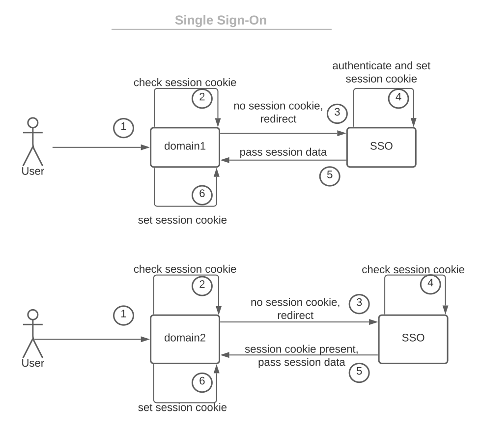

# 单点登录（SSO）指南

1. 简介

    单点登录机制（[SSO](https://www.baeldung.com/sso-spring-security-oauth2)）允许用户一次登录到一个应用程序，并获得对所有相关系统的访问，而不需要分别登录到这些系统。在这篇文章中，我们将详细定义SSO是如何工作的，以及该技术的优点和缺点是什么。

2. 基本原理

    正如我们所提到的，由于SSO，一个用户只需登录一次服务，就可以自动登录到所有相关的应用程序。作为一个例子，让我们考虑一个谷歌账户。在登录到谷歌的一个服务后，例如Gmail，用户被授予访问所有其他独立的应用程序，如Youtube、Google Play或Google Drive。此外，相同的凭证在这些相关系统中都被使用。

    在企业中，员工每天都在使用多个应用程序。SSO摆脱了单独登录它们的需要。此外，用户不需要存储或记住多个凭证。因此，系统管理员在配置对系统的访问方面有更少的工作。因此，忘记或无法使用凭证的情况不太可能发生，也更容易处理。正如我们所看到的，SSO可以改善组织中的多个流程。

    1. 联合的身份

        首先，让我们定义一个[联合身份](https://en.wikipedia.org/wiki/Federated_identity)必须处理的问题：

        - [认证](https://www.baeldung.com/spring-security-authentication-and-registration)
        - [授权](https://www.baeldung.com/spring-security-custom-oauth-requests)
        - 用户管理
        认证是一个验证用户身份的过程。简单地说，它确保一个用户确实是他或她所声称的那个人。有很多流行的认证方法，如密码、软件或硬件令牌、个人识别号码、指纹等。

        授权过程验证了用户是否有权限访问特定的资源。例如，一个网上商店的管理员将能够访问买家不应该访问的资源，例如，更新产品的价格。授权应该总是发生在认证之后。

        用户管理是对用户账户的监督。因此，一般来说，创建、存储和修改它们。

        单点登录只与一个认证过程有关。因此，它本身不是一个联合身份，只是它的一部分。它的任务是验证用户的身份，并在相关的应用程序中分享这些信息。

        让我们看看SSO在实践中是如何工作的。

    2. 工作流程

        让我们简单介绍一下SSO所解决的问题。我们希望一个用户能够在域1和域2用相同的登录名和密码登录。此外，如果用户已经在域1中登录，他应该自动在域2中登录，反之亦然。解决办法是在域之间共享会话数据。然而，由于[同源政策](https://en.wikipedia.org/wiki/Same-origin_policy)，[cookies](https://www.baeldung.com/cookies-java)不能在域之间共享。因此，SSO通过认证用户并以各种方式共享他们的会话数据来拯救他们。

        我们将在下一节介绍不同的SSO配置。一般来说，有一个中心域来识别用户并分享他们的会话数据，例如，以[JWT](https://www.baeldung.com/spring-security-oauth-jwt)的形式。让我们大致描述一下SSO的过程。

        - 用户进入domain1
        - domain1检查是否没有会话cookie，因此将用户重定向到SSO系统
        - SSO系统检查到没有会话cookie，所以提示登录页面
        - SSO系统对用户进行认证
        - SSO系统设置一个会话cookie（如果认证成功）。
        - SSO系统用一个包含会话数据的参数（例如，JWT）重定向回domain1
        - domain1使用传递的数据设置会话cookie
        - 用户进入domain2
        - domain2检查是否没有会话cookie，因此将用户重定向到SSO系统
        - SSO系统检查会话cookie是否存在
        - SSO系统用一个包含会话数据（例如，JWT）的参数重定向回domain2
        - domain2使用所传递的数据设置会话cookie
        上述方法是最通用的方法。它可以根据实施的SSO配置和架构而有所不同。下面我们可以在图中看到前面描述的过程：

        
3. 架构

    有多种架构可以用来实现SSO。

    常见的用例是由WEB SSO处理的。WEB SSO只用于可以使用Web浏览器访问的服务。它允许用户通过一次登录访问一组Web服务器。有两种主要的方法来实现WEB SSO：

    - 使用一个基于网络的反向代理控制认证过程
    - 使用一个安装在每个特定服务器上的代理
    这种架构通常使用cookies来跟踪用户的认证状态。上一节中描述的SSO过程适用于WEB SSO架构。

    下一个架构被称为企业单点登录（E-SSO）。它与WEB SSO略有不同，对终端用户来说，这些变化是透明的。用户对E-SSO客户端有单一的凭证，只需登录一次。E-SSO处理对相关应用程序的登录。不同的是，服务可以有单独的凭证进行认证。这些证书由E-SSO客户端维护。此外，应用程序不需要知道E-SSO客户端的情况。当组织想为已经存在和配置好的系统提供SSO时，这种架构尤其通常。

    SSO的目的是在一个单一的组织内使用。联合SSO架构提供的认证数据（通常是令牌）在不同的组织之间是可信的。该架构使用流行的协议，如WS-Federation、[OAuth](https://www.baeldung.com/spring-security-oauth)或SAML来传递令牌。SSO架构在多个组织合作的情况下特别有用。

4. 优点和缺点

    让我们来分析一下SSO解决方案的优点和缺点。

    优点：

    - 简化使用多种服务的终端用户的登录过程
    - 减少遗忘或无法使用证书的情况。因此，它减少了服务台的成本和工作量。
    - 简化了凭证管理
    - 通过减少凭证暴露提高安全性
    - 可以改善组织间的整合和合作
    缺点：

    - 当SSO供应商出现故障时，所有的应用程序可能无法访问
    - 实施SSO可能会耗费时间和成本
    - 窃取SSO凭证使黑客可以进入所有相关系统
    - 必须强制使用一个强大而复杂的密码
    - 一些SSO供应商与第三方共享数据。需要对供应商的条款和政策进行扎实的研究
5. 结语

    在这篇文章中，我们详细地讨论了单点登录。首先，我们介绍了SSO的基本原理和联合身份的主要关注点。其次，我们介绍了一般的SSO工作流程。然后，我们简要地描述了不同的SSO架构。最后，我们概述了SSO解决方案的优点和缺点。

## 相关文章

- [ ] [Guide to Single Sign-On (SSO)](https://www.baeldung.com/cs/sso-guide)
