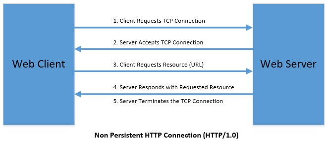
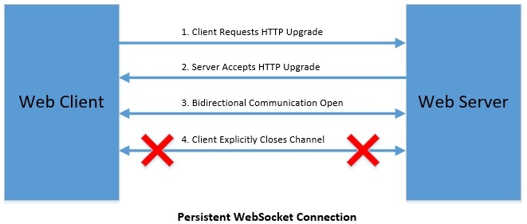

# Spring Security Web Sockets

## 安全和WebSockets简介

1. 简介

    在之前的[文章](https://www.baeldung.com/websockets-spring)中，我们展示了如何将WebSockets添加到Spring MVC项目中。

    在这里，我们将描述如何在Spring MVC中为Spring WebSockets添加安全性。在继续之前，请确保你已经有了基本的Spring MVC安全覆盖，如果没有，请查看这篇[文章](https://www.baeldung.com/spring-security-basic-authentication)。

2. Maven依赖性

    我们的WebSocket实现需要两组主要的Maven依赖项。

    首先，让我们指定我们将使用的Spring框架和Spring Security的总体版本：

    ```xml
    <properties>
        <spring.version>5.3.13</spring.version>
        <spring-security.version>5.7.3</spring-security.version>
    </properties>
    <dependency>
        <groupId>org.springframework</groupId>
        <artifactId>spring-core</artifactId>
        <version>${spring.version}</version>
    </dependency>
    <dependency>
        <groupId>org.springframework</groupId>
        <artifactId>spring-web</artifactId>
        <version>${spring.version}</version>
    </dependency>
    <dependency>
        <groupId>org.springframework</groupId>
        <artifactId>spring-webmvc</artifactId>
        <version>${spring.version}</version>
    </dependency>
    <dependency>
        <groupId>org.springframework.security</groupId>
        <artifactId>spring-security-web</artifactId>
        <version>${spring-security.version}</version>
    </dependency>
    <dependency>
        <groupId>org.springframework.security</groupId>
        <artifactId>spring-security-config</artifactId>
        <version>${spring-security.version}</version>
    </dependency>
    ```

    其次，让我们添加实现基本认证和授权所需的Spring MVC和Spring Security核心库：

    spring-core、spring-web、spring-webmvc、spring-security-web、spring-security-config的最新版本可以在Maven中心找到。

    最后，让我们添加所需的依赖项：

    ```xml
    <dependency>
        <groupId>org.springframework</groupId>
        <artifactId>spring-websocket</artifactId>
        <version>${spring.version}</version>
    </dependency>
    <dependency>
        <groupId>org.springframework</groupId>
        <artifactId>spring-messaging</artifactId>
        <version>${spring.version}</version>
    </dependency>
    <dependency>
        <groupId>org.springframework.security</groupId>
        <artifactId>spring-security-messaging</artifactId>
        <version>${spring-security.version}</version>
    </dependency>
    ```

3. 基本的WebSocket安全

    使用spring-security-messaging库的WebSocket特定安全性集中在AbstractSecurityWebSocketMessageBrokerConfigurer类及其在项目中的实现：

    ```java
    @Configuration
    public class SocketSecurityConfig 
    extends AbstractSecurityWebSocketMessageBrokerConfigurer {
        //...
    }
    ```

    AbstractSecurityWebSocketMessageBrokerConfigurer类提供了由WebSecurityConfigurerAdapter提供的额外安全覆盖。

    spring-security-messaging库不是实现WebSockets安全的唯一途径。如果我们坚持使用普通的spring-websocket库，我们可以实现WebSocketConfigurer接口，并将安全拦截器附加到我们的套接字处理程序。

    由于我们使用的是spring-security-messaging库，我们将使用AbstractSecurityWebSocketMessageBrokerConfigurer方法。

    1. 实现configureInbound()

        configureInbound()的实现是配置AbstractSecurityWebSocketMessageBrokerConfigurer子类的最重要步骤：

        ```java
        @Override 
        protected void configureInbound(
        MessageSecurityMetadataSourceRegistry messages) { 
            messages
            .simpDestMatchers("/secured/**").authenticated()
            .anyMessage().authenticated(); 
        }
        ```

        WebSecurityConfigurerAdapter让你为不同的路由指定各种应用范围的授权要求，而AbstractSecurityWebSocketMessageBrokerConfigurer则让你为套接字目的地指定具体的授权要求。

    2. 类型和目的地匹配

        MessageSecurityMetadataSourceRegistry允许我们指定安全约束，如路径、用户角色，以及允许哪些消息。

        类型匹配器限制了哪些SimpMessageType被允许，以及以何种方式被允许：

        `.simpTypeMatchers(CONNECT, UNSUBSCRIBE, DISCONNECT).permitAll()`

        目的地匹配器限制了哪些端点模式可以访问以及以何种方式访问：

        `.simpDestMatchers("/app/**").hasRole("ADMIN")`

        订阅目的地匹配器映射一个SimpDestinationMessageMatcher实例的列表，该列表在SimpMessageType.SUBSCRIBE上匹配：

        `.simpSubscribeDestMatchers("/topic/**").authenticated()`

        下面是类型和目的地匹配的所有可用方法的[完整列表](https://docs.spring.io/spring-security/site/docs/current/api/org/springframework/security/config/annotation/web/messaging/MessageSecurityMetadataSourceRegistry.html)。

4. 确保套接字路由的安全

    现在我们已经介绍了基本的套接字安全和类型匹配配置，我们可以将套接字安全、视图、STOMP（一种文本消息协议）、消息代理和套接字控制器结合起来，在我们的Spring MVC应用中实现安全的WebSockets。

    首先，让我们为基本的Spring安全覆盖设置我们的套接字视图和控制器：

    ```java
    @Configuration
    @EnableGlobalMethodSecurity(prePostEnabled = true, securedEnabled = true)
    @EnableWebSecurity
    @ComponentScan("com.baeldung.springsecuredsockets")
    public class SecurityConfig { 
        @Bean 
        public SecurityFilterChain filterChain(HttpSecurity http) throws Exception { 
            http
            .authorizeRequests()
            .antMatchers("/", "/index", "/authenticate").permitAll()
            .antMatchers(
                "/secured/**/**",
                "/secured/success", 
                "/secured/socket",
                "/secured/success").authenticated()
            .anyRequest().authenticated()
            .and()
            .formLogin()
            .loginPage("/login").permitAll()
            .usernameParameter("username")
            .passwordParameter("password")
            .loginProcessingUrl("/authenticate")
            //...
        }
    }
    ```

    第二，让我们设置实际的消息目的地与认证要求：

    ```java
    @Configuration
    public class SocketSecurityConfig 
    extends AbstractSecurityWebSocketMessageBrokerConfigurer {
        @Override
        protected void configureInbound(MessageSecurityMetadataSourceRegistry messages) {
            messages
            .simpDestMatchers("/secured/**").authenticated()
            .anyMessage().authenticated();
        }   
    }
    ```

    现在，在我们的WebSocketMessageBrokerConfigurer中，我们可以注册实际的消息和STOMP端点：

    ```java
    @Configuration
    @EnableWebSocketMessageBroker
    public class SocketBrokerConfig 
    implements WebSocketMessageBrokerConfigurer {
        @Override
        public void configureMessageBroker(MessageBrokerRegistry config) {
            config.enableSimpleBroker("/secured/history");
            config.setApplicationDestinationPrefixes("/spring-security-mvc-socket");
        }
        @Override
        public void registerStompEndpoints(StompEndpointRegistry registry) {
            registry.addEndpoint("/secured/chat")
            .withSockJS();
        }
    }
    ```

    让我们定义一个套接字控制器和端点的例子，我们在上面提供了安全覆盖：

    ```java
    @Controller
    public class SocketController {
        @MessageMapping("/secured/chat")
        @SendTo("/secured/history")
        public OutputMessage send(Message msg) throws Exception {
            return new OutputMessage(
            msg.getFrom(),
            msg.getText(), 
            new SimpleDateFormat("HH:mm").format(new Date())); 
        }
    }
    ```

5. 同源政策

    同源策略要求与一个端点的所有交互必须来自交互开始的同一域。

    例如，假设你的WebSockets实现托管在foo.com，并且你正在执行同源策略。如果用户连接到托管在foo.com的客户端，然后打开另一个浏览器到bar.com，那么bar.com将无法访问你的WebSocket实现。

    1. 重写同源政策

        Spring WebSockets开箱即执行同源政策，而普通WebSockets则不执行。

        事实上，Spring Security要求任何有效的CONNECT消息类型都要有CSRF（跨站请求伪造）令牌：

        ```java
        @Controller
        public class CsrfTokenController {
            @GetMapping("/csrf")
            public @ResponseBody String getCsrfToken(HttpServletRequest request) {
                CsrfToken csrf = (CsrfToken) request.getAttribute(CsrfToken.class.getName());
                return csrf.getToken();
            }
        }
        ```

        通过调用/csrf的端点，客户端可以获得令牌并通过CSRF安全层进行认证。

        然而，可以通过在AbstractSecurityWebSocketMessageBrokerConfigurer中添加以下配置来覆盖Spring的同源策略：

        ```java
        @Override
        protected boolean sameOriginDisabled() {
            return true;
        }
        ```

    2. STOMP、SockJS支持和框架选项

        通常使用[STOMP](http://jmesnil.net/stomp-websocket/doc/)和[SockJS](https://github.com/sockjs)来实现对Spring WebSockets的客户端支持。

        SockJS被配置为默认不允许通过HTML iframe元素进行传输。这是为了防止点击劫持的威胁。

        然而，在某些使用情况下，允许iframe利用SockJS的传输是有益的。要做到这一点，你可以创建SecurityFilterChain bean：

        ```java
        @Bean
        public SecurityFilterChain filterChain(HttpSecurity http) 
        throws Exception {
            http
            .csrf()
                //...
                .and()
            .headers()
                .frameOptions().sameOrigin()
            .and()
                .authorizeRequests();
            return http.build();
        }
        ```

        请注意，在这个例子中，尽管允许通过iframes进行传输，但我们还是遵循了同源政策。

6. 覆盖Oauth2

    对Spring WebSockets的Oauth2特定支持是通过在标准的WebSecurityConfigurerAdapter覆盖范围之外实现Oauth2安全覆盖来实现的，并通过扩展来实现。下面是一个如何实现Oauth2的例子。

    为了验证并获得对WebSocket端点的访问，在从客户端连接到后端WebSocket时，您可以将Oauth2访问令牌传递到一个查询参数。

    下面是一个使用SockJS和STOMP演示这一概念的例子：

    ```js
    var endpoint = '/ws/?access_token=' + auth.access_token;
    var socket = new SockJS(endpoint);
    var stompClient = Stomp.over(socket);
    ```

7. 总结

    在这个简短的教程中，我们展示了如何为Spring WebSockets添加安全性。如果你想了解有关这种集成的更多信息，请看Spring的[WebSocket](https://docs.spring.io/spring/docs/current/spring-framework-reference/html/websocket.html)和[WebSocket安全](http://docs.spring.io/autorepo/docs/spring-security/4.2.x/reference/html/websocket.html)参考文档。

## 春天的WebSockets： 向特定用户发送消息

1. 简介

    在本教程中，我们将描述如何使用Spring WebSockets向单个用户发送STOMP消息。这很重要，因为我们有时不想向每个用户广播每条消息。除此之外，我们将演示如何以安全的方式发送这些消息。

    关于WebSockets的介绍，请查看[这个](https://www.baeldung.com/websockets-spring)教程，了解如何启动和运行。如果想更深入地了解安全问题，请看这篇[文章](https://www.baeldung.com/spring-security-websockets)，以确保你的WebSockets实现。

2. 队列、主题和端点

    使用Spring WebSockets和STOMP，有三种主要的方式来说明消息的发送地点和订阅方式：

    - Topics - 对任何客户端或用户开放的普通对话或聊天主题
    - Queues - 为特定的用户和他们的当前会话保留的队列
    - Endpoints - 通用端点

    现在，让我们快速看一下每个人的上下文路径的例子：

    - "/topic/movies"
    - "/user/queue/specific-user"
    - "/secured/chat"

    需要注意的是，我们必须使用队列来发送消息给特定的用户，因为topic和Endpoints不支持这个功能。
3. 配置

    现在，让我们学习如何配置我们的应用程序，以便我们可以向特定用户发送消息：

    ```java
    public class SocketBrokerConfig extends 
    WebSocketMessageBrokerConfigurer {

        @Override
        public void configureMessageBroker(MessageBrokerRegistry config) {
            config.enableSimpleBroker("/secured/user/queue/specific-user");
            config.setApplicationDestinationPrefixes("/spring-security-mvc-socket");
            config.setUserDestinationPrefix("/secured/user");
        }

        @Override
        public void registerStompEndpoints(StompEndpointRegistry registry) {
            registry.addEndpoint("/secured/room").withSockJS();
        }
    }
    ```

    让我们确保包括一个用户目的地，因为这决定了哪些端点被保留给单个用户。

    我们还在所有的队列和用户目的地前加上"/secured"，以使它们需要认证。对于不受保护的端点，我们可以去掉"/secured" 前缀（因为我们有其他安全设置）。

    从pom.xml的角度来看，不需要额外的依赖性。

4. URL映射

    我们希望我们的客户端能够使用符合以下模式的URL映射来订阅队列：

    `"/user/queue/updates"`

    这个映射将被UserDestinationMessageHandler自动转换为用户会话的特定地址。

    例如，如果我们有一个名为 "user123" 的用户，相应的地址将是：

    `"/queue/updates-user123"`

    在服务器端，我们将使用下面的URL映射模式发送我们的用户特定响应：

    `"/user/{username}/queue/updates"`

    这也将被转化为我们已经订阅的客户端的正确URL映射。

    因此，我们看到这里的基本成分有两个方面：

    1. 预先添加我们指定的用户目标前缀（在WebSocketMessageBrokerConfigurer中配置）。
    2. 在映射的某个地方使用"/queue"。

    在下一节中，我们将看看究竟如何做到这一点。

5. 调用convertAndSendToUser()

    我们可以从SimpMessagingTemplate或SimpMessageSendingOperations非静态地调用convertAndSendToUser()：

    ```java
    @Autowired
    private SimpMessagingTemplate simpMessagingTemplate;

    @MessageMapping("/secured/room") 
    public void sendSpecific(
    @Payload Message msg, 
    Principal user, 
    @Header("simpSessionId") String sessionId) throws Exception { 
        OutputMessage out = new OutputMessage(
        msg.getFrom(), 
        msg.getText(),
        new SimpleDateFormat("HH:mm").format(new Date())); 
        simpMessagingTemplate.convertAndSendToUser(
        msg.getTo(), "/secured/user/queue/specific-user", out); 
    }
    ```

    你可能已经注意到了：

    `@Header("simpSessionId") String sessionId`

    @Header注解允许访问入站消息所暴露的头信息。例如，我们可以抓取当前的sessionId，而不需要复杂的拦截器。同样地，我们可以通过Principal访问当前用户。

    重要的是，我们在这篇文章中采取的方法在URL映射方面为@sendToUser注解提供了更大的定制。关于该注解的更多信息，请查看这篇的[文章](https://www.baeldung.com/spring-websockets-sendtouser)。

    在客户端，我们将使用JavaScript中的connect()来初始化一个SockJS实例，并使用STOMP连接到我们的WebSocket服务器：

    ```java
    var socket = new SockJS('/secured/room'); 
    var stompClient = Stomp.over(socket);
    var sessionId = "";

    stompClient.connect({}, function (frame) {
        var url = stompClient.ws._transport.url;
        url = url.replace(
        "ws://localhost:8080/spring-security-mvc-socket/secured/room/",  "");
        url = url.replace("/websocket", "");
        url = url.replace(/^[0-9]+\//, "");
        console.log("Your current session is: " + url);
        sessionId = url;
    }
    ```

    我们还访问了提供的sessionId，并将其追加到 "secured/room" 的URL映射中。这使我们有能力动态地和手动地提供一个用户特定的订阅队列：

    ```java
    stompClient.subscribe('secured/user/queue/specific-user' 
    + '-user' + that.sessionId, function (msgOut) {
        //handle messages
    }
    ```

    一旦一切准备就绪，我们就应该看到：

    特定的套接字

    <https://www.baeldung.com/wp-content/uploads/2018/09/Specific-Sockets-Specific-1024x554.png>

    而在我们的服务器控制台：

    特定套接字终端

    <https://www.baeldung.com/wp-content/uploads/2018/09/Specific-Sockets-Terminal-1024x494.png>

6. 总结

    请查看Spring官方[博客](http://assets.spring.io/wp/WebSocketBlogPost.html)和[官方文档](https://docs.spring.io/spring-framework/docs/4.3.x/spring-framework-reference/html/websocket.html)，了解更多关于该主题的信息。

## REST与WebSockets

1. 概述

    在本教程中，我们将了解客户机-服务器通信的基本知识，并通过当今两种流行的选择进行探讨。我们将看到WebSocket是一个新加入者，它与RESTful HTTP这一更受欢迎的选择相比，表现如何。

2. 网络通信的基础知识

    在我们深入研究不同选项的细节及其优缺点之前，让我们快速回顾一下网络通信的情况。这将有助于把事情放在正确的角度，更好地理解这一点。

    从开放系统互连（[OSI](https://www.baeldung.com/cs/osi-model)）模型来看，网络通信可以得到最好的理解。

    OSI模型将通信系统划分为七个抽象层：

    

    在这个模型的顶部是应用层，这是我们在本教程中感兴趣的。不过，我们将在比较WebSocket和RESTful HTTP的过程中讨论前四层中的一些方面。

    应用层最接近终端用户，负责与参与通信的应用对接。有几个[流行的协议](https://www.baeldung.com/cs/popular-network-protocols)被用于这一层，如FTP、SMTP、SNMP、HTTP和WebSocket。

3. 描述WebSocket和RESTful HTTP

    虽然通信可以发生在任何数量的系统之间，但我们对客户端-服务器通信特别感兴趣。更具体地说，我们将专注于网络浏览器和网络服务器之间的通信。这就是我们用来比较WebSocket和RESTful HTTP的框架。

    但在我们进一步开展工作之前，为什么不快速了解它们是什么呢！？

    1. WebSockets

        按照正式定义，[WebSocket](https://tools.ietf.org/html/rfc6455)是一种通信协议，其特点是通过持久的TCP连接进行双向、全双工通信。现在，我们将在接下来的讨论中详细了解这一声明的每一部分。

        WebSocket于2011年被IETF作为[RFC 6455](https://tools.ietf.org/html/rfc6455)标准化为一种通信协议。如今，大多数现代网络浏览器都支持WebSocket协议。

    2. RESTful HTTP

        虽然我们都知道[HTTP](https://tools.ietf.org/html/rfc2616)，因为它在互联网上无处不在，但它也是一个应用层通信协议。HTTP是一个基于请求-响应的协议，同样，我们将在本教程的后面更好地理解这一点。

        REST（Representational State Transfer）是一种架构风格，它对HTTP进行了一系列的约束，以创建网络服务。

4. WebSocket子协议

    虽然WebSocket定义了客户端和服务器之间的双向通信协议，但它并没有对要交换的消息提出任何条件。这一点留待通信中的各方作为子协议协商的一部分来达成一致。

    为非琐碎的应用开发一个子协议并不方便。幸运的是，有许多流行的子协议如[STOMP](https://stomp.github.io/)可供使用。STOMP是Simple Text Oriented Messaging Protocol的缩写，通过WebSocket工作。Spring Boot对STOMP有一流的支持，我们将在教程中利用它。

5. 在Spring Boot中快速设置

    没有什么比看到一个工作实例更好的了。因此，我们将在WebSocket和RESTful HTTP中建立简单的用例，进一步探索它们，然后进行比较。让我们为两者创建一个简单的服务器和客户端组件。

    我们将使用JavaScript创建一个简单的客户端，它将发送一个名称。我们将使用Java创建一个服务器，它将以问候语作为回应。

    1. WebSocket

        要在Spring Boot中使用WebSocket，我们需要适当的启动器：

        ```xml
        <dependency>
            <groupId>org.springframework.boot</groupId>
            <artifactId>spring-boot-starter-websocket</artifactId>
        </dependency>
        ```

        我们现在要配置STOMP的端点：

        ```java
        @Configuration
        @EnableWebSocketMessageBroker
        public class WebSocketMessageBrokerConfig implements WebSocketMessageBrokerConfigurer {
            @Override
            public void registerStompEndpoints(StompEndpointRegistry registry) {
                registry.addEndpoint("/ws");
            }
            @Override
            public void configureMessageBroker(MessageBrokerRegistry config) {
                config.setApplicationDestinationPrefixes("/app");
                config.enableSimpleBroker("/topic");
            }
        }
        ```

        让我们快速定义一个简单的WebSocket服务器，它接受一个名字并回应一个问候语：

        springsockets.controllers/WebSocketController.java

        最后，让我们建立客户端，与该WebSocket服务器进行通信。由于我们强调的是浏览器到服务器的通信，让我们在 JavaScript 中创建一个客户端：

        ```js
        var stompClient = null;
        function connect() {
            stompClient = Stomp.client('ws://localhost:8080/ws');
            stompClient.connect({}, function (frame) {
                stompClient.subscribe('/topic/greetings', function (response) {
                    showGreeting(JSON.parse(response.body).content);
                });
            });
        }
        function sendName() {
            stompClient.send("/app/hello", {}, JSON.stringify({'name': $("#name").val()}));
        }
        function showGreeting(message) {
            $("#greetings").append("<tr><td>" + message + "</td></tr>");
        }
        ```

        这就完成了我们的WebSocket服务器和客户端的工作实例。代码库中有一个HTML页面，它提供了一个简单的用户界面来进行交互。

        虽然这只是触及表面，但带有Spring的WebSocket可以用来[构建复杂的聊天客户端](https://www.baeldung.com/websockets-spring)等。

    2. RESTful HTTP

        我们现在将对RESTful服务进行类似的设置。我们的简单网络服务将接受一个带有名字的GET请求，并以问候语进行回应。

        这次让我们用Spring Boot's web starter来代替：

        ```xml
        <dependency>
            <groupId>org.springframework.boot</groupId>
            <artifactId>spring-boot-starter-web</artifactId>
        </dependency>
        ```

        现在，我们将利用Spring中强大的注释支持来定义一个REST端点：

        ```java
        @RestController
        @RequestMapping(path = "/rest")
        public class RestAPIController {
            @GetMapping(path="/{name}", produces = "application/json")
            public String getGreeting(@PathVariable("name") String name)
            {
                return "{\"greeting\" : \"Hello, " + name + "!\"}";
            }
        }
        ```

        最后，让我们在JavaScript中创建一个客户端：

        ```js
        var request = new XMLHttpRequest()
        function sendName() {
            request.open('GET', 'http://localhost:8080/rest/'+$("#name").val(), true)
            request.onload = function () {
                var data = JSON.parse(this.response)
                showGreeting(data.greeting)
            }
            request.send()
        }

        function showGreeting(message) {
            $("#greetings").append("<tr><td>" + message + "</td></tr>");
        }
        ```

        基本上就是这样了! 同样，在代码库中有一个HTML页面，可以与一个用户界面一起工作。

        虽然它的简单性很深刻，但[定义生产级的REST API](https://www.baeldung.com/rest-with-spring-series)可能是更广泛的任务！

6. WebSocket和RESTful HTTP的比较

    在创建了WebSocket和RESTful HTTP的最小但可行的示例之后，我们现在准备了解它们之间的对比情况。我们将在接下来的小节中根据几个标准对其进行考察。

    需要注意的是，虽然我们可以直接比较HTTP和WebSocket，因为它们都是应用层协议，但将REST与WebSocket进行比较并不自然。正如我们之前看到的，REST是一种架构风格，它利用HTTP进行通信。

    因此，我们与WebSocket的比较主要是关于HTTP的能力或缺乏能力。

    1. URL方案

        URL定义了网络资源的独特位置和检索机制。在客户-服务器通信中，我们往往希望通过其相关的URL来获取静态或动态资源。

        我们都熟悉HTTP的URL方案：

        <http://localhost:8080/rest>

        WebSocket的URL方案也没有什么不同：

        ws://localhost:8080/ws

        一开始，唯一的区别似乎是冒号前的字符，但它抽象了很多发生在幕后的东西。让我们进一步探讨。

    2. 握手

        握手是指通信各方之间自动协商通信协议的方式。HTTP是一个无状态的协议，以请求-响应的机制工作。在每个HTTP请求中，都会通过套接字与服务器建立一个TCP连接。

        然后，客户端等待，直到服务器响应资源或出现错误。客户端的下一个请求会重复一切，就像之前的请求从未发生过一样：

        

        与HTTP相比，WebSocket的工作方式非常不同，它在实际通信之前先进行握手。

        让我们来看看WebSocket握手的组成内容：

        

        在WebSocket中，客户端在HTTP中发起协议握手请求，然后等待服务器的回应，接受从HTTP升级到WebSocket。

        当然，由于协议握手是在HTTP上进行的，所以它遵循了上一张图的顺序。但一旦建立了连接，客户和服务器就会切换到WebSocket进行进一步通信。

    3. 连接

        正如我们在上一小节中所看到的，WebSocket和HTTP之间的一个明显区别是，WebSocket在一个持久的TCP连接上工作，而HTTP为每个请求创建一个新的TCP连接。

        现在，显然为每个请求创建新的TCP连接的性能并不高，HTTP并非没有意识到这一点。事实上，作为HTTP/1.1的一部分，引入了持久连接以缓解HTTP的这一缺陷。

        然而，WebSocket从一开始就被设计为与持久的TCP连接一起工作。

    4. 通信

        WebSocket相对于HTTP的好处是，客户机和服务器可以以老式HTTP无法实现的方式进行通信，这是一种特殊情况。

        例如，在HTTP中，通常由客户发送该请求，然后由服务器响应所请求的数据。没有通用的方法让服务器自己与客户端进行通信。当然，人们已经设计了一些模式和解决方案来规避这一点，如服务器发送事件（SSE），但这些都不是完全自然的。

        有了WebSocket，在持久的TCP通信上工作，服务器和客户端都有可能相互独立地发送数据，事实上，也有可能向许多通信方发送数据！这被称为双向通信！这被称为双向通信。

        WebSocket通信的另一个有趣的特点是，它是全双工的。现在，虽然这个术语听起来很深奥，但它只是意味着服务器和客户端都可以同时发送数据。与HTTP中的情况相比，服务器必须等到完全收到请求后才能响应数据。

        虽然双向和全双工通信的好处可能不会立即显现出来，但我们将看到一些使用案例，在这些案例中它们释放了一些真正的力量。

    5. 安全性

        最后但并非最不重要的是，HTTP和WebSocket都利用了TLS的优势来保证安全。虽然HTTP将https作为其URL方案的一部分来使用，但WebSocket将wss作为其URL方案的一部分，以达到同样的效果。

        因此，上一小节中的安全版URL应该看起来像：

        <https://localhost:443/rest>

        wss://localhost:443/ws

        确保RESTful服务或WebSocket通信的安全是一个非常深入的问题，在此不做赘述。现在，我们只能说两者在这方面都得到了充分的支持。

    6. 性能

        我们必须明白，WebSocket是一个有状态的协议，通信通过专用的TCP连接进行。另一方面，HTTP本质上是一个无状态协议。这对这些协议在负载下的表现有影响，但这确实取决于用例。

        由于WebSocket的通信是通过可重复使用的TCP连接进行的，因此与HTTP相比，每条消息的开销较低。因此，它可以达到每个服务器更高的吞吐量。但单台服务器的规模是有限的，这就是WebSocket的问题所在。用WebSocket横向扩展应用程序并不容易。

        这正是HTTP的优势所在。通过HTTP，每个新请求都有可能落在任何服务器上。这意味着，为了提高总体吞吐量，我们可以轻松地增加更多的服务器。这对使用HTTP运行的应用程序应该是没有影响的。

        显然，一个应用程序本身可能需要状态和会话粘性，这可能使它说起来容易做起来难。

7. 我们应该在哪里使用它们？

    现在，我们已经看到了HTTP上的RESTful服务和WebSocket上的简单通信，足以形成我们对它们的看法。但是，我们应该在什么地方使用呢？

    重要的是要记住，虽然WebSocket是在HTTP的缺点中出现的，但事实上它并不是HTTP的替代品。因此，它们都有各自的位置和用途。让我们快速了解一下，我们如何才能做出决定。

    对于大部分需要与服务器偶尔沟通的场景，比如获取员工的记录，使用HTTP/S上的REST服务仍然是明智的。但对于较新的客户端应用，如需要从服务器实时更新的股票价格应用，利用WebSocket就方便多了。

    综上所述，WebSocket更适合于基于推送的实时通信的情况，这种情况更适合定义需求。此外，WebSocket还适用于需要同时向多个客户端推送消息的场景。在这些情况下，客户端和服务器通过RESTful服务进行通信将发现困难重重，甚至令人望而却步。

    尽管如此，在HTTP上使用WebSocket和RESTful服务还是需要从需求中得出。就像没有银弹一样，我们不能只指望选取一种来解决所有问题。因此，我们必须用我们的智慧加上知识来设计一个高效的通信模型。

8. 结语

    在本教程中，我们回顾了网络通信的基础知识，重点是应用层协议HTTP和WebSocket。我们看到了Spring Boot中WebSocket和RESTful API通过HTTP的一些快速演示。

    最后，我们比较了HTTP和WebSocket协议的特点，并简要讨论了何时使用这两种协议。

## Relevant Articles

- [ ] [Intro to Security and WebSockets](https://www.baeldung.com/spring-security-websockets)
- [ ] [Spring WebSockets: Send Messages to a Specific User](https://www.baeldung.com/spring-websockets-send-message-to-user)
- [x] [REST vs WebSockets](https://www.baeldung.com/rest-vs-websockets)

## Running This Project

要build该项目，运行命令： `mvn clean install`。这将在目标文件夹中建立一个war文件，您可以将其部署在Tomcat等服务器上。

或者，从IDE中运行该项目，使用maven目标`mvn org.codehaus.cargo:cargo-maven2-plugin:run`。

登录时，使用src/main/resource中的data.sql文件的凭证，例如：user/password。

执行 `mvn clean install`

- [x] **Error** executing DDL via JDBC Statement org.hibernate.tool.schema.spi.CommandAcceptanceException: Error executing DDL via JDBC Statement
    Caused by: org.h2.jdbc.JdbcSQLSyntaxErrorException: Syntax error in SQL statement "create table [*]user (user_id bigint not null, password varchar(255) not null, username varchar(255) not null, primary key (user_id))"; expected "identifier"; SQL statement:
    create table user (user_id bigint not null, password varchar(255) not null, username varchar(255) not null, primary key (user_id)) [42001-214]

    schema.sql 中 Create table user 引起，在 hibernate 5 中 user 是保留关键字。
    处理：springsecuredsockets.domain/user.java ``@Table(name = "user")`` 改为 ``@Table(name = "`user`")``

- [ ] **Error**: [main] WARN  o.s.w.s.s.t.h.DefaultSockJsService - Failed to create a default WebSocketTransportHandler
    java.lang.IllegalStateException: No suitable default RequestUpgradeStrategy found

    ```xml
    <dependency>
        <groupId>org.apache.tomcat.embed</groupId>
        <artifactId>tomcat-embed-websocket</artifactId>
        <version>9.0.30</version>
    </dependency>
    ```

## Code

与往常一样，请查看我们的[Github](https://github.com/eugenp/tutorials/tree/master/spring-security-modules/spring-security-web-sockets)项目，了解本文中使用的示例。
