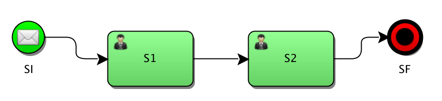
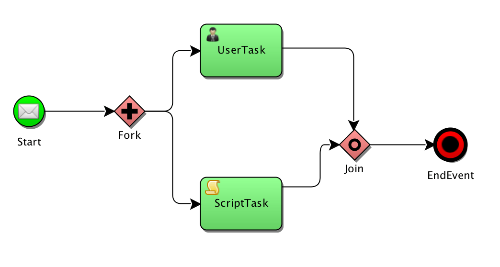

# Spring状态机

- [x] [Spring状态机项目指南](#项目指南)

## 项目指南

<https://www.baeldung.com/spring-state-machine>

有限状态机（finite-state machine, FSM）又称有限状态自动机（finite-state automaton, FSA），简称状态机，是表示有限个状态以及在这些状态之间的转移和动作等行为的数学计算模型。

- 状态State：一般在状态转移图中用圆圈表示。
- 事件Event：表示从一种状态迁移到另一种状态的触发机制。对应状态转换图中的箭头部分。
- 动作Action: 表示状态转换后，执行的动作，但不是必须的，也可以状态转换后不执行任何动作。
- 转移Transition：表示状态转换，从原始状态迁移到目的状态的一个过程。
- 条件Guard：表示发生状态转移需满足的条件。

1. 简介

    本文主要介绍 Spring 的[状态机项目](https://spring.io/projects/spring-statemachine)，该项目可用于表示工作流或任何其他类型的有限状态自动机表示问题。

2. Maven 依赖

    要开始使用，我们需要添加主要的 Maven 依赖项：

    ```xml
        <groupId>org.springframework.statemachine</groupId>
        <artifactId>spring-statemachine-core</artifactId>
    ```

3. 状态机配置

    现在，让我们开始定义一个简单的状态机：

    SimpleStateMachineConfiguration.java

    ```java
    @Configuration
    @EnableStateMachine
    public class SimpleStateMachineConfiguration 
    extends StateMachineConfigurerAdapter<String, String> {
        @Override
        public void configure(StateMachineStateConfigurer<String, String> states) 
        throws Exception {
            states
            .withStates().initial("SI").end("SF")
            .states(new HashSet<String>(Arrays.asList("S1", "S2", "S3")));
        }

        @Override
        public void configure(StateMachineTransitionConfigurer<String, String> transitions) 
        throws Exception {
            transitions.withExternal()
            .source("SI").target("S1").event("E1").and()
            .withExternal()
            .source("S1").target("S2").event("E2").and()
            .withExternal()
            .source("S2").target("SF").event("end");
        }
    }
    ```

    请注意，该类既被注释为传统的 Spring 配置，也被注释为状态机。它还需要扩展 StateMachineConfigurerAdapter，以便调用各种初始化方法。在其中一个配置方法configure中，我们定义了状态机的所有可能状态；在另一个配置方法StateMachineTransitionConfigurer中，我们定义了事件如何改变当前状态。

    上面的配置设置了一个非常简单的直线转换状态机，应该很容易理解。

    

    现在，我们需要启动一个 Spring 上下文，并获取对配置定义的状态机的引用：

    ```java
    @Autowired
    private StateMachine<String, String> stateMachine;
    ```

    有了状态机后，我们需要启动它：

    `stateMachine.start();`

    现在机器处于初始状态，我们可以发送事件，从而触发转换：

    `stateMachine.sendEvent("E1");`

    我们可以随时检查状态机的当前状态：

    `stateMachine.getState();`

4. 动作(Actions)

    让我们添加一些要在状态转换时执行的操作。首先，我们在同一个配置文件中将动作定义为 Spring Bean：

    SimpleStateMachineConfiguration.java\initAction()

    然后，我们可以在配置类中的过渡上注册上述创建的动作：

    ```java
    configure(StateMachineTransitionConfigurer) {
        transitions.withExternal()
        .source("SI").target("S1")
        .event("E1").action(initAction())
        ...
    }
    ```

    当通过事件 E1 从 SI 过渡到 S1 时，将执行此操作。动作可以附加到状态本身：

    SimpleStateMachineConfiguration.java\executeAction()

    ```java
    configure(StateMachineStateConfigurer) {
        states
            .withStates()
            .state("S3", executeAction(), errorAction());
            ...
    }
    ```

    此状态定义函数接受当机器处于目标状态时要执行的操作，以及可选的错误动作处理程序。

    错误动作处理程序与其他动作并无太大区别，但如果在评估状态动作的过程中随时抛出异常，它就会被调用：

    SimpleStateMachineConfiguration.java\errorAction()

    还可以为进入、执行和退出状态转换注册单独的操作：

    - SimpleStateMachineConfiguration.java\entryAction()
    - SimpleStateMachineConfiguration.java\executeAction()
    - SimpleStateMachineConfiguration.java\exitAction()

    ```java
    states
    .withStates()
    .stateEntry("S3", entryAction())
    .state("S3", executeAction())
    .stateExit("S3", exitAction());
    ```

    相应的操作将在相应的状态转换时执行。例如，我们可能希望在进入时验证一些前置条件，或在退出时触发一些报告。

5. 全局监听器(Global Listeners)

    可以为状态机定义全局事件监听器。这些监听器将在状态转换发生时被调用，并可用于日志记录或安全等用途。

    首先，我们需要添加另一个配置方法--它不处理状态或转换，而是处理状态机本身的配置。

    我们需要通过扩展 StateMachineListenerAdapter 来定义一个监听器：

    StateMachineListener.java

    这里我们只重载了 stateChanged，尽管还有许多其他钩子可用。

6. 扩展状态(Extended State)

    Spring 状态机会跟踪自己的状态，但要跟踪应用程序的状态，无论是一些计算值、来自管理员的条目还是调用外部系统的响应，我们都需要使用所谓的扩展状态。

    假设我们要确保账户申请经过两级审批。我们可以使用存储在扩展状态中的整数来跟踪批准次数：

    SimpleStateMachineConfiguration.java\executeAction()

7. 防护(Guards)

    在执行状态转换之前，可以使用保护程序来验证某些数据。防护看起来与动作非常相似：

    SimpleStateMachineConfiguration.java\simpleGuard()

    这里的明显区别在于，守护返回的是 true 或 false，它会告知状态机是否允许发生转换。

    此外，还支持将 SPeL 表达式作为 guards。上面的示例也可以写成

    `.guardExpression("extendedState.variables.approvalCount > 0")`

8. 来自生成器的状态机

    StateMachineBuilder 可用于创建状态机，而无需使用 Spring 注解或创建 Spring 上下文：

    StateMachineBuilderIntegrationTest.java\whenUseStateMachineBuilder_thenBuildSuccessAndMachineWorks()

9. 分层状态(Hierarchical States)

    通过使用多个 withStates() 和 parent()，可以配置分层状态：

    ```java
    states
    .withStates()
        .initial("SI")
        .state("SI")
        .end("SF")
        .and()
    .withStates()
        .parent("SI")
        .initial("SUB1")
        .state("SUB2")
        .end("SUBEND");
    ```

    这种设置允许状态机有多个状态，因此调用 getState() 会产生多个 ID。例如，启动后会立即产生以下表达式：

    ```log
    stateMachine.getState().getIds()
    ["SI", "SUB1"]
    ```

10. 连接点(Junctions)

    到目前为止，我们创建的状态转换都是线性的。这不仅非常无趣，而且也不能反映开发人员需要实现的实际用例。我们有可能需要实现有条件的路径，而 Spring 状态机的连接点（或选择）恰好能让我们做到这一点。

    首先，我们需要在状态定义中将一个状态标记为结点（选择）：

    ```java
    states
        .withStates()
        .junction("SJ")
    ```

    然后，在转换中，我们定义第一/然后/最后选项，这些选项与 if-then-else 结构相对应：

    ```java
    .withJunction()
    .source("SJ")
    .first("high", highGuard())
    .then("medium", mediumGuard())
    .last("low")
    ```

    首先，然后接受第二个参数，该参数是一个正则表达式保护，将被调用以找出要采取的路径：

    JunctionStateMachineConfiguration.java

    - mediumGuard()
    - highGuard()

    请注意，转换不会在交界节点停止，而是会立即执行定义的守护并转到指定路线之一。

    在上面的示例中，指示状态机过渡到 SJ 会导致实际状态变为 low，因为两个保护都只是返回 false。

    最后需要注意的是，应用程序接口同时提供路口和选择。然而，从功能上来说，它们在各个方面都是相同的。

11. 分叉(Fork)

    有时，有必要将执行拆分为多个独立的执行路径。这可以使用 fork 功能来实现。

    首先，我们需要指定一个节点作为分叉节点，并创建分层区域，让状态机执行分叉：

    ForkJoinStateMachineConfiguration.java\configure(StateMachineStateConfigurer)

    然后定义 fork 过渡：

    ForkJoinStateMachineConfiguration.java\configure(StateMachineTransitionConfigurer)

12. 连接(Join)

    分叉操作的补充是连接。它允许我们设置一个状态，该状态的转换依赖于其他状态的完成：

    

    与分叉操作一样，我们需要在状态定义中指定一个连接节点：

    ```java
    states
    .withStates()
    .join("SJoin")
    ```

    然后在转换中，我们定义需要完成哪些状态才能启用我们的连接状态：

    ```java
    transitions
    .withJoin()
        .source("Sub1-2")
        .source("Sub2-2")
        .target("SJoin");
    ```

    就是这样！通过这种配置，当 Sub1-2 和 Sub2-2 都实现时，状态机将过渡到 SJoin。

13. 用枚举代替字符串

    在上面的示例中，我们使用字符串常量来定义状态和事件，这样既清晰又简单。在实际生产系统中，我们可能希望使用 Java 的枚举来避免拼写错误并获得更高的类型安全性。

    首先，我们需要定义系统中所有可能的状态和事件：

    ApplicationReviewStates.java

    ApplicationReviewEvents.java

    在扩展配置时，我们还需要将枚举作为泛型参数传递：

    ```java
    public class SimpleEnumStateMachineConfiguration 
    extends StateMachineConfigurerAdapter
    <ApplicationReviewStates, ApplicationReviewEvents>
    ```

    定义后，我们就可以使用枚举常量来代替字符串。例如，定义一个过渡：

    ```java
    transitions.withExternal()
    .source(ApplicationReviewStates.PEER_REVIEW)
    .target(ApplicationReviewStates.PRINCIPAL_REVIEW)
    .event(ApplicationReviewEvents.APPROVE)
    ```

## Code

你可以在 [GitHub](https://github.com/eugenp/tutorials/tree/master/spring-state-machine) 上找到示例源代码。
