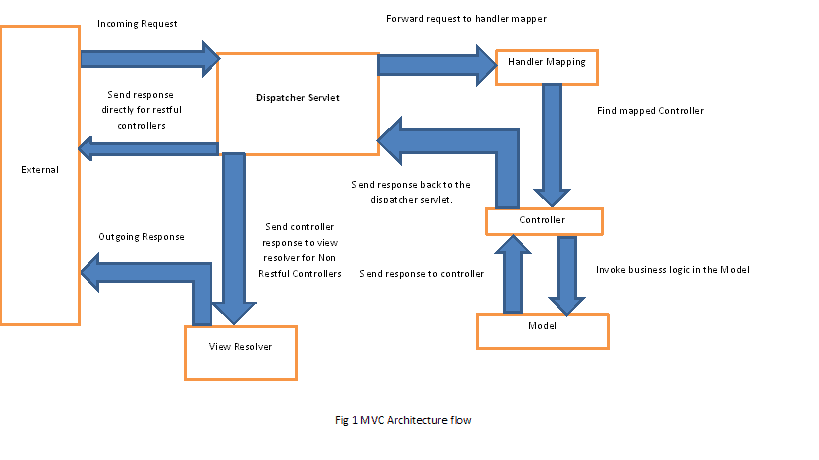

# [Spring控制器快速指南](https://www.baeldung.com/spring-controllers)

1. 介绍

    在本教程中，我们将重点关注Spring MVC的核心概念，即控制器。

2. 一览表

    让我们先退后一步，在典型的Spring Model View Controller架构中研究Front Controller的概念。

    在非常高的层面上，主要职责包括：

    - 拦截传入的请求
    - 将请求的有效负载转换为数据的内部结构
    - 将数据发送到模型以进行进一步处理
    - 从模型中获取已处理的数据，并将该数据推进到视图中进行渲染

    以下是Spring MVC中高水平流程的快速图表：

    

    正如我们所看到的，DispatcherServlet在架构中发挥着Front Controller的作用。

    该图适用于典型的MVC控制器和RESTful控制器，但有一些小的区别（如下所述）。

    在传统方法中，MVC应用程序不是以服务为导向的；因此，有一个视图解析器，根据从控制器收到的数据呈现最终视图。

    RESTful应用程序被设计为面向服务并返回原始数据（通常为JSON/XML）。由于这些应用程序不进行任何视图渲染，因此没有视图解析器，控制器通常期望通过HTTP响应直接发送数据。

    让我们从MVCo风格的控制器开始。

3. Maven附属机构

    为了在Spring Boot中与Spring MVC配合使用，我们将首先处理Maven依赖项：

    ```xml
    <dependency>
        <groupId>org.springframework.boot</groupId>
        <artifactId>spring-boot-starter-web</artifactId>
        <version>3.0.2</version>
    </dependency>
    ```

4. Spring Boot网络配置

    现在让我们来看看如何配置Spring Boot。由于我们在类路径中添加了thymeleaf依赖项，因此我们不需要为此配置任何@Beans：

    ```xml
    <dependency>
        <groupId>org.springframework.boot</groupId>
        <artifactId>spring-boot-starter-thymeleaf</artifactId>
    </dependency>
    ```

    在我们的WebConfig中，我们需要为Greeting对象和ObjectMapper添加一个bean，以启用默认servlet：

    ```java
    @Bean
    public WebServerFactoryCustomizer<ConfigurableServletWebServerFactory> enableDefaultServlet() {
        return factory -> factory.setRegisterDefaultServlet(true);
    }

    @Bean
    public Greeting greeting() {
        Greeting greeting = new Greeting();
        greeting.setMessage("Hello World !!");
        return greeting;
    }

    @Bean
    public ObjectMapper objectMapper() {
        return new ObjectMapper();
    }
    ```

    因此，例如，如果控制器返回一个名为“welcome”的视图，视图解析器将尝试解析模板文件夹中名为“welcome.html”的页面。这是thyeamleaf将搜索视图的默认文件夹。

5. MVC控制器

    现在，我们最终将实现MVC风格控制器。

    请注意，我们如何返回包含模型映射和视图对象的ModelAndView对象；两者都将由视图解析器用于数据渲染：

    ```java
    @Controller
    @RequestMapping(value = "/test")
    public class TestController {
        @GetMapping
        public ModelAndView getTestData() {
            ModelAndView mv = new ModelAndView();
            mv.setViewName("welcome");
            mv.getModel().put("data", "Welcome home man");
            return mv;
        }
    }
    ```

    那么，我们到底在这里设置了什么。

    首先，我们创建了一个名为TestController的控制器，并将其映射到“/test”路径。在该类中，我们创建了一个返回ModelAndView对象的方法，并映射到GET请求。因此，任何以“test”结尾的URL调用都将由DispatcherServlet路由到TestController中的getTestData方法。

    当然，为了好起見，我们正在返回带有一些模型数据的ModelAndView对象。

    视图对象的名称设置为“welcome”。如上所述，View Resolver将在模板文件夹中搜索一个名为“welcome.html”的页面。

    下面我们可以看到GET(localhost:8080/test)操作示例的结果：`Data returned is Welcome home man`

6. REST控制器

    Spring RESTful应用程序的设置与MVC应用程序的设置相同，唯一的区别是没有视图解析器或模型映射。

    API通常会将原始数据返回给客户端，通常是XML和JSON表示，因此DispatcherServlet绕过视图解析器，并在HTTP响应正文中返回数据。

    让我们来看看一个简单的RESTful控制器实现：

    ```java
    @RestController
    public class RestController {

        @GetMapping(value = "/student/{studentId}")
        public Student getTestData(@PathVariable Integer studentId) {
            Student student = new Student();
            student.setName("Peter");
            student.setId(studentId);

            return student;
        }
    }
    ```

    我们可以在下面看到输出：将GET(localhost:8080/student/1)请求发送到`student id of 1`的API的结果。

    这里有一个快速说明，@RequestMapping注释是我们真正必须探索的核心注释之一，以充分发挥其潜力。

7. Spring Boot和@RestController注释

    Spring Boot中的@RestController注释基本上是一个快速快捷方式，使我们不必总是定义@ResponseBody。

    以下是之前使用此新注释的控制器示例：

    ```java
    @RestController
    public class RestAnnotatedController {
        @GetMapping(value = "/annotated/student/{studentId}")
        public Student getData(@PathVariable Integer studentId) {
            Student student = new Student();
            student.setName("Peter");
            student.setId(studentId);

            return student;
        }
    }
    ```

8. 结论

    在本文中，我们从典型的MVC应用程序和RESTful API的角度探讨了在Spring Boot中使用控制器的基础知识。
